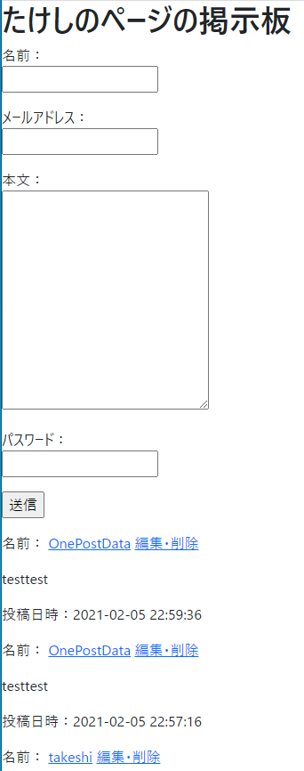
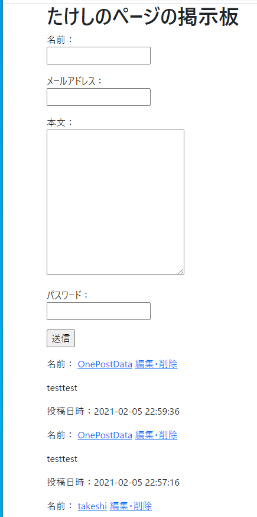
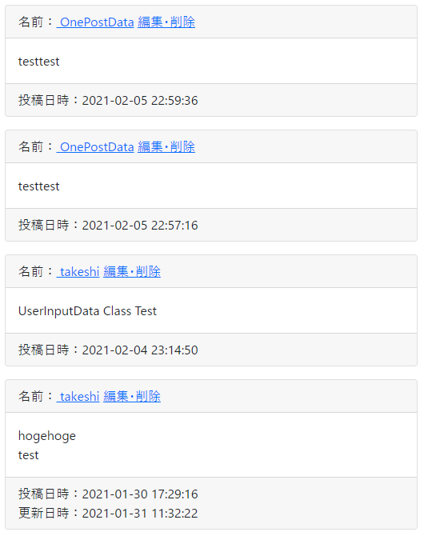
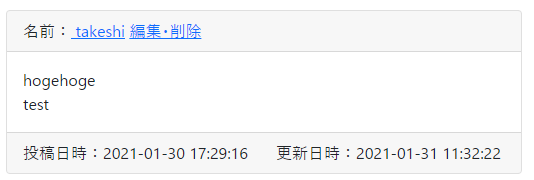
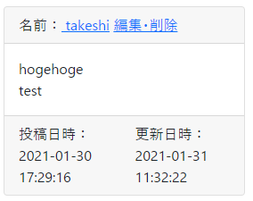
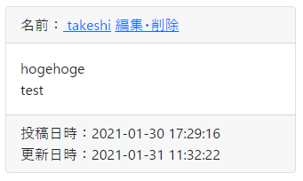
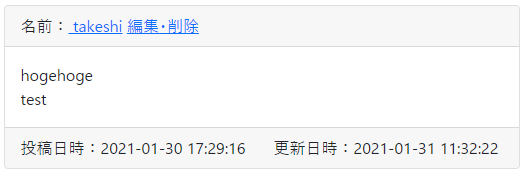

# Bootstrapで見た目を整える　～記事部分～

いい加減に見た目を何とかする。

## 環境

- ローカル
  - Windows 10
  - XAMPP 7.4.13
  - MariaDB 10.4.17
- リモート
  - Raspberry Pi 3B+
  - Raspberry Pi OS 10.4
  - MariaDB 10.3.23

## Bootstrapとは

ここでたらたら説明するよりググる方が早いので、概要はそちらで。

でも、どうもつい最近バージョン5になったらしく（2021年2月現在）、ググって出てくる具体的な実装手順については、現状と異なっている部分がある。なるべく公式ドキュメントを参考にしながら進めていく。

## 導入手順

`view/post.html`を編集。

~~~php+HTML
<?php
$posts = $action->GetDBPostData();
?>
<!DOCTYPE html>
<html lang="ja">

<head>
    <meta charset="UTF-8">
    <title>たけしのページの掲示板</title>
    
    <!-- 以下を挿入 -->
    
    <meta name="viewport" content="width=device-width, initial-scale=1">
    <link href="https://cdn.jsdelivr.net/npm/bootstrap@5.0.0-beta1/dist/css/bootstrap.min.css" rel="stylesheet"
        integrity="sha384-giJF6kkoqNQ00vy+HMDP7azOuL0xtbfIcaT9wjKHr8RbDVddVHyTfAAsrekwKmP1" crossorigin="anonymous">
    
    <!-- ここまで -->
    
</head>

<body>
    
    (略)
        
    <!-- 記事表示エリア終了 -->
    
    <!-- 以下を挿入 -->
    
    
    
    <!-- ここまで -->
    
</body>

</html>
~~~

CDNという方法で、アクセス毎にBootstrapサーバー（？）から取得する形をとる。自分でDLして準備するのは面倒なので。

導入しただけで何も変えてないけど、見た目がちょっと変わった。可能性を感じる。

ブラウザの左端にくっつきすぎてヤバい。

## とりあえず何かしてみる

公式ドキュメントをとりあえず読み散らかしてきた。

[Introduction · Bootstrap v5\.0](https://getbootstrap.com/docs/5.0/getting-started/introduction/)

全体を`

`で囲んでみる。

`view/post.php`

~~~php+HTML
(略)

<body>
    
  <!-- ←追加 -->
        
        (略)
        
    
  <!-- ←追加 -->
</body>

</html>
~~~

ブラウザの左端にくっつかなくなった。

## 記事を装飾

記事を`card`クラスというもので囲ってみる。

[Cards · Bootstrap v5\.0](https://getbootstrap.com/docs/5.0/components/card/)

構造は以下。

~~~html

  

      
  

  

    
  

  

      
  

~~~

`view/post.php`に上の構造を適用。分かりにくいけど、分かるかな？

~~~php+HTML
<!-- 記事表示エリア -->

    <?php if ($posts->HavePosts()) : ?>
    

        <?php foreach ($posts as $post) :?>
        
        
<!-- ←ここ -->
            
            
<!-- ←ここ -->
                
                

                    

                        名前：<?php if ($post->TheEmail() !== "") : ?><a href="mailto:<?php echo $post->TheEmail(); ?>"><?php endif; ?>
                        <?php echo $post->TheName(); ?></a>
                        <a href="edit/<?php echo $post->TheId(); ?>">編集・削除</a>
                    

                

                
            
<!-- ←ここ -->
            
            
<!-- ←ここ -->
                
                

                    

                        <?php echo nl2br(h($post->TheBody())); ?>
                    

                

                
            
<!-- ←ここ -->
            
            
<!-- ←ここ -->
                
                

                    

                        投稿日時：<?php echo $post->ThePostedDate(); ?>
                    

                

                <?php if ($post->IsUpdated()) : ?>
                

                    更新日時：<?php echo $post->TheUpdatedDate(); ?>
                

                <?php endif;?>
                
            
<!-- ←ここ -->
            
        
<!-- ←ここ -->
        
        <?php endforeach; ?>
    

    <?php endif; ?>

<!-- 記事表示エリア終了 -->
~~~

結果。なんか変だけど、なんかそれっぽい。

### 微調整

とりあえず気になるのは各要素の下部スペース（おそらく`padding-bottom`）が大きい。

Bootstrapでは、こういう微調整もクラスを指定して行うらしい。

[Spacing · Bootstrap v5\.0](https://getbootstrap.com/docs/5.0/utilities/spacing/)

`
`タグに`class="mb-0"`を追加する。

~~~php+HTML

    

        
 <!-- ←ここ -->
            名前：<?php if ($post->TheEmail() !== "") : ?><a href="mailto:<?php echo $post->TheEmail(); ?>"><?php endif; ?>
            <?php echo $post->TheName(); ?></a>
            <a href="edit/<?php echo $post->TheId(); ?>">編集・削除</a>
        

    

~~~

お、名前の下の余計なスペースがなくなった。

じゃあ、記事表示部分の全ての`
`に`class="mb-0"`を付けてみよう。

とりあえずコピペで付けていく。もっとスマートなやり方があるんだろうけど、それはもっと習熟度が上がってから考えよう。

~~~php+HTML
<!-- 記事表示エリア -->

    <?php if ($posts->HavePosts()) : ?>
    

        <?php foreach ($posts as $post) :?>
        

            

                

                    
 <!-- ←ここ -->
                        名前：<?php if ($post->TheEmail() !== "") : ?><a href="mailto:<?php echo $post->TheEmail(); ?>"><?php endif; ?>
                        <?php echo $post->TheName(); ?></a>
                        <a href="edit/<?php echo $post->TheId(); ?>">編集・削除</a>
                    

                

            

            

                

                    
 <!-- ←ここ -->
                        <?php echo nl2br(h($post->TheBody())); ?>
                    

                

            

            

                

                    
 <!-- ←ここ -->
                        投稿日時：<?php echo $post->ThePostedDate(); ?>
                    

                

                <?php if ($post->IsUpdated()) : ?>
                
 <!-- ←ここ -->
                    更新日時：<?php echo $post->TheUpdatedDate(); ?>
                

                <?php endif;?>
            

        

        <?php endforeach; ?>
    

    <?php endif; ?>

<!-- 記事表示エリア終了 -->
~~~

おお、シュッとしたやん。

次はカードコンポーネント（＝記事1つ分）のスペースが開いてないから、逆にこれはマージンを付与する。

~~~php+HTML
<!-- 記事表示エリア -->

    <?php if ($posts->HavePosts()) : ?>
    

        <?php foreach ($posts as $post) :?>
        

            

                

~~~

ほんのり開いた。ふむふむ。

投稿日時と更新日時が横並びになってくれたらいいのではないか。

こういう場合は`row`クラスと`col`クラスを指定する。

[Grid system · Bootstrap v5\.0](https://getbootstrap.com/docs/5.0/layout/grid/)

構造は以下。

~~~HTML

    

        <!-- ここに投稿日時 -->
    

    

        <!-- ここに更新日時 -->
    

~~~

組み込み。

~~~php+HTML

    
 <!-- ←ここ -->
        
 <!-- ←ここ -->
            

                

                    投稿日時：<?php echo $post->ThePostedDate(); ?>
                

            

        
 <!-- ←ここ -->
        <?php if ($post->IsUpdated()) : ?>
        
 <!-- ←ここ -->
            

                更新日時：<?php echo $post->TheUpdatedDate(); ?>
            

        
 <!-- ←ここ -->
        <?php endif;?>
    
 <!-- ←ここ -->

~~~

ほほーう。いいねいいね。

でもこのままでは、画面が小さくなった時でも逆に横並びのままになってしまって微妙。

どうも画面幅が550px以下になってきたところで崩れ始める模様。なので、ブレイクポイントを設定する。

具体的には`col`クラスを`col-sm`に直す。

~~~php+HTML

    

        
 <!-- ←ここ -->
            

                

                    投稿日時：<?php echo $post->ThePostedDate(); ?>
                

            

        

        <?php if ($post->IsUpdated()) : ?>
        
 <!-- ←ここ -->
            

                更新日時：<?php echo $post->TheUpdatedDate(); ?>
            

        

        <?php endif;?>
    

~~~

ブレイクポイントとは、指定画面幅以上でないと有効にならないクラス。`-sm`を付けると576px以上でないと`col`クラスが有効にならないという意味。`col`が無効になると横並びが解除されて、縦並びになるという仕組み。

だからこのまま画面幅を広げると、ちゃんと横並びになる。いいね。

公式によるとこうなっているらしい。

[Breakpoints · Bootstrap v5\.0](https://getbootstrap.com/docs/5.0/layout/breakpoints/#available-breakpoints)

| Breakpoint        | Class infix | Dimensions |
| ----------------- | ----------- | ---------- |
| X-Small           | *None*      | <576px     |
| Small             | `sm`        | ≥576px     |
| Medium            | `md`        | ≥768px     |
| Large             | `lg`        | ≥992px     |
| Extra large       | `xl`        | ≥1200px    |
| Extra extra large | `xxl`       | ≥1400px    |

次は「編集・削除」が右上に寄ってくれたらうれしい。とりあえず`card-header`の中身に`row`、`col`を適用する。

~~~php+HTML

    

        
 <!-- ←ここついでにpタグをやめてdivタグにした -->
            
 <!-- ←ここ -->
                名前：
                <?php if ($post->TheEmail() !== "") : ?>
                <a href="mailto:<?php echo $post->TheEmail(); ?>">
                    <?php endif; ?>
                    <?php echo $post->TheName(); ?></a>
            
 <!-- ←ここ -->
            
 <!-- ←ここ -->
                <a href="edit/<?php echo $post->TheId(); ?>">編集・削除</a>
            
 <!-- ←ここ -->
        
 <!-- ←ここ -->
    

~~~

ここで「編集・削除」をラップしている`
`タグの`col`クラスを`col-auto`クラスに変える。

[Columns · Bootstrap v5\.0](https://getbootstrap.com/docs/5.0/layout/columns/#margin-utilities)

~~~php+HTML

    

        

            

                名前：
                <?php if ($post->TheEmail() !== "") : ?>
                <a href="mailto:<?php echo $post->TheEmail(); ?>">
                    <?php endif; ?>
                    <?php echo $post->TheName(); ?></a>
            

            
 <!-- ←ここ -->
                <a href="edit/<?php echo $post->TheId(); ?>">編集・削除</a>
            

        

    

~~~

`col-auto`はできる限り離れてくれるらしい。これが正しい使い方なのかは分からないけど、動いているのでとりあえずよしとする。

## まとめ

初めて使ったにしては上出来かな？

「もっと記事と記事の間は広げた方がいい」とか「そもそも囲う必要性は？」とか考え始めるとキリがないのでとりあえずこの辺で置いとく。