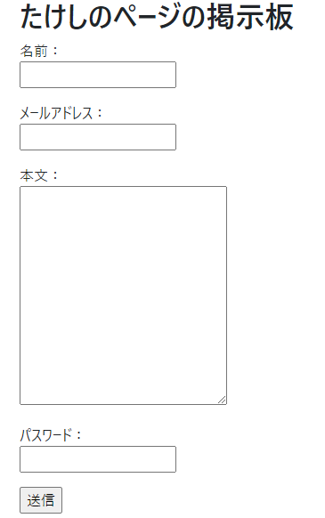
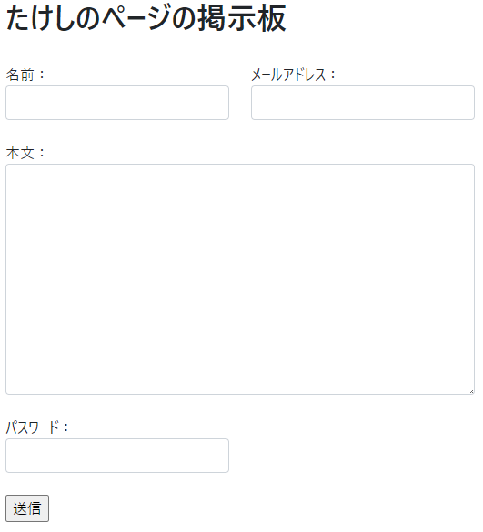
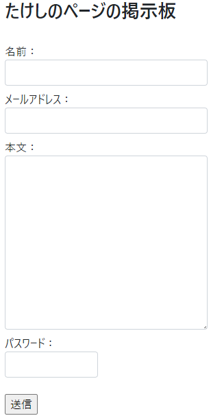
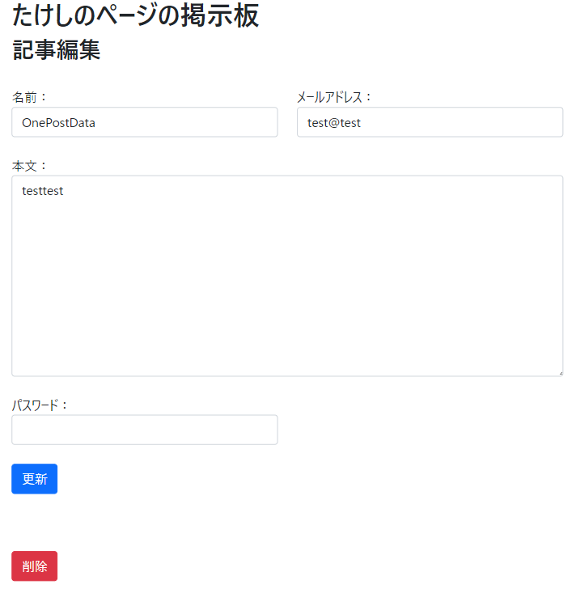

# Bootstrapで見た目を整える　～入力部分～

今回もBootstrap 5を使って進めていく。

## 環境

- ローカル
  - Windows 10
  - XAMPP 7.4.13
  - MariaDB 10.4.17
- リモート
  - Raspberry Pi 3B+
  - Raspberry Pi OS 10.4
  - MariaDB 10.3.23

## 現状

何も手を付けていない。

`view/post.html`

~~~php+HTML
<body>
    

        <h1>たけしのページの掲示板</h1>
        <!-- 記事入力エリア -->
        

            <form action="./index.php" method="post" id="post_form">
                

                    名前： 
                    <input type="text" name="name" id="name" value="<?php if ($repostFlag) { echo h($postDataFromUser['name']);}?>">
                

                

                    メールアドレス： 
                    <input type="email" name="email" id="email" value="<?php if ($repostFlag) { echo h($postDataFromUser['email']);}?>">
                

                

                    本文： 
                    <textarea name="body" id="body" cols="30" rows="10"><?php if ($repostFlag) { echo h($postDataFromUser['body']);}?></textarea>
                

                

                    パスワード： 
                    <input type="password" name="password" id="password">
                

                

                    <input type="hidden" name="eventId" value="save">
                    <input type="hidden" name="token" value="<?php echo h(password_hash(session_id(), PASSWORD_DEFAULT)) ?>">
                    <input type="submit" value="送信">
                

            </form>
        

        <!-- 記事入力エリア終了 -->
        
        (略)
~~~

## `row`と`col`でとりあえず整形してみる

おそらく最初に`row`と`col`で配置を決めていくのがBootstrap流。

※今まで`if`を書いていたところはphp cs fixerが無理矢理整形してしまって鬱陶しいので、三項演算子を使って1行に書くようにした。

~~~php+HTML
(略)

<body>
    

        

            <h1>たけしのページの掲示板</h1>
        

        <!-- 記事入力エリア -->
        

            

                <form action="./index.php" method="post" id="post_form">
                    

                        

                            <label for="name">名前：</label>
                            <input type="text" class="form-control" name="name" id="name" value="<?php echo $repostFlag ? h($postDataFromUser['name']) : "";?>">
                        

                        

                            <label for="email">メールアドレス：</label>
                            <input type="email" class="form-control" name="email" id="email" value="<?php echo $repostFlag ? h($postDataFromUser['email']) : "";?>">
                        

                    

                    

                        
<label for="body">本文：</label>

                        
<textarea name="body" class="form-control" rows=10 id="body"><?php echo $repostFlag ? h($postDataFromUser['body']) : "";?></textarea>

                    

                    

                        
<label for="password">パスワード：</label>

                        
<input type="password" class="form-control" name="password" id="password">

                        <input type="hidden" name="eventId" value="save">
                        <input type="hidden" name="token" value="<?php echo h(password_hash(session_id(), PASSWORD_DEFAULT)) ?>">
                    

                    

                        <input type="submit" value="送信">
                    

                </form>
            

        

        <!-- 記事入力エリア終了 -->

(略)
~~~

なんか雰囲気が出てきた。

画面幅が縮まったとき、名前とメールアドレスは縦並びになる。

まあ結局`mb-*`で調整しまくりだけど。

ちなみにちょっとハマったところとして、

~~~HTML

    

    
    

    

    

~~~

とあったとして、

* 画面幅が`sm`以上（つまり576px以上）なら横並び
* 画面幅が`sm`以下なら縦並び　←　このときに縦並びの間にマージンを入れたい

という場合、

~~~HTML

    

    
    

    

    

~~~

としてしまってハマった。

画面幅が`sm`以下のとき限定ってのが惑わされたところで`-sm`を入れればいいやと思ったけど、実際は`-sm`を入れると画面幅が`sm`以下の時に**無効**になるということ。

つまり、

* 画面幅が`sm`以上（つまり576px以上）なら横並び　←　この時にマージンが有効
* 画面幅が`sm`以下なら縦並び　←　マージンが**無効**

と、狙いと逆になってしまった。

正しくは

~~~HTML

    

    
    

    

    

~~~

としないといけない。

* 常に`mb-2`
* ただし、画面幅が`sm`以上になったら`mb-sm-0`が有効になりそっちが優先される

ちょっと分かってきた。

## ボタン

~~~php+HTML
				(略)

				

                
<label for="password">パスワード：</label>

                
<input type="password" class="form-control" name="password" id="password">

                <input type="hidden" name="eventId" value="save">
                <input type="hidden" name="token" value="<?php echo h(password_hash(session_id(), PASSWORD_DEFAULT)) ?>">
            

			<!-- ボタン -->
            

                <button class="btn btn-primary" type="submit">送信</button>
            

			<!-- ここまで -->

        </form>
    

<!-- 記事入力エリア終了 -->
~~~

`<button>`タグに変えてクラスを付与したら、

あらそれっぽい。

最後に入力エリアと記事表示エリアをちょっとだけ離して入力部分は終わり。

~~~php+HTML
<body>
    

        

            <h1>たけしのページの掲示板</h1>
        

        <!-- 記事入力エリア -->
        

            

                <form action="./index.php" method="post" id="post_form" class="mb-5"> <!-- formにmb-5を入れる -->
                    
                (略)
~~~

## 記事編集画面も同様に整える

同じようにコーディングした。

`view/edit.php`

~~~php+HTML
<!DOCTYPE html>
<html lang="ja">

<head>
    <meta charset="UTF-8">
    <title>たけしのページの掲示板</title>
    <meta name="viewport" content="width=device-width, initial-scale=1">
    <link href="https://cdn.jsdelivr.net/npm/bootstrap@5.0.0-beta1/dist/css/bootstrap.min.css" rel="stylesheet"
        integrity="sha384-giJF6kkoqNQ00vy+HMDP7azOuL0xtbfIcaT9wjKHr8RbDVddVHyTfAAsrekwKmP1" crossorigin="anonymous">
</head>

<body>
    

        

            <h1>たけしのページの掲示板</h1>
            <h2>記事編集</h2>
        

        <!-- エラーメッセージ表示エリア -->
        <?php if (isset($errmsg)) :?>
        

            
<?php echo h($errmsg) ?>
            

        

        <?php endif; ?>
        <!-- エラーメッセージ終了 -->
        <!-- 記事入力エリア -->
            

                

                    <form action="../index.php" method="post" id="post_form" class="mb-5">
                        

                            

                                <label for="name">名前：</label>
                                <input type="text" class="form-control" name="name" id="name" value="<?php echo $reupdateFlag ? h($_SESSION['name']) : $edit_data->TheName();?>">
                            

                            

                                <label for="email">メールアドレス：</label>
                                <input type="email" class="form-control" name="email" id="email" value="<?php echo $reupdateFlag ? h($_SESSION['email']) : $edit_data->TheEmail();?>">
                            

                        

                        

                            
<label for="body">本文：</label>

                            
<textarea name="body" class="form-control" rows=10 id="body"><?php echo h(preg_replace("/(\r\n|\n|\r)/", "\n", $reupdateFlag ? $_SESSION['body'] : $edit_data->TheBody()));?></textarea>

                        

                        

                            
<label for="password">パスワード：</label>

                            
<input type="password" class="form-control" name="password" id="password">

                            <input type="hidden" name="id"
                                value="<?php echo h($edit_data->TheId()) ?>">
                            <input type="hidden" name="token"
                                value="<?php echo h(password_hash(session_id(), PASSWORD_DEFAULT)) ?>">
                        

                        

                            <button name="eventId" value="update" class="btn btn-primary mb-4">更新</button> 
                        

                        <button name="eventId" value="delete" class="btn btn-danger">削除</button>
                    </form>
                

            

        <!-- 記事入力エリア終了 -->
    

    
</body>

</html>
~~~

