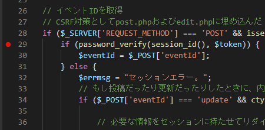
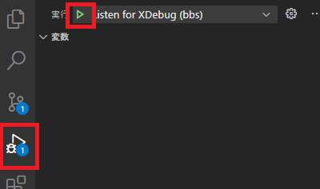
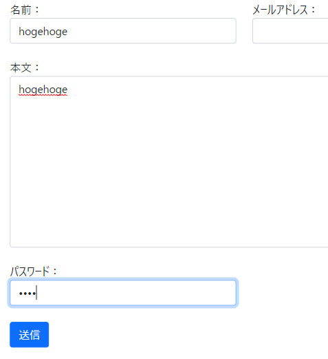
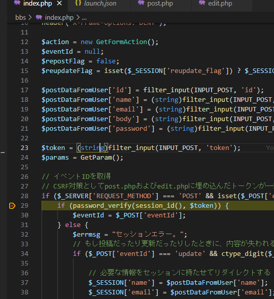
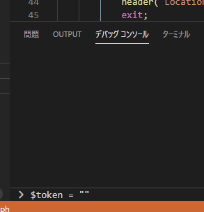
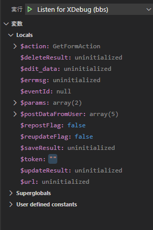
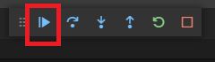
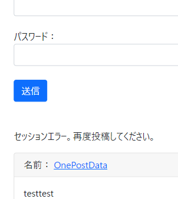
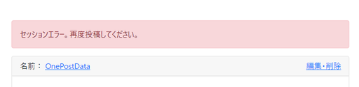
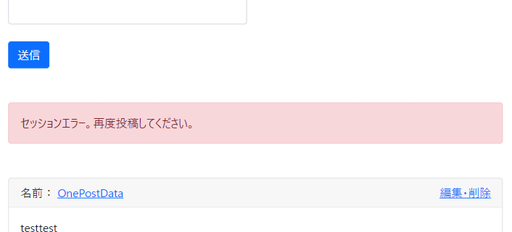

# Bootstrapで見た目を整える　～エラーメッセージ部分～

おそらくレア現象となるであろう、セッション切れのエラーメッセージをBootstrapでそれっぽく整える。

## 環境

- ローカル
  - Windows 10
  - XAMPP 7.4.13
  - MariaDB 10.4.17
- リモート
  - Raspberry Pi 3B+
  - Raspberry Pi OS 10.4
  - MariaDB 10.3.23

## エラーメッセージ再現方法

セッション切れを手動で起こす。

1. ブレークポイントを設定してデバッグモードにする。

   

   
   
2. 適当に記事を投稿して、ブレークポイントで止める。

   

   

3. VSCodeの下部にある（はず）デバッグコンソールに`$token = ""`を打つ。

   

   エンターを押すと実行され`$token`に空文字が代入される。

   

4. そのままコードを再実行。

   

5. エラーメッセージが出ているのを確認。

   

これを整える。

## エラーメッセージ用の装飾

`view/post.php`

~~~php+HTML
<!-- エラーメッセージ表示エリア -->
<?php if (isset($errmsg)) :?>

 <!-- ←変更 -->
    <?php echo h($errmsg) ?> <!-- pタグを取った -->

<?php endif; ?>
<!-- エラーメッセージ終了 -->
~~~

おおー。これでいいやん。

ちょっとマージンを設定。`mb-5`をクラスに追加。

よし。