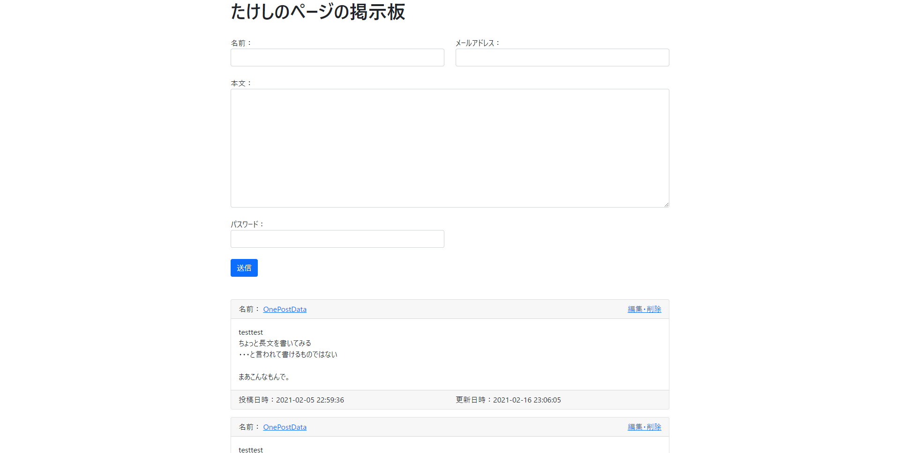
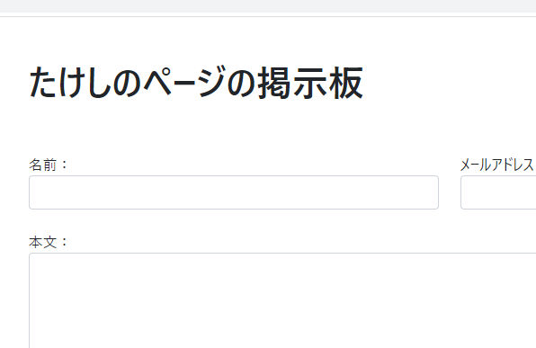
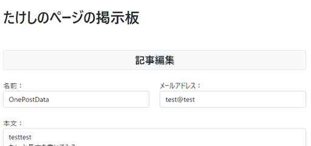

# Bootstrap 5で見た目を整える　～全体調整～

仕上げ。

## 環境

- ローカル
  - Windows 10
  - XAMPP 7.4.13
  - MariaDB 10.4.17
- リモート
  - Raspberry Pi 3B+
  - Raspberry Pi OS 10.4
  - MariaDB 10.3.23

## PCでブラウザの最大化をしたとき

ちょっと見にくいかな？間延び感がすごい。

無理矢理`max-width`を設定してしまう。

`view/post.php`

~~~php+HTML
<body>
    <!-- 以下を追加 -->
    
    <!-- ここまで -->
    
 <!-- maxWidthクラスを追加 -->
        

            <h1>たけしのページの掲示板</h1>
        

        <!-- 記事入力エリア -->
~~~

ちょっとシュッとした。

## タイトルを調整

タイトルだけ凝ってみようかと思ったけど、今更なのでBootstrapのみで。と言っても余白を開けただけ。

`view/post.php`

~~~php+HTML
<body>
    
    

        
 <!-- ←mb-4からmy-5に変更 -->
            <h1>たけしのページの掲示板</h1>
        

        <!-- 記事入力エリア -->
~~~

記事編集画面の方は「記事編集」の文字が`<h2>`タグになっていてちょい微妙だったので変更。

`view/edit.php`

~~~php+HTMl
<body>
    

        
 <!-- ←post.phpに合わせる -->
            <h1>たけしのページの掲示板</h1>
        

        
        <!-- 以下を追加 -->
        

            

                

                    記事編集
                

            

        

        <!-- ここまで -->
        
        (略)
~~~

なんとなく記事編集モード感。