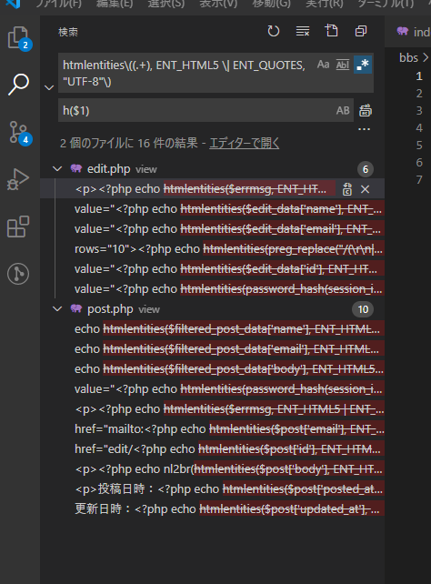

# コード見直し　～TODOのお掃除②～

セキュリティを強化している中でさらに見つけた修正点を回収。

## 環境

- ローカル
  - Windows 10
  - VSCode 1.51.1
  - XAMPP 7.4.13
  - MariaDB 10.4.17
- リモートにはアップしない

## 処理に失敗したときのエラーメッセージの表示

現状ではView上で判断をしているけど、これは全然よろしくない。

`view/post.php`

~~~php+HTML
(略)

<!-- エラーメッセージ表示エリア -->
<?php if (isset($saveResult) && $saveResult == false) :?>

    
記事投稿に失敗しました。

<?php elseif (isset($updateResult) && $updateResult == false) :?>

    
記事編集に失敗しました。

<?php elseif (isset($errmsg)) :?>

    
<?php echo htmlentities($errmsg, ENT_HTML5 | ENT_QUOTES, "UTF-8") ?>
    

<?php endif; ?>
<!-- エラーメッセージ終了 -->

(略)
~~~

エラーメッセージを`$errmsg`に格納するようにすれば最初2つの分岐はいらない。

`view/post.php`（修正後）

~~~php+HTML
(略)

<!-- エラーメッセージ表示エリア -->
<?php if (isset($errmsg)) :?>

    
<?php echo htmlentities($errmsg, ENT_HTML5 | ENT_QUOTES, "UTF-8") ?>
    

<?php endif; ?>
<!-- エラーメッセージ終了 -->

(略)
~~~

コントローラーにその判断を任せる。

`index.php`

`$errmsg`への代入文をそれぞれ追加。

~~~php
(略)

switch ($eventId) {
    case 'save':
        $saveResult = $action->SaveDBPostData($_POST);
        
        // 追加
        if ($saveResult == false) {
            $errmsg = "記事投稿に失敗しました。";
        }
        
        require('./view/post.php');
        break;
    case 'update':
        $updateResult = $action->UpdateDBPostData($_POST);
        
        // 追加
        if ($updateResult == false){
            $errmsg = "記事編集に失敗しました。";
        }
        
        require('./view/post.php');
        break;
    case 'delete':
        $deleteResult = $action->DeleteDBPostData($_POST);
        
        // 追加
        if ($deleteResult == false){
            $errmsg = "記事削除に失敗しました。";
        }
        
        require('./view/post.php');
        break;
    default:
        switch ($params['mode']) {

(略)
~~~

## 改行文字について

改行は

* HTML上では` `
* textarea内では`\n`

なんだけど、Windowsはご存じの通り改行コードが`\r\n`なのでそれぞれに変換しないといけない。

ここでは入力時はそのままDBに保存して、それを出力するときに（つまりViewで）対処するようにする。

`view/post.php`

`htmlentities`をさらに`nl2br`で包む。

~~~php+HTML
<!-- 記事表示エリア -->

	(略)

	

        
<?php echo nl2br(htmlentities($post['body'], ENT_HTML5 | ENT_QUOTES, "UTF-8")); ?>
        

    

	(略)

<!-- 記事表示エリア終了 -->
~~~

`view/edit.php`

`htmlentities`内で正規表現による置き換え（`preg_replace`）を行う。

~~~php+HTML
<!-- 記事入力エリア -->

	(略)

	

        本文： 
        <textarea name="body" id="body" cols="30"
                  rows="10"><?php echo htmlentities(preg_replace("/(\r\n|\n|\r)/", "\n", $edit_data['body']), ENT_HTML5 | ENT_QUOTES, "UTF-8") ?></textarea>
    

	(略)

<!-- 記事入力エリア終了 -->
~~~

## 削除後記事表示ページが表示されてからリロードをしたらエラーが出る

現状、記事投稿したり更新したり削除したりしたあと、リロードするとPOSTデータも再送信されて同じ処理が繰り返される。

それは問題と言えば問題だけど、まあ記事投稿なら2個タブるだけだし、更新なら同じ更新がされて見た目的には問題ない。でも同じ記事を2回削除してしまうとエラーが出るのでそれは対処しておく。

`model/GetFormAction.php`

~~~php
public function DeleteDBPostData($data)
{
    // 渡されたデータが正当なものかどうか
    if ($this->IsDataIncorrect($data)) {
        return false;
    }

    // パスワードを確認
    $old_data = $this->GetDBOnePostData((int)$data['id']);
    if (! password_verify($data['password'], $old_data['password'])) {
        return false;
    }

    $smt = $this->pdo->prepare('update posts set deleted_at=now() where id=:id');
    $postId = (int)$data['id'];
    $smt->bindParam(':id', $postId, PDO::PARAM_INT);
    return $smt->execute();
}
~~~

この時、2回同じ記事を削除しようとすると`$old_data`に`false`が格納され、次の条件判断で「`$old_data`は配列じゃないぞ！」と怒られる。

なので早期リターンで対処。

`model/GetFormAction.php`（変更後）

~~~php
public function DeleteDBPostData($data)
{
    // 渡されたデータが正当なものかどうか
    if ($this->IsDataIncorrect($data)) {
        return false;
    }

    // パスワードを確認
    $old_data = $this->GetDBOnePostData((int)$data['id']);
    
    // 追加
    if ($old_data === false) {
        return false;
    }
    
    if (! password_verify($data['password'], $old_data['password'])) {
        return false;
    }

    $smt = $this->pdo->prepare('update posts set deleted_at=now() where id=:id');
    $postId = (int)$data['id'];
    $smt->bindParam(':id', $postId, PDO::PARAM_INT);
    return $smt->execute();
}
~~~

`if`節を独立させてリターンさせることを早期リターンとかガード節とかいうらしい。ガード節は処理の最初の方に`if`節を書いて当てはまるやつはさっさと`return`する。不正なデータが深い処理に渡されるのをガードする感じ。早期リターンもほぼ同じ意味。

## `htmlentities`をラップする

これがそこかしこに出てきている。

~~~php
htmlentities(対象文字列, ENT_HTML5 | ENT_QUOTES, "UTF-8");
~~~

Viewに表示させるとき、エスケープするのはほぼお決まりみたいなものなので、簡単に書けるようにラップする。

### ラップ関数`h($str)`の準備

ちょっとした関数をモデルと呼ぶのはちょっとアレなので、ドキュメントルートに`lib`というフォルダを作り、その中に`func.php`というファイルを作ってそこにちょっとした関数を入れていく。

何でもそこに入れるんじゃなくて、ラップ関数のような簡単なものだけ入れる。

`lib/func.php`

~~~php
<?php

function h($str)
{
    return htmlentities($str, ENT_HTML5 | ENT_QUOTES, "UTF-8");
}

~~~

この`h($str)`は`htmlentities`以外何もしていない。こういうのをラップ関数という。ラップというのは「wrap」で包むという意味。サランラップとかクレラップとかそういうのも同じ意味。

この関数を`index.php`の最初で読み込んでおく。

`index.php`

~~~php
<?php
// CSRF対策としてセッションIDを使う
session_start();

require_once('./config/properties.php');
require_once('./model/GetFormAction.php');
require_once('./lib/func.php');  // ←追記

// クリッキングジャック対策
header('X-Frame-Options: DENY');

(略)
~~~

### 今までの`htmlentities`の置き換え

VSCodeの強力な検索機能で一気にやってしまう。

検索ペインを開き、以下のように検索。

~~~
htmlentities\((.+), ENT_HTML5 \| ENT_QUOTES, "UTF-8"\)
↓
h($1)
~~~

今作った`h($str)`の中身も引っかかってしまうのでそれは除外する。

一括ヘンカーン。