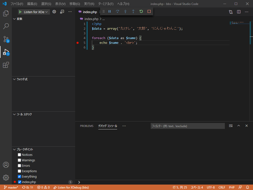
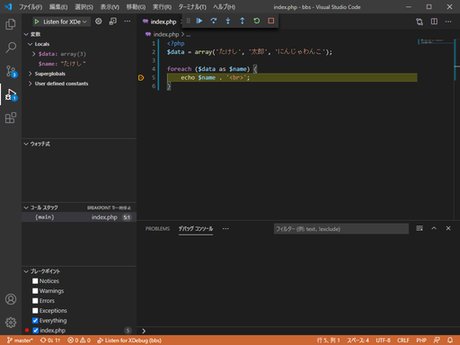
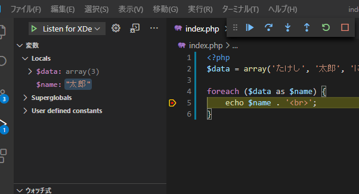
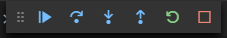

# VSCodeの拡張機能②「PHP Debug」でデバッグをしてみる

そこまで大きいプログラムにはならないとは思うけど、デバッグは大事。

## 環境

* ローカル
  * Windows 10
  * VSCode 1.51.1
  * XAMPP 7.4.13　※[XAMPP 8.0.0はデバッグできない可能性あり](troubleshooting.html)

## PHP Debug

同じ名前で別の拡張機能がいくつかある。DL数が300万を超えているものが正解。

インストールして使うには以下の手順が必要。

1. PHP Debugをインストール
2. XDebugを有効化
3. `launch.json`の編集

### PHP Debugをインストール

これはインストールボタンを押すだけ。

### XDebugを有効化

`C:\xampp\php\php.ini`に以下を追記。

~~~php
[XDebug]
xdebug.remote_enable = 1
xdebug.remote_autostart = 1
zend_extension = C:\xampp\php\ext\php_xdebug.dll
~~~

そしてApacheを再起動。

確認するためには、ドキュメントルートに`phpinfo();`と書かれた`index.php`を作成し、ブラウザから`localhost/index.php`にアクセスしPHP情報を表示させて、XDebugの欄が増えているか確認する。

※以下の画像のXDebugのバージョンが3.0.1となっているけど、XAMPP付属のXDebugはそれよりバージョンが低い可能性がある。でもそれで特に問題ない。

### `launch.json`の編集

VSCodeの左側のアイコンから「実行」（Gitの下）をクリックし、「launch.jsonファイルを作成します」をクリック。

画面上部に何か表示されるので、`bbs`を選択。

環境の選択で「PHP」を選択。

`launch.json`が開くので、そのまま保存して閉じる。

~~~json
{
    // IntelliSense を使用して利用可能な属性を学べます。
    // 既存の属性の説明をホバーして表示します。
    // 詳細情報は次を確認してください: https://go.microsoft.com/fwlink/?linkid=830387
    "version": "0.2.0",
    "configurations": [
        {
            "name": "Listen for XDebug",
            "type": "php",
            "request": "launch",
            "port": 9000
        },
        {
            "name": "Launch currently open script",
            "type": "php",
            "request": "launch",
            "program": "${file}",
            "cwd": "${fileDirname}",
            "port": 9000
        }
    ]
}
~~~

保存をしてVSCodeを再起動。

## デバッグをする

適当にコードを書き、行番号の左側をクリックするとブレークポイントが設定できる。これで実行中に処理がここまで来たら止まる。

デバッグペインの上部のドロップボックスから「Launch currently open script」を選択し、開始ボタンをクリック。

VSCode下部のアクティビティーバーがオレンジになる。

この状態のままブラウザから`localhost/index.php`にアクセスしてみる。

そうすると、ブラウザ上では変化が起きないが、VSCode上で処理が途中で止まる。

画面上部に表示されているステップインをクリックすれば1行ずつ実行していく。コードが少ないので少し分かりにくいけど、今は`foreach`ループの2回目の状態。左側に現在の`$name`に格納されている変数が表示されていて、`$data`配列の2つ目の要素が格納されているのが分かる。

こうやって1行1行処理を実行して、動かしながら問題がある個所を特定するのが正しいデバッグ。動かないからと言って適当にコードを変えて何回も実行するのはあまりよろしくない。

### 最低限の使い方

再生ボタンみたいなのが「続行」。そこから順番に

* 続行・・・現在の行から処理を再開する
* ステップオーバー・・・1行ずつ実行（自作関数などはジャンプせずにまとめて実行する）
* ステップイン・・・1行ずつ実行（自作関数などがあればそちらにジャンプする）
* ステップアウト・・・ジャンプ先の残りの処理をすべて終わらせ、ジャンプ元に戻る
* 再起動・・・もう一度最初からやり直し
* 停止・・・停止

この中でステップオーバーとステップアウトはデバッグに慣れてからでよい。つまりステップインさえ分かっておけばOK。

1. コードの途中でブレークポイントを作る
2. 途中まで実行し、ブレークポイントからステップインで1行ずつ実行
3. 処理がどうなっているのか見る

そうやってデバッグしてるとだんだん「いちいち1行ずつ実行して鬱陶しいなぁ」なんて思うようになるから、そうなったらステップアウトやステップオーバーの使い方を見てみるといい。

このPHP編でも、機会があればデバッグの実例を（身をもって）紹介していきたい。