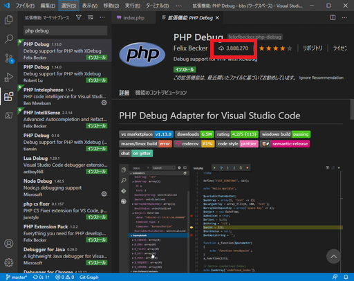
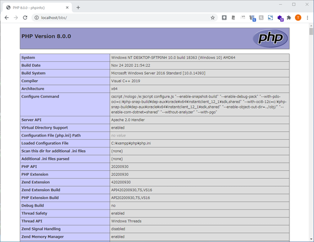
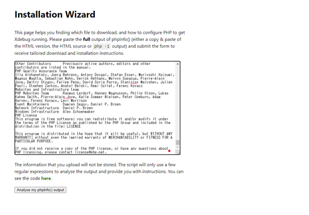
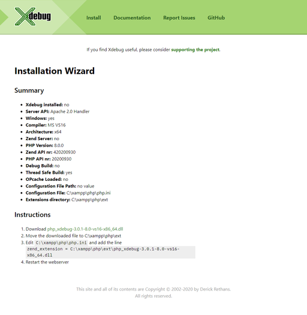
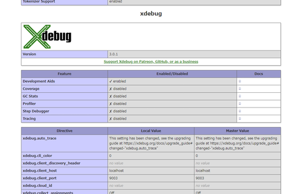
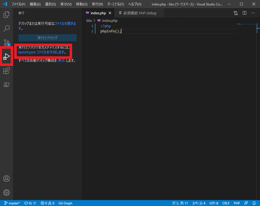
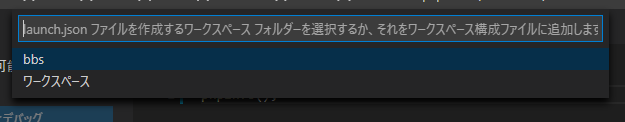
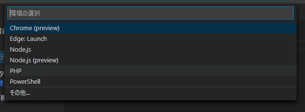
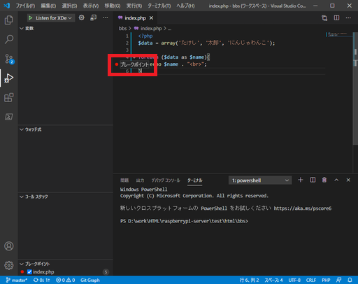
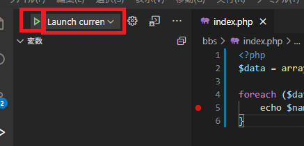

# VSCodeの拡張機能②「PHP Debug」でデバッグをしてみる

そこまで大きいプログラムにはならないとは思うけど、デバッグは大事。

## 環境

* ローカル
  * Windows 10
  * VSCode 1.51.1
  * PHP 8.0.0

## PHP Debug

同じ名前で別の拡張機能がいくつかある。DL数が300万を超えているものが正解。

インストールして使うにはいくつか手順が必要。

1. PHP Debugをインストール
2. XDebugをインストール
3. `launch.json`の編集

### PHP Debugをインストール

これはインストールボタンを押すだけ。

### XDebugをインストール

これはまず`index.php`に`phpinfo();`と書き込み保存。ブラウザからアクセスしてPHPの情報を表示させる。

これを`Ctrl + A`で丸ごと全部選択し、`Ctrl + C`でコピー。

然る後、[Xdebug: Support — Tailored Installation Instructions](https://xdebug.org/wizard)に飛び、コピーした内容をペーストし「Analyse my phpinfo() output」をクリック。

そうすると自分の環境に合わせてカスタマイズしたXDebugがダウンロードできる。素敵。

DLLがダウンロードできるので、それを`C:\xampp\php\ext`に保存。（または各自のXAMPPのインストールフォルダ配下の`\php\ext`フォルダ。以下適宜読み替え）

その後、`C:\xampp\php\php.ini`を開き、以下の行を追加。DLL名は各自の環境により変わる可能性あり。

~~~php
[XDebug]
xdebug.remote_enable = 1
xdebug.remote_autostart = 1
zend_extension = C:\xampp\php\ext\php_xdebug-3.0.1-8.0-vs16-x86_64.dll
~~~

そしてApacheを再起動。

再度`phpinfo();`が書かれた`index.php`をブラウザで表示させて、XDebugの欄が増えているか確認する。（表示されない人はApacheの再起動をするか、ブラウザをリロードする）

### `launch.json`の編集

VSCodeの左側のアイコンから「実行」（Gitの下）をクリックし、「launch.jsonファイルを作成します」をクリック。

画面上部に何か表示されるので、`bbs`を選択。

環境の選択で「PHP」を選択。

`launch.json`が開くので中身を以下のようにする。

※実際にはある程度最初から書かれていて、追記するのは`Listen for XDebug`ブロックの`"pathMappings"`の項目と、`Launch currently open script`ブロックの`"pathMappings"`と`"runtimeExecutable"`の項目だけ。

~~~json
{
    // IntelliSense を使用して利用可能な属性を学べます。
    // 既存の属性の説明をホバーして表示します。
    // 詳細情報は次を確認してください: https://go.microsoft.com/fwlink/?linkid=830387
    "version": "0.2.0",
    "configurations": [
        {
            "name": "Listen for XDebug",
            "type": "php",
            "request": "launch",
            "port": 9000,
            "pathMappings": {
                "${workspaceRoot}" : "${workspaceRoot}"
            }
        },
        {
            "name": "Launch currently open script",
            "type": "php",
            "request": "launch",
            "program": "${file}",
            "cwd": "${fileDirname}",
            "port": 9000,
            "pathMappings": {
                "C:\\xampp\\htdocs\\test" : "${workspaceRoot}"
            },
            "runtimeExecutable": "C:\\xampp\\php\\php.exe"
        }
    ]
}
~~~

保存をして一応VSCodeを再起動。

## デバッグをする

適当にコードを書き、行番号の左側をクリックするとブレークポイントが設定できる。これで実行中に処理がここまで来たら止まる。

デバッグペインの上部のドロップボックスから「Launch currently open script」を選択し、開始ボタンをクリック。

