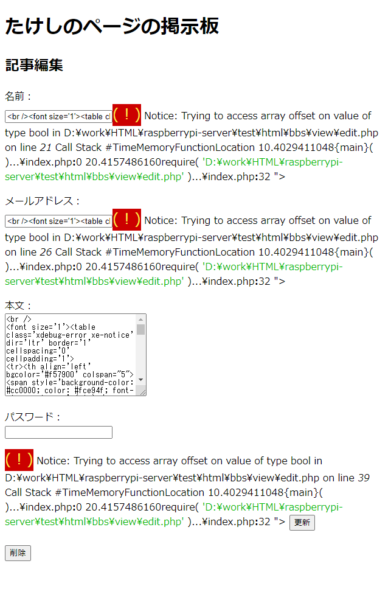

# 記事削除機能をビューに組み込んで統合テスト

## 環境

- ローカル
  - Windows 10
  - VSCode 1.51.1
  - XAMPP 7.4.13
  - MariaDB 10.4.17
- リモートにはアップしない

## Viewに組み込む

今までHTML上のボタンには`input`タグを使ってきたけど、HTML5から導入された`button`タグを使えば、ボタンに値を埋め込むことができるらしい。

`view/edit.php`

~~~php+HTML
    

        <input type="hidden" name="eventId" value="update">
        <input type="hidden" name="id"
               value="<?php echo $post_data['id'] ?>">
        <input type="submit" value="送信">
    

</form>

↓

    

        <input type="hidden" name="id"
               value="<?php echo $post_data['id'] ?>">
        <button name="eventId" value="update">更新</button>  
        <button name="eventId" value="delete">削除</button>
    

</form>
~~~

こういう風に、ボタンに`eventId`の値をセットして、クリックされたボタンに応じて処理を変化させる。

コントローラーにも分岐を作る。

`index.php`

~~~php
switch ($eventId) {
    case 'save':
        $saveResult = $action->SaveDBPostData($_POST);
        require('./view/post.php');
        break;
    case 'update':
        $updateResult = $action->UpdateDBPostData($_POST);
        require('./view/post.php');
        break;
        
    // 以下を追記
        
    case 'delete':
        $deleteResult = $action->DeleteDBPostData((int)$_POST['id'], $_POST['password']);
        require('./view/post.php');
        break;
        
    // ここまで
    default:
        $params = $action->GetParam();
        switch ($params['mode']) {
            case 'edit':
                require('./view/edit.php');
                break;
            default:
                require('./view/post.php');
                break;
        }
        break;
}
~~~

`save`や`update`では`$_POST`を丸ごと渡しているのに、`delete`では一部だけを抜き出してるのがすごい気になるけど、後で直そう。

## 試してみる

XAMPPを起動して`localhost/bbs`にアクセス。適当に記事を投稿。

投稿が反映された。このまま「編集・削除」をクリック。

先ほど入力したパスワードを再度入力して削除ボタンをクリック。

消えた―！

試しに`localhost/bbs/edit/183`にアクセスしてみる。

ギャー！

## どうにかする

どうも削除済みの記事IDを使って`/bbs/edit/(記事ID)`にアクセスするとこうなるらしい。コントローラーの分岐ミスか？

`index.php`

~~~php
switch ($eventId) {
    case 'save':
        $saveResult = $action->SaveDBPostData($_POST);
        require('./view/post.php');
        break;
    case 'update':
        $updateResult = $action->UpdateDBPostData($_POST);
        require('./view/post.php');
        break;
    default:
        $params = $action->GetParam();
        switch ($params['mode']) {
            case 'edit':
                require('./view/edit.php');
                break;
            default:
                require('./view/post.php');
                break;
        }
        break;
}
~~~

これは編集画面に行くとき、IDが有効化どうかノーチェックでページ遷移している。なので、`require`する前に`GetDBOnePostData`で記事取得を試みて、上手くいけば編集画面へ、失敗したら通常のビューへ移動するようにしよう。

変更後。

~~~php
switch ($eventId) {
    case 'save':
        $saveResult = $action->SaveDBPostData($_POST);
        require('./view/post.php');
        break;
    case 'update':
        $updateResult = $action->UpdateDBPostData($_POST);
        require('./view/post.php');
        break;
    case 'delete':
        $deleteResult = $action->DeleteDBPostData((int)$_POST['id'], $_POST['password']);
        require('./view/post.php');
        break;
    default:
        $params = $action->GetParam();
        switch ($params['mode']) {
            case 'edit':
                
                // 以下を変更
                $post_data = $action->GetDBOnePostData($params['id']);
                if (is_array($post_data)) {
                    require('./view/edit.php');
                    break;
                }
                // no break
                // ここまで
            default:
                require('./view/post.php');
                break;
        }
        break;
}
~~~

`no break`はVSCodeの拡張機能であるphp cs fixerが勝手に入れたもの。でもここを`no break`にすることによって、`$post_data = false`だったときにIF節に入らず`default:`に流れるはず。

`view/edit.php`から記事取得処理を削除。

~~~php+HTML
<!-- 以下を削除 -->
<?php
$post_data = $action->GetDBOnePostData($params['id']);
?>
<!-- ここまで -->
<!DOCTYPE html>
<html lang="ja">

<head>
    <meta charset="UTF-8">
    <title>たけしのページの掲示板</title>
</head>
~~~

そして、通常ビューでエラーメッセージを表示。

~~~php+HTML
<!-- エラーメッセージ表示エリア -->
<?php if (isset($saveResult) && $saveResult == false) :?>

    
記事投稿に失敗しました。

<?php elseif (isset($updateResult) && $updateResult == false) :?>

    
記事編集に失敗しました。

<!-- 以下を追記 -->
<?php elseif (isset($post_data) && $post_data == false) : ?>

    
無効なパラメーターが指定されました。

<!-- ここまで -->

<?php endif; ?>
<!-- エラーメッセージ終了 -->
~~~

さて、どうか。

ありゃ、エラーメッセージが表示されない。

この原因は`view/post.php`で、以下のコードが「不正な記事IDで編集画面に移ろうとしたときは、`$post_data`には`false`が入っているはず」という前提になっているが・・・

~~~php+HTML
    <?php elseif (isset($post_data) && $post_data == false) : ?>
    

        
無効なパラメーターが指定されました。

    

~~~

普通にページの冒頭で表示記事取得のために`$post_data`を使ってて、要は変数が被ってるってこと。

`view/post.php`

~~~php+HTML
<?php
$post_data = $action->GetDBPostData();
?>
<!DOCTYPE html>
<html lang="ja">

<head>
    <meta charset="UTF-8">
    <title>たけしのページの掲示板</title>
</head>
~~~

ダメじゃん。

ということで再びコード変更。

`index.php`

~~~php
case 'edit':
	// $post_dataではなく$edit_dataにする
    $edit_data = $action->GetDBOnePostData($params['id']);
    if (is_array($edit_data)) {
        require('./view/edit.php');
        break;
    }
    // no break
~~~

`view/edit.php`

~~~php+HTML
<!-- $post_dataを全て$edit_dataに変える -->

<form action="../index.php" method="post" id="post_form">
    

        名前： 
        <input type="text" name="name" id="name"
               value="<?php echo $edit_data['name'] ?>">
    

    

        メールアドレス： 
        <input type="email" name="email" id="email"
               value="<?php echo $edit_data['email'] ?>">
    

    

        本文： 
        <textarea name="body" id="body" cols="30"
                  rows="10"><?php echo $edit_data['body'] ?></textarea>
    

    

        パスワード： 
        <input type="password" name="password" id="password">
    

    

        <input type="hidden" name="id"
               value="<?php echo $edit_data['id'] ?>">
        <button name="eventId" value="update">更新</button>  
        <button name="eventId" value="delete">削除</button>
    

</form>
~~~

`view/post.php`

~~~php+HTML
<!-- エラーメッセージ表示エリア -->
<?php if (isset($saveResult) && $saveResult == false) :?>

    
記事投稿に失敗しました。

<?php elseif (isset($updateResult) && $updateResult == false) :?>

    
記事編集に失敗しました。

<!-- $post_dataを$edit_dataに変える -->
<?php elseif (isset($edit_data) && $post_data == false) : ?>

    
無効なパラメーターが指定されました。

<?php endif; ?>
<!-- エラーメッセージ終了 -->
~~~

どうだ。

よしよし。

本当は「無効なIDです」だけ表示するページを用意して、通常ページにリダイレクトするようにした方がURL的にも良いんだろうけど、とりあえず。

