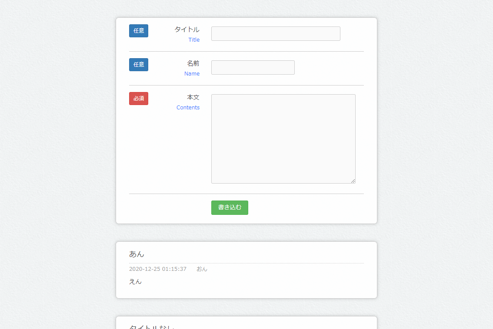
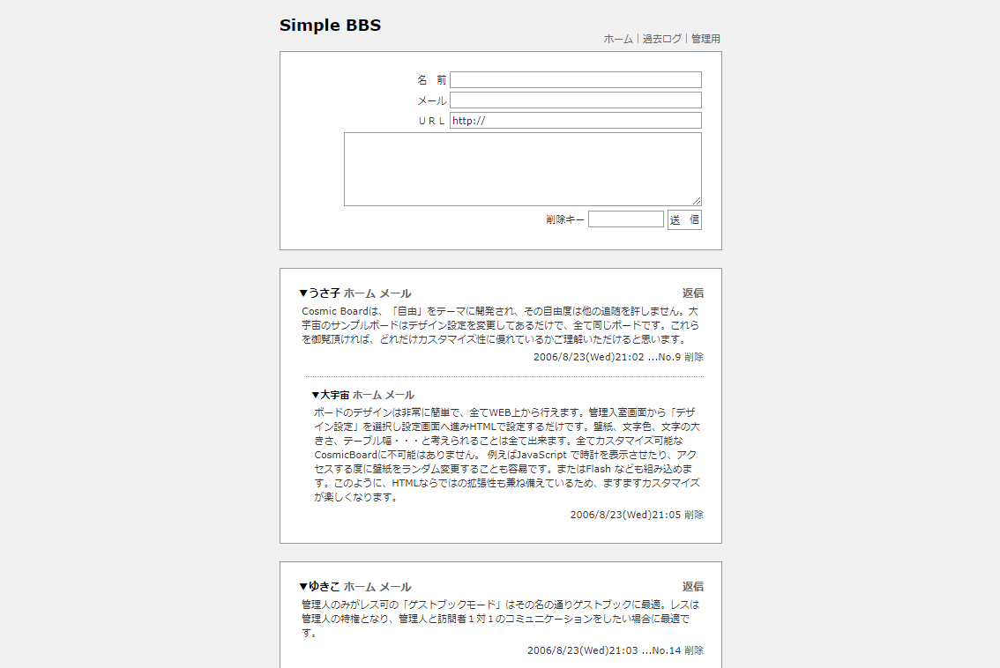
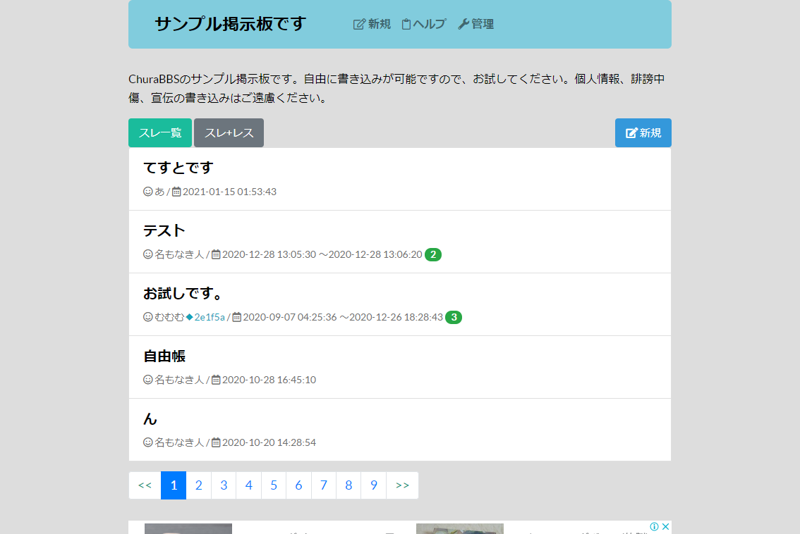

# BBSのデザインを参考にしたい

[コメントBBS](https://www.1-firststep.com/samplephp/comment-bbs-v2.0/)

[Simple BBS](http://www.bigcosmic.com/board/s/board.cgi?id=sampl085#del)

[サンプル掲示板です](https://churabbs.com/sample)

## セキュリティについて

* XSS
  * HTML特殊文字をエスケープ
* スパム・荒らし
  * IPで書き込み特定、禁止機能
* CSRF
  * 他サイトからのリクエストを禁止
  * トークン
  * [IPA ISEC　セキュア・プログラミング講座：Webアプリケーション編　第4章 セッション対策：リクエスト強要（CSRF）対策](https://www.ipa.go.jp/security/awareness/vendor/programmingv2/contents/301.html)
  * [これで完璧！今さら振り返る CSRF 対策と同一オリジンポリシーの基礎 \- Qiita](https://qiita.com/mpyw/items/0595f07736cfa5b1f50c)
    [とっても簡単なCSRF対策 \- Qiita](https://qiita.com/mpyw/items/8f8989f8575159ce95fc)
  * 
* 管理者モード