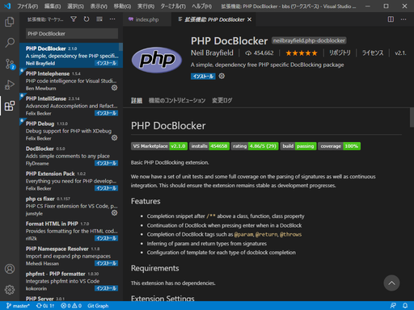
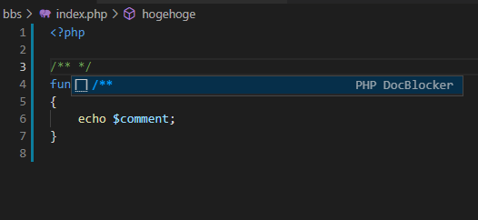
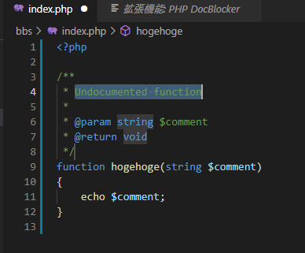
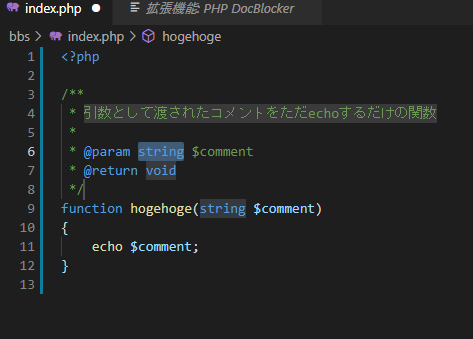
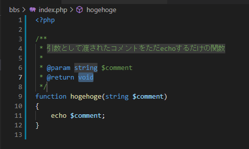
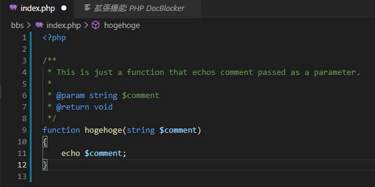

## VSCodeの拡張機能④「PHP DocBlocker」でコードの説明を書く

便利そうだったのと、Intelephenseがコードの説明を自動で読み取ってヒントとして出してくれるっぽいので。

## 環境

- ローカル
  - Windows 10
  - VSCode 1.51.1
  - XAMPP 7.4.13

## 導入手順

拡張機能で「PHP DocBlocker」と検索して出てくる、**DL40万overのもの**をインストールするだけ。やっぱり今回も似た名前のものがあってややこしい。

## 実験

適当にコードを書く。

~~~php
<?php

function hogehoge(string $comment)
{
    echo $comment;
}

~~~

この`function`の上に`/**`と打ちエンターを押すと、自動でDocBlockを挿入してくれる。`/**`と打つと、自動で残りの`*/`が補完され、PHP DocBlockerが候補を表示した。

エンターを押すとDocBlockが挿入される。

自動で必要なところを選択状態にしてくれるので、Tabキーで次に移れる。

英語で書くとそれっぽい。

## 使いどころ

関数を書き終えてから`/**`でDocBlockを作成。

関数を修正し、DocBlockを大幅に書き換えないといけないときは、一旦DocBlockを消して再度`/**`で挿入・編集、というところか。