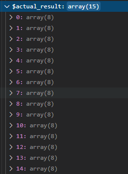

# 記事編集機能の追加

いよいよ実装する。

※今回はコーディングとテストとデバッグを行ったり来たりしてめちゃめちゃ長いので注意。

## 環境

- ローカル
  - Windows 10
  - VSCode 1.51.1
  - XAMPP 7.4.13
  - MariaDB 10.4.17
- リモートにはアップしない

## `GetParam`

とりあえず書いてみる。

~~~php
public function GetParam()
{
    $ret = array(
        'mode' => '',
        'id' => ''
    );
    $params = explode('/', $_SERVER['REQUEST_URI'], 5);
    if ($params[1] != 'bbs') {
        return $ret;
    }
    if ($params[2] != 'edit') {
        return $ret;
    }
    if (! is_int($params[3])) {
        return $ret;
    }

    $ret['mode'] = $params[2];
    $ret['id'] = $params[3];

    return $ret;
}
~~~

頑張ってテストを書いた割には実装はこんなもんか。テストしてみる。

~~~shell
> ./phpunit tests/
PHPUnit 9.0.0 by Sebastian Bergmann and contributors.

.......FFF...ES                                                   15 / 15 (100%)

Time: 00:00.637, Memory: 4.00 MB

There was 1 error:

1) GetFormActionTest::testGetDBOnePostData
Trying to access array offset on value of type null

D:\work\HTML\raspberrypi-server\test\html\bbs\tests\GetFormActionTest.php:249

--

There were 3 failures:

1) GetFormActionTest::testGetParam with data set "successful" (array('/bbs/edit/1234'), array('edit', 1234))
Failed asserting that two strings are equal.
--- Expected
+++ Actual
@@ @@
-'edit'
+''

D:\work\HTML\raspberrypi-server\test\html\bbs\tests\GetFormActionTest.php:173

2) GetFormActionTest::testGetParam with data set "successfulWithSlash" (array('/bbs/edit/5678/'), array('edit', 5678))
Failed asserting that two strings are equal.
--- Expected
+++ Actual
@@ @@
-'edit'
+''

D:\work\HTML\raspberrypi-server\test\html\bbs\tests\GetFormActionTest.php:173

3) GetFormActionTest::testGetParam with data set "successfulWithRedundant" (array('/bbs/edit/1122/hogehoge'), array('edit', 1122))
--- Expected
+++ Actual
@@ @@
+''

D:\work\HTML\raspberrypi-server\test\html\bbs\tests\GetFormActionTest.php:173

ERRORS!
Tests: 15, Assertions: 29, Errors: 1, Failures: 3, Skipped: 1.
~~~

む、なんか見慣れない結果。

~~~
There were 3 failures:

1) GetFormActionTest::testGetParam with data set "successful" (array('/bbs/edit/1234'), array('edit', 1234))
Failed asserting that two strings are equal.
--- Expected
+++ Actual
@@ @@
-'edit'
+''

D:\work\HTML\raspberrypi-server\test\html\bbs\tests\GetFormActionTest.php:173
~~~

期待してる結果と違うと出た。成功例をテストしているのに、どうも空の配列が返ってきてるっぽい。

ブレークポイントを設定してデバッグしてみる。

※画像の中のコードは盛大に間違えてるけど無視してください。

`if (! is_int($params[3]))`のところで躓いているっぽい。`$params`の中身を見てみると・・・

IDにあたるところがどうも文字列っぽい。

[PHP: explode \- Manual](https://www.php.net/manual/ja/function.explode.php)

`explode`関数の戻り値は文字列だった。よく考えたらそりゃそうか。

以下を修正。

`model/GetFormAction.php -> GetParam`

~~~php
if (! is_int($params[3])) {
    return $ret;
}

↓
    
if ((int)$params[3] == 0) {
    return $ret;
}
~~~

再度テスト。

~~~shell
> ./phpunit tests/
PHPUnit 9.0.0 by Sebastian Bergmann and contributors.

............FES                                                   15 / 15 (100%)

Time: 00:00.208, Memory: 4.00 MB

There was 1 error:

1) GetFormActionTest::testGetDBOnePostData
Trying to access array offset on value of type null

D:\work\HTML\raspberrypi-server\test\html\bbs\tests\GetFormActionTest.php:249

--

There was 1 failure:

1) GetFormActionTest::testGetParam with data set "wrongID" (array('/bbs/edit/123abc'), array('', ''))        
Failed asserting that two strings are equal.
--- Expected
+++ Actual
@@ @@
-''
+'edit'

D:\work\HTML\raspberrypi-server\test\html\bbs\tests\GetFormActionTest.php:173

ERRORS!
Tests: 15, Assertions: 31, Errors: 1, Failures: 1, Skipped: 1.
~~~

今度は違う失敗パターンが出た。

~~~
1) GetFormActionTest::testGetParam with data set "wrongID" (array('/bbs/edit/123abc'), array('', ''))        
Failed asserting that two strings are equal.
--- Expected
+++ Actual
@@ @@
-''
+'edit'
~~~

今度はIDが不正なのに、空の配列が返っていない。

おそらく文字列`"123abc"`を`int`にキャストすると`123`になってしまうんじゃなかろうか。

ということで、渡された文字列が全て数字かどうか調べる`ctype_digit`という関数を使う。

`model/GetFormAction.php -> GetParam`

~~~php
if ((int)$params[3] == 0) {
    return $ret;
}

↓

if (! ctype_digit($params[3])) {
    return $ret;
}
~~~

テストをすると、やっと通った。エラーが出ているのはまだ未実装の部分。

~~~shell
> ./phpunit tests/
PHPUnit 9.0.0 by Sebastian Bergmann and contributors.

.............ES                                                   15 / 15 (100%)

Time: 00:00.860, Memory: 4.00 MB

There was 1 error:
~~~

### `GetDBOnePostData`

~~~php
public function GetDBOnePostData(int $postId)
{
    $stm = $this->pdo->prepare('select * from posts where :id');
    $stm->bindParam(':id', $postId, PDO::PARAM_INT);
    $stm->execute();
    $result = $stm->fetchAll(PDO::FETCH_ASSOC);

    return $result;
}
~~~

テストしてみる。

~~~shell
> ./phpunit tests/
PHPUnit 9.0.0 by Sebastian Bergmann and contributors.

.............ES                                                   15 / 15 (100%)

Time: 00:00.231, Memory: 4.00 MB

There was 1 error:

1) GetFormActionTest::testGetDBOnePostData
Undefined index: name

D:\work\HTML\raspberrypi-server\test\html\bbs\tests\GetFormActionTest.php:249

ERRORS!
Tests: 15, Assertions: 32, Errors: 1, Skipped: 1.
~~~

ん？

~~~
1) GetFormActionTest::testGetDBOnePostData
Undefined index: name
~~~

未定義のインデックス`name`とは？

`tests/GetFormActionTest.php -> testGetDBOnePostData`

~~~php
// 4. SQL文で直接記事を取得を試みる
$sql = "select * from posts where name = '$data[name]' and email = '$data[email]' and body = '$data[post_body]'";
$stmt = self::$pdo->query($sql);
$actual_fetch = $stmt->fetch();

// 5. GetDBOnePostDataで1レコードのみ取得
$actual_result = $action->GetDBOnePostData($actual_fetch['id']);

// 6. SQL文で取得したデータと比較
$this->assertEquals($actual_fetch['name'], $actual_result['name']);
$this->assertEquals($actual_fetch['email'], $actual_result['email']);
$this->assertEquals($actual_fetch['body'], $actual_result['body']);
$this->assertEquals($actual_fetch['password'], $actual_result['password']);
~~~

エラー箇所は

~~~php
// 6. SQL文で取得したデータと比較
$this->assertEquals($actual_fetch['name'], $actual_result['name']);
~~~

デバッグしてみる。

やばい、`$actual_result`が多すぎ。これは・・・絞り込めてない。

`model/GetFormAction.php`

~~~php
public function GetDBOnePostData(int $postId)
{
    $stm = $this->pdo->prepare('select * from posts where :id');　←間違い
    $stm->bindParam(':id', $postId, PDO::PARAM_INT);
    $stm->execute();
    $result = $stm->fetchAll(PDO::FETCH_ASSOC);

    return $result;
}
~~~

`where :id`ってなんやねん。`where id = :id`でしょ。

修正して再度テスト。

~~~shell
> ./phpunit tests/
PHPUnit 9.0.0 by Sebastian Bergmann and contributors.

.............ES                                                   15 / 15 (100%)

Time: 00:00.203, Memory: 4.00 MB

There was 1 error:

1) GetFormActionTest::testGetDBOnePostData
Undefined index: name

D:\work\HTML\raspberrypi-server\test\html\bbs\tests\GetFormActionTest.php:249

ERRORS!
Tests: 15, Assertions: 32, Errors: 1, Skipped: 1.
~~~

あれ、また同じエラー。再度デバッグ。

あ、`$actual_result[0]['name']`になっているのね。

`model/GetFormAction.php`

~~~php
public function GetDBOnePostData(int $postId)
{
    $stm = $this->pdo->prepare('select * from posts where id = :id');
    $stm->bindParam(':id', $postId, PDO::PARAM_INT);
    $stm->execute();
    $result = $stm->fetchAll(PDO::FETCH_ASSOC);　←ここ

    return $result;
}
~~~

`fetchAll`にしてるからか。`fetch`にして1つだけ取るように修正。

再度テスト。

~~~shell
> ./phpunit tests/
PHPUnit 9.0.0 by Sebastian Bergmann and contributors.

.............ES                                                   15 / 15 (100%)

Time: 00:00.249, Memory: 4.00 MB

There was 1 error:

1) GetFormActionTest::testGetDBOnePostData
TypeError: Argument 1 passed to GetFormAction::GetDBOnePostData() must be of the type int, string given, called in D:\work\HTML\raspberrypi-server\test\html\bbs\tests\GetFormActionTest.php on line 255

D:\work\HTML\raspberrypi-server\test\html\bbs\model\GetFormAction.php:69
D:\work\HTML\raspberrypi-server\test\html\bbs\tests\GetFormActionTest.php:255

ERRORS!
Tests: 15, Assertions: 36, Errors: 1, Skipped: 1.
~~~

もー、なんやねん。

~~~
TypeError: Argument 1 passed to GetFormAction::GetDBOnePostData() must be of the type int, string given, called in D:\work\HTML\raspberrypi-server\test\html\bbs\tests\GetFormActionTest.php on line 255
~~~

型違反。「`int`が渡されるはずなのに`string`が渡されたぞ」と言っている。どういうこと？

`tests/GetFormActionTest.php -> testGetDBOnePostData`

~~~php
// 7. 引数に空欄が渡されたら
$failure = $action->GetDBOnePostData('');

// 8. 失敗する
$this->assertFalse($failure);
~~~

あー、確かに。`''`を渡している。

でも、そもそもこのテスト要るか？不正なIDだったら`['mode']`も`['id']`も何もない文字列が入るから、それを見て`GetDBOnePostData`を呼び出さないという実装にしてしまえばいいんじゃないか？

ということでこのテストは削除。

完成形

`model/GetFormAction.php`

~~~php
public function GetDBOnePostData(int $postId)
{
    $stm = $this->pdo->prepare('select * from posts where id = :id');
    $stm->bindParam(':id', $postId, PDO::PARAM_INT);
    $stm->execute();
    $result = $stm->fetch(PDO::FETCH_ASSOC);

    return $result;
}
~~~

テスト

~~~shell
> ./phpunit tests/
PHPUnit 9.0.0 by Sebastian Bergmann and contributors.

..............F                                                   15 / 15 (100%)

Time: 00:00.226, Memory: 4.00 MB

There was 1 failure:
~~~

とりあえずOK。

### `UpdateDBPostData`

`model/GetFormAction.php`

~~~php
public function UpdateDBPostData(array $data)
{
    // 渡されたデータが正当なものかどうか
    if (($data['id'] == '') or ($data['name'] == '') or ($data['email'] == '') or ($data['post_body'] == '') or ($data['password'] == '')) {
        return false;
    }
    if ((! ctype_digit($data['id'])) or ((mb_strlen($data['name'])) > 100) or ((mb_strlen($data['email']) > 256)) or (mb_strlen($data['post_body']) > 5000) or (mb_strlen($data['password']) > 50) or (mb_strlen($data['password']) < 4)) {
        return false;
    }

    // パスワードを確認
    $old_data = $this->GetDBOnePostData((int)$data['id']);
    if ($data['password'] != $old_data['password']) {
        return false;
    }

    // 編集された記事をDBに保存
    $smt = $this->pdo->prepare('update posts set name=:name, email=:email, body=:body where id=:id');
    $smt->bindParam(':name', $data['name'], PDO::PARAM_STR);
    $smt->bindParam(':email', $data['email'], PDO::PARAM_STR);
    $smt->bindParam(':body', $data['post_body'], PDO::PARAM_STR);
    $smt->bindParam(':id', (int)$data['id'], PDO::PARAM_STR);
    return $smt->execute();
}
~~~

テスト。

~~~shell
> ./phpunit tests/
PHPUnit 9.0.0 by Sebastian Bergmann and contributors.

..............F                                                   15 / 15 (100%)

Time: 00:00.572, Memory: 4.00 MB

There was 1 failure:

1) GetFormActionTest::testUpdateDBPostData
Failed asserting that false is true.

D:\work\HTML\raspberrypi-server\test\html\bbs\tests\GetFormActionTest.php:277

FAILURES!
Tests: 15, Assertions: 37, Failures: 1.
~~~

ありゃ。失敗した。

`tests/GetFormActionTest.php -> testUpdateDBPostData`

~~~php
// 2. 変更後のデータを準備
$data = array(
    'id' => $originalPostData['id'],
    'name' => 'UpdatePostData',
    'email' => 'update@update',
    'post_body' => 'updateupdate',
    'password' => $originalPostData['password']
);

// 3. 更新
$result = $action->UpdateDBPostData($data);
$this->assertTrue($result);
~~~

`id`が`int`になっているのか？デバッグしてみる。

マウスカーソルを乗せたら型が見えた。やっぱり`int`になっている。これでは`ctype_digit`のチェックで引っかかってしまう。

`ctype_digit`の引数は文字列ではないといけない。一応-128～256までの`int`は渡せるけど、それはASCIIコードとして解釈されてしまう。

[PHP: ctype\_digit \- Manual](https://www.php.net/manual/ja/function.ctype-digit.php)

でも実際はHTMLから渡されるデータとしては文字列のはず。ということはテストの方を少し変える。

`tests/GetFormActionTest.php -> testUpdateDBPostData`

~~~php
// 2. 変更後のデータを準備
$data = array(
    'id' => (string)$originalPostData['id'],　←文字列型にキャスト
    'name' => 'UpdatePostData',
    'email' => 'update@update',
    'post_body' => 'updateupdate',
    'password' => $originalPostData['password']
);

// 3. 更新
$result = $action->UpdateDBPostData($data);
$this->assertTrue($result);
~~~

さて、どうか。

~~~shell
> ./phpunit tests/
PHPUnit 9.0.0 by Sebastian Bergmann and contributors.

..............E                                                   15 / 15 (100%)

Time: 00:00.619, Memory: 4.00 MB

There was 1 error:

1) GetFormActionTest::testUpdateDBPostData
Error: Cannot pass parameter 2 by reference

D:\work\HTML\raspberrypi-server\test\html\bbs\model\GetFormAction.php:103
D:\work\HTML\raspberrypi-server\test\html\bbs\tests\GetFormActionTest.php:276

ERRORS!
Tests: 15, Assertions: 36, Errors: 1.
~~~

うーむ。まだか。

`model/GetFormAction.php -> UpdateDBPostData`

~~~php
// パスワードを確認
$old_data = $this->GetDBOnePostData((int)$data['id']);
if ($data['password'] != $old_data['password']) {
    return false;
}

// 編集された記事をDBに保存
$smt = $this->pdo->prepare('update posts set name=:name, email=:email, body=:body where id=:id');
$smt->bindParam(':name', $data['name'], PDO::PARAM_STR);
$smt->bindParam(':email', $data['email'], PDO::PARAM_STR);
$smt->bindParam(':body', $data['post_body'], PDO::PARAM_STR);
$smt->bindParam(':id', (int)$data['id'], PDO::PARAM_INT);　←ここ
return $smt->execute();
~~~

最後の方の`bindParam`でエラーが出ている模様。

調べてみると、バインドする場合は一度変数に入れてあげないといけないらしい。

`model/GetFormAction.php -> UpdateDBPostData`

~~~php
// パスワードを確認
$old_data = $this->GetDBOnePostData((int)$data['id']);
if ($data['password'] != $old_data['password']) {
    return false;
}

// 編集された記事をDBに保存
$smt = $this->pdo->prepare('update posts set name=:name, email=:email, body=:body where id=:id');
$smt->bindParam(':name', $data['name'], PDO::PARAM_STR);
$smt->bindParam(':email', $data['email'], PDO::PARAM_STR);
$smt->bindParam(':body', $data['post_body'], PDO::PARAM_STR);
$id = (int)$data['id'];
$smt->bindParam(':id', $id, PDO::PARAM_INT);
return $smt->execute();
~~~

これでどうか。

~~~shell
> ./phpunit tests/
PHPUnit 9.0.0 by Sebastian Bergmann and contributors.

..............E                                                   15 / 15 (100%)

Time: 00:00.212, Memory: 4.00 MB

There was 1 error:

1) GetFormActionTest::testUpdateDBPostData
Undefined index: post_body

D:\work\HTML\raspberrypi-server\test\html\bbs\tests\GetFormActionTest.php:287

ERRORS!
Tests: 15, Assertions: 39, Errors: 1.
~~~

もー、まだー？どこー？

`tests/GetFormActionTest.php -> testUpdateDBPostData`

~~~php
// 5. 評価
$this->assertEquals($data['name'], $actual_fetch['name']);
$this->assertEquals($data['email'], $actual_fetch['email']);
$this->assertEquals($data['post_body'], $actual_fetch['post_body']);
$this->assertNotEquals($originalPostData['name'], $actual_fetch['name']);
$this->assertNotEquals($originalPostData['email'], $actual_fetch['email']);
$this->assertNotEquals($originalPostData['post_body'], $actual_fetch['post_body']);　←ここ
~~~

あ、`'post_body'`はHTMLから渡されたときで、DBから取ってきたときは`'body'`か。統一しとけよ自分。

修正してテスト。

~~~shell
> ./phpunit tests/
PHPUnit 9.0.0 by Sebastian Bergmann and contributors.

..............E                                                   15 / 15 (100%)

Time: 00:00.238, Memory: 4.00 MB

There was 1 error:

1) GetFormActionTest::testUpdateDBPostData
Undefined index: post_body

D:\work\HTML\raspberrypi-server\test\html\bbs\model\GetFormAction.php:85
D:\work\HTML\raspberrypi-server\test\html\bbs\tests\GetFormActionTest.php:295

ERRORS!
Tests: 15, Assertions: 43, Errors: 1.
~~~

もー！どこ！？

`tests/GetFormActionTest.php -> testUpdateDBPostData`

~~~php
// 6. パスワードが違うと失敗する
$wrongData = $originalPostData;
$wrongData['password'] = "hugahuga";
$result = $action->UpdateDBPostData($wrongData);
$this->assertFalse($result);
~~~

この`$originalPostData`はもともとは一つ前のテストでDBから`fetch`してきたものが格納されている。つまり`$originalPostData['post_body']`ではなく、`$originalPostData['body']`で渡しているので、`UpdateDBPostData`の内部で参照できなくなっている。

`model/GetFormAction.php`

~~~php
if (($data['id'] == '') or ($data['name'] == '') or ($data['email'] == '') or ($data['post_body'] == '') or ($data['password'] == '')) {
    return false;
}
~~~

めんどくさいけど、これをちゃんと修正しようと思ったら・・・今までの全ての`post_body`を全部`body`に変えるのが良いけど・・・、めんどくさ。

と思ったらさすがVSCode。強力な検索＆置換機能で複数のファイルをまたいで一括置換ができるみたい。

しかもそれぞれの行をクリックすると、置換のプレビューが表示される。

そして、置換したくないところは「×」で無視できる。

最後の`
`はCSS用なのでこれは除外して、それ以外を置換。

今度こそ！

~~~shell
> ./phpunit tests/
PHPUnit 9.0.0 by Sebastian Bergmann and contributors.

...............                                                   15 / 15 (100%)

Time: 00:00.210, Memory: 4.00 MB

OK (15 tests, 50 assertions)
~~~

きたー！！！ありがとう俺！お疲れ俺！

## コミット＆プッシュ

忘れずに。

## DB掃除

途中でエラーが出ると投稿した記事データが削除されないので、DB内にゴミがむちゃくちゃ溜まってしまった。

とりあえず手動で掃除しておくけど、これもそのうち自動化しようかな。

ローカルのMySQLにrootでログインして以下を打つ。

~~~mysql
> use bbs
> delete from posts where name != 'takeshi';
~~~

## 後記

最初は「TDDやるぞ！って言ったからテスト書いたけど、どう見てもこれ実装に対するテストのコード量が割に合わないな」と思ってたけど、これだけテストして躓いて修正して、を繰り返してたら「テスト書いててよかった」って思えるようになってきた。

もしテスト無しで実装したとしても、手動で確認はするから時間的には同じかテスト無しの方がちょっと早いかもしれないけど、テストコードはこれからも残るから実装を変更してもテストが通れば機能面の保証ができて安心。

それにこの後コードを見直してリファクタリングもしようと思ってるから、その時もいちいち手作業で確認することを考えるとテストにある程度の時間をかける価値はあると思う。

ただ、テストをどこまで書くかはバランス感覚による。もちろん業務で要求されたら書かなきゃいけないけど、個人開発でテストコードにそんなに時間をかけるほどか？とも思う。

まあ開発しているものの用途次第かな。