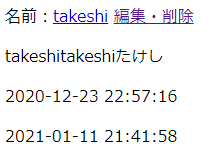

# 記事編集機能をビューに組み込んで統合テスト

統合テストと言うか、実際組み込んで使ってみるというだけだけど。

## 環境

- ローカル
  - Windows 10
  - VSCode 1.51.1
  - XAMPP 7.4.13
  - MariaDB 10.4.17
- リモートにはアップしない

## リンクを作成

適当に名前の横に「編集・削除」みたいなリンクを作る。

`view/post.php`

~~~php+HTML
(略)
<!-- 記事表示エリア -->

    <?php if (!empty($post_data)) : ?>
    

        <?php foreach ($post_data as $post) :?>
        

            
名前：<a
                     href="mailto:<?php echo $post['email']; ?>"><?php echo $post['name']; ?></a>
                <a
                   href="edit/<?php echo $post['id'] ?>">編集・削除</a>
            

        

(略)
~~~

Apacheの設定ファイル`httpd.conf`に以下を記述。ついでにドキュメントルートの`D:\work\HTML\raspberrypi-server\test\html\bbs`から`\bbs`を削除する。

~~~
(略)
DocumentRoot "D:\work\HTML\raspberrypi-server\test\html"

# ここから
<IfModule mod_rewrite.c>
	RewriteEngine On
	RewriteRule /bbs/edit/([0-9]+/?) /bbs/index.php [L]
</IfModule>
# ここまで

<Directory "D:\work\HTML\raspberrypi-server\test\html">
(略)
~~~

ブラウザから`localhost/bbs`にアクセス。ここでは特に何も変わらず。

次に「編集・削除」のリンクを踏む。Apacheの設定をしないでリンクを踏むと404が出るけど、設定すると`index.php`に戻ってくる。でも`$_SERVER['REQUEST_URI'] = "/bbs/edit/(id番号)"`となっている。

見た目が変わらないので、確認用コードを仕込んでみる。

`view/post.php`

~~~php+HTML
(略)
<body>
    <h1>たけしのページの掲示板</h1>
    
<?php echo $_SERVER['REQUEST_URI'] ?>
　←これを挿入
    <!-- 記事入力エリア -->
    

(略)
~~~

`localhost/bbs`にアクセス。

`localhost/bbs/edit/2`にアクセス。

OK。確認できたので、確認用コードは削除しておく。

## コントローラーに編集画面への分岐を記述

~~~php
<?php
require_once('./config/properties.php');
require_once('./model/GetFormAction.php');

$action = new GetFormAction();

$eventId = null;

// イベントIDを取得

if (isset($_POST['eventId'])) {
    $eventId = $_POST['eventId'];
}

switch ($eventId) {
    case 'save':
        $action->SaveDBPostData($_POST);
        require('./view/post.php');
        break;
    
    default:
        // 以下を追記
        $params = $action->GetParam();
        switch ($params['mode']) {
            case 'edit':
                require('./view/edit.php');
                break;
            default:
                require('./view/post.php');
                break;
        }
        // ここまで
        break;
}
~~~

もうちょっとスマートにやりたいけど、まあ後で直そう。

## 編集画面作成

`view`フォルダ内に`edit.php`を新規作成。ほぼ`post.php`のパクリでいく。

~~~php+HTML
<?php
$post_data = $action->GetDBOnePostData($params['id']);
?>
<!DOCTYPE html>
<html lang="ja">

<head>
    <meta charset="UTF-8">
    <title>たけしのページの掲示板</title>
</head>

<body>
    <h1>たけしのページの掲示板</h1>
    <h2>記事編集</h2>
    <!-- 記事入力エリア -->
    

        <form action="../index.php" method="post" id="post_form">
            

                名前： 
                <input type="text" name="name" id="name"
                    value="<?php echo $post_data['name'] ?>">
            

            

                メールアドレス： 
                <input type="email" name="email" id="email"
                    value="<?php echo $post_data['email'] ?>">
            

            

                本文： 
                <textarea name="body" id="body" cols="30"
                    rows="10"><?php echo $post_data['body'] ?></textarea>
            

            

                パスワード： 
                <input type="password" name="password" id="password">
            

            

                <input type="hidden" name="eventId" value="update">
                <input type="hidden" name="id"
                    value="<?php echo $post_data['id'] ?>">
                <input type="submit" value="送信">
            

        </form>
    

    <!-- 記事入力エリア終了 -->
</body>

</html>
~~~

## 再度コントローラーに記事データアップデートの分岐を作成

`$eventId = update`になって再度`index.php`に戻ってくるので、分岐を増やす。

~~~php
<?php
require_once('./config/properties.php');
require_once('./model/GetFormAction.php');

$action = new GetFormAction();

$eventId = null;

// イベントIDを取得

if (isset($_POST['eventId'])) {
    $eventId = $_POST['eventId'];
}

switch ($eventId) {
    case 'save':
        $saveResult = $action->SaveDBPostData($_POST);
        require('./view/post.php');
        break;
        
    // ここから
    case 'update':
        $updateResult = $action->UpdateDBPostData($_POST);
        require('./view/post.php');
        break;
    // ここまで

    default:
        $params = $action->GetParam();
        switch ($params['mode']) {
            case 'edit':
                require('./view/edit.php');
                break;
            default:
                require('./view/post.php');
                break;
        }
        break;
}
~~~

アップデートの結果を取得。ついでに記事投稿の結果も取得していなかったので取得するようにした。

## 記事編集に失敗したときのメッセージを表示するようにする

`view/post.php`

~~~php+HTML
(略)

<!-- 記事入力エリア終了 -->

<!-- エラーメッセージ表示エリア -->
<?php if (isset($saveResult) && $saveResult == false) :?>

    
記事投稿に失敗しました。

<?php elseif (isset($updateResult) && $updateResult == false) :?>

    
記事編集に失敗しました。

<?php endif; ?>
<!-- エラーメッセージ終了 -->

<!-- 記事表示エリア -->

(略)
~~~

赤くしてもいいけど、装飾は後でまとめてCSSでする。

## 完成

記事編集画面で適当に本文を変え、パスワードを打ち込んで「送信」ボタンを押す。

そうすると本文が更新された。スーパー分かりにくいけど、2個目の日時は更新した時に表示されるもの。

せめて「投稿日時：」とか「更新日時：」とか書いておこうか。

`view/post.php`

~~~php+HTML
(略)

    
投稿日時：<?php echo $post['posted_at']; ?>
    

<?php if ($post['posted_at'] != $post['updated_at']) : ?>

    更新日時：<?php echo $post['updated_at']; ?>

<?php endif;?>
<?php endforeach; ?>
(略)
~~~

まあ、こんなもんか。見た目は後で整えよう。