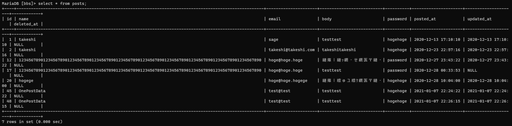

# 記事編集機能のテストを書く

[記事編集機能の設計](pranningedit.html)をしたので、先にテストを書いてみる。

## 環境

- ローカル
  - Windows 10
  - VSCode 1.51.1
  - XAMPP 7.4.13
  - MariaDB 10.4.17
- リモート
  - Raspberry Pi 3B+
  - Raspberry Pi OS 10.4
  - Nginx 1.14.2
  - PHP 7.3.19-1~deb10u1
  - MariaDB 10.3.23

## テスト

### `GetParam`

`tests/GetFormActionTest.php`に以下を追加。

~~~php
/**
 * @dataProvider getParamProvider
 */
public function testGetParam($data, $expected)
{
    // 1. GetFormActionインスタンスを生成
    $action = new GetFormAction();

    // 2. リクエストURIセット
    $_SERVER['REQUEST_URI'] = $data['uri'];

    // 3. GetParamでパラメーター取得
    $actual_result = $action->GetParam();

    // 4. 評価
    $this->assertEquals($expected['mode'], $actual_result['mode']);
    $this->assertEquals($expected['id'], $actual_result['id']);
}

public function getParamProvider()
{
    return [
        'successful' => [[
            'uri' => '/bbs/edit/1234'
        ],[
            'mode' => 'edit',
            'id' => 1234
        ]],
        'successfulWithSlash' => [[
            'uri' => '/bbs/edit/5678/'
        ],[
            'mode' => 'edit',
            'id' => 5678
        ]],
        'successfulWithRedundant' => [[
            'uri' => '/bbs/edit/1122/hogehoge'
        ],[
            'mode' => 'edit',
            'id' => 1122
        ]],
        'wrongModePrameter' => [[
            'uri' => '/bbs/editable/5678'
        ],[
            'mode' => '',
            'id' => ''
        ]],
        'wrongOrder' => [[
            'uri' => '/bbs/2345/edit'
        ],[
            'mode' => '',
            'id' => ''
        ]],
        'wrongID' => [[
            'uri' => '/bbs/edit/123abc'
        ],[
            'mode' => '',
            'id' => ''
        ]]
    ];
}
~~~

試しにテストを実行してみる。

~~~shell
> ./phpunit tests/
PHPUnit 9.0.0 by Sebastian Bergmann and contributors.

.......EEEEEE                                                     13 / 13 (100%)

Time: 00:00.563, Memory: 4.00 MB

There were 6 errors:

1) GetFormActionTest::testGetParam with data set "successful" (array('/bbs/edit/1234'), array('edit', 1234))
Error: Call to undefined method GetFormAction::GetParam()

D:\work\HTML\raspberrypi-server\test\html\bbs\tests\GetFormActionTest.php:170

2) GetFormActionTest::testGetParam with data set "successfulWithSlash" (array('/bbs/edit/5678/'), array('edit', 5678))
Error: Call to undefined method GetFormAction::GetParam()

D:\work\HTML\raspberrypi-server\test\html\bbs\tests\GetFormActionTest.php:170

3) GetFormActionTest::testGetParam with data set "successfulWithRedundant" (array('/bbs/edit/1122/hogehoge'), array('edit', 1122))
Error: Call to undefined method GetFormAction::GetParam()

D:\work\HTML\raspberrypi-server\test\html\bbs\tests\GetFormActionTest.php:170

4) GetFormActionTest::testGetParam with data set "wrongModePrameter" (array('/bbs/editable/5678'), array('', ''))
Error: Call to undefined method GetFormAction::GetParam()

D:\work\HTML\raspberrypi-server\test\html\bbs\tests\GetFormActionTest.php:170

5) GetFormActionTest::testGetParam with data set "wrongOrder" (array('/bbs/2345/edit'), array('', ''))
Error: Call to undefined method GetFormAction::GetParam()

D:\work\HTML\raspberrypi-server\test\html\bbs\tests\GetFormActionTest.php:170

6) GetFormActionTest::testGetParam with data set "wrongID" (array('/bbs/edit/123abc'), array('', ''))
Error: Call to undefined method GetFormAction::GetParam()

D:\work\HTML\raspberrypi-server\test\html\bbs\tests\GetFormActionTest.php:170

ERRORS!
Tests: 13, Assertions: 20, Errors: 6.
~~~

~~~
Error: Call to undefined method GetFormAction::GetParam()
~~~

まあそりゃまだ実装してないからな。

### `GetDBOnePostData`

~~~php
public function testGetDBOnePostData()
{
    // 1. GetFormActionインスタンスを生成
    $action = new GetFormAction();

    // 2. 投稿データを作成
    $data = array(
        'name' => 'OnePostData',
        'email' => 'test@test',
        'post_body' => 'testtest',
        'password' => 'hogehoge'
    );

    // 3. SQL文で直接記事を登録
    $smt = self::$pdo->prepare('insert into posts (name,email,body,password,posted_at,updated_at) values(:name,:email,:body,:password,now(),now())');
    $smt->bindParam(':name', $data['name'], PDO::PARAM_STR);
    $smt->bindParam(':email', $data['email'], PDO::PARAM_STR);
    $smt->bindParam(':body', $data['post_body'], PDO::PARAM_STR);
    $smt->bindParam(':password', $data['password'], PDO::PARAM_STR);
    $smt->execute();

    // 4. SQL文で直接記事を取得を試みる
    $sql = "select * from posts where name = '$data[name]' and email = '$data[email]' and body = '$data[post_body]'";
    $stmt = self::$pdo->query($sql);
    $actual_fetch = $stmt->fetch();

    // 5. GetDBOnePostDataで1レコードのみ取得
    $actual_result = $action->GetDBOnePostData($actual_fetch['id']);

    // 6. SQL文で取得したデータと比較
    $this->assertEquals($actual_fetch['name'], $actual_result['name']);
    $this->assertEquals($actual_fetch['email'], $actual_result['email']);
    $this->assertEquals($actual_fetch['body'], $actual_result['body']);
    $this->assertEquals($actual_fetch['password'], $actual_result['password']);

    // 7. 引数に空欄が渡されたら
    $failure = $action->GetDBOnePostData('');

    // 8. 失敗する
    $this->assertFalse($failure);

    // 9. 後片付け
    $sql = "delete from posts where name = '$data[name]' and email = '$data[email]' and body = '$data[post_body]'";
    $smt = self::$pdo->query($sql);
}
~~~

今回はデータプロバイダーは無し。`GetParam`でバリデーションされた数値が渡されるので「数字」または「空欄」しか可能性が無い。

~~~shell
> ./phpunit tests/
PHPUnit 9.0.0 by Sebastian Bergmann and contributors.

.......EEEEEEE                                                    14 / 14 (100%)

Time: 00:00.615, Memory: 4.00 MB

There were 7 errors:
~~~

まあそりゃあエラーですよね。

ちゃんとDBに登録したデータは掃除されているのか？

見にくいけど、どうも削除されていないっぽい。どうやら未定義メソッドでエラーが起きるテストの場合、そこまでは実行されるけどエラー以降は実行されないっぽい。まあそりゃそうか。

直接SQL文を打ち、掃除しておく。

~~~mysql
MariaDB [bbs]> delete from posts where name != 'takeshi';
~~~

実装するまでは手動で掃除しないといけない。

### `UpdateDBPostData`

ここでPHPUnitの「依存性」という機能があったことを思い出したので試してみる。

[2\. PHPUnit 用のテストの書き方 — PHPUnit latest Manual](https://phpunit.readthedocs.io/ja/latest/writing-tests-for-phpunit.html#writing-tests-for-phpunit-test-dependencies)

簡単に言えば、テストAが`return`文で何か変数を返し、テストBがそれを引き継いで次のテストをするというもの。

ここでは`testGetDBOnePostData`でDBに登録したデータを流用してテストすることにする。

`testGetDBOnePostData`の後片付けの部分を削除し、`return`文にする。

~~~php
    // 9. 後片付け
    $sql = "delete from posts where name = '$data[name]' and email = '$data[email]' and body = '$data[post_body]'";
    $smt = self::$pdo->query($sql);

↓↓↓↓↓↓↓↓↓書き換え↓↓↓↓↓↓↓↓↓↓↓↓
    
    // 9. testUpdateDBPostDataへ引き継ぎ
    return $actual_fetch;
~~~

そして、今から書く`testUpdateDBPostData`の直前に`@depends`アノテーションを付ける。

~~~php
/**
 * @depends testGetDBOnePostData
 */
public function testUpdateDBPostData($originalPostData) 
{
    // 1. GetFormActionインスタンスを生成
    $action = new GetFormAction();

    // 2. 変更後のデータを準備
    $data = array(
        'id' => $originalPostData['id'],
        'name' => 'UpdatePostData',
        'email' => 'update@update',
        'post_body' => 'updateupdate',
        'password' => $originalPostData['password']
    );

    // 3. 更新
    $result = $action->UpdateDBPostData($data);
    $this->assertTrue($result);

    // 4. SQL文で直接記事を取得を試みる
    $sql = "select * from posts where id = $originalPostData[id]";
    $stmt = self::$pdo->query($sql);
    $actual_fetch = $stmt->fetch();

    // 5. 評価
    $this->assertEquals($data['name'], $actual_fetch['name']);
    $this->assertEquals($data['email'], $actual_fetch['email']);
    $this->assertEquals($data['post_body'], $actual_fetch['post_body']);
    $this->assertNotEquals($originalPostData['name'], $actual_fetch['name']);
    $this->assertNotEquals($originalPostData['email'], $actual_fetch['email']);
    $this->assertNotEquals($originalPostData['post_body'], $actual_fetch['post_body']);

    // 6. パスワードが違うと失敗する
    $wrongData = $originalPostData;
    $wrongData['password'] = "hugahuga";
    $result = $action->UpdateDBPostData($wrongData);
    $this->assertFalse($result);

    // 7. 記事データが更新されていないことを確認
    $sql = "select * from posts where id = $wrongData[id]";
    $stmt = self::$pdo->query($sql);
    $actual_fetch = $stmt->fetch();
    $this->assertEquals($data['name'], $actual_fetch['name']);
    $this->assertEquals($data['email'], $actual_fetch['email']);
    $this->assertEquals($data['post_body'], $actual_fetch['post_body']);
    $this->assertNotEquals($wrongData['name'], $actual_fetch['name']);
    $this->assertNotEquals($wrongData['email'], $actual_fetch['email']);
    $this->assertNotEquals($wrongData['post_body'], $actual_fetch['post_body']);

    // 8. 後片付け
    $sql = "delete from posts where where id = $wrongData[id]";
    $smt = self::$pdo->query($sql);
}
~~~

もう少し上手に書けたかもしれないけど、もうとりあえず今回はこれで良しとする。

試しにテスト。

~~~shell
> ./phpunit tests/
PHPUnit 9.0.0 by Sebastian Bergmann and contributors.

.......EEEEEEE                                                    14 / 14 (100%)

Time: 00:00.860, Memory: 4.00 MB

There were 7 errors:
~~~

さっきと変わらないのは、`testGetDBOnePostData`でエラーが出たら、依存関係にある`testUpdateDBPostData`はそもそも実行されないという仕様になっているらしい。

最初からこの`@depends`を使って書いていたら最初からもっときれいにテストが書けていたんじゃないか？と思ったけど、今回は練習と割り切って次からちゃんとすることにする。

## テスト完成

次はこのテストでエラーが出なくなることを目標に機能を実装する。