# VSCodeの拡張機能③「php cs fixer」でコードの整形

自動でPHPっぽいコードに整形してくれるらしい。

## 環境

- ローカル
  - Windows 10
  - VSCode 1.51.1
  - XAMPP 7.4.13

## 手順

### Composerのインストール

[Composer](https://getcomposer.org/download/)

> Composer is **not** a package manager in the same sense as Yum or Apt are. Yes, it deals with "packages" or libraries, but it manages them on a per-project basis, installing them in a directory (e.g. `vendor`) inside your project. By default, it does not install anything globally. Thus, it is a dependency manager. It does however support a "global" project for convenience via the [global](https://getcomposer.org/doc/03-cli.md#global) command.
>
> ComposerはYumやAptみたいなパッケージマネージャーではない。確かに、これはパッケージやライブラリを扱うけど、プロジェクト単位で管理したり、プロジェクトフォルダの中にインストールしたりする。デフォルトではグローバルインストールはしない。だからこいつは依存関係マネージャーだ。でも「グローバル」コマンドでグローバルなプロジェクトもサポートするよ。

とにかくこいつがパッケージやライブラリを突っ込んでくれるのは間違いないらしい。

上記サイトからComposer-Setup.exeをダウンロードして起動。とりあえずDeveloper modeは無しで。

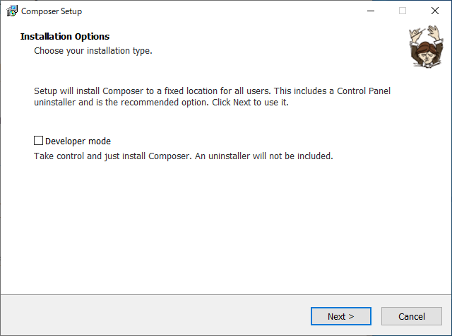

PHPのパスを聞かれる。よく知ってるね。

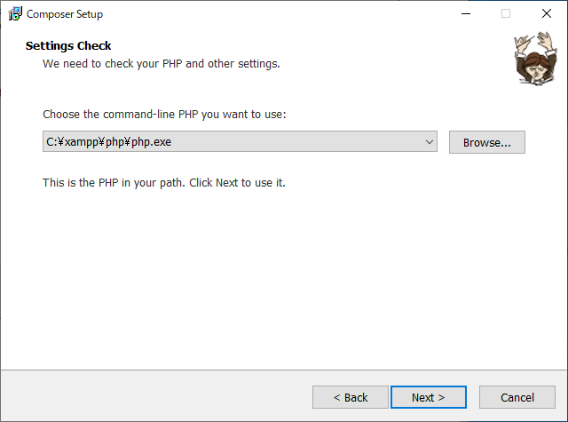

プロクシは無い。

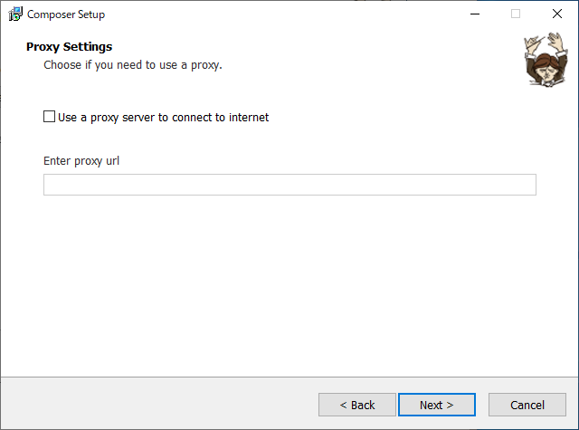

Install!

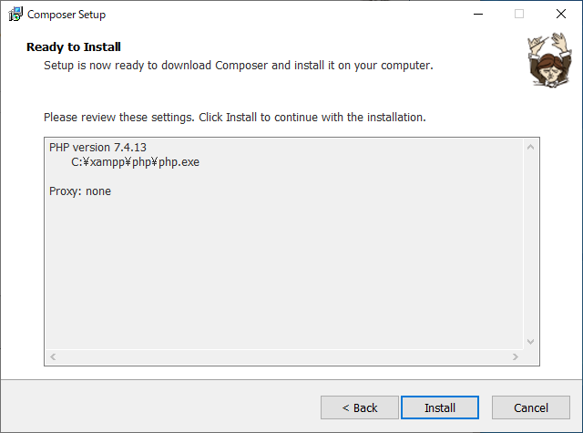

「環境（環境変数のこと？）が変わったから最初は新しいコマンドウィンドウ（ターミナルのこと）を開かなあかんで。あかんかったらExplorer全部閉じるか、リログするか、最悪再起動してな」

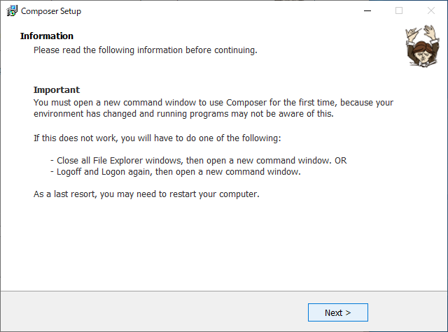

おじさーん。存在感デカすぎ。

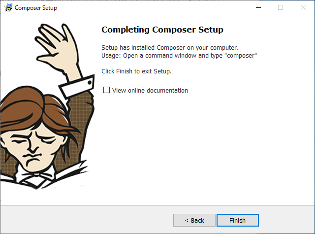

試しにPowerShellで`composer`と打ってみる。

~~~
> composer
   ______
  / ____/___  ____ ___  ____  ____  ________  _____
 / /   / __ \/ __ `__ \/ __ \/ __ \/ ___/ _ \/ ___/
/ /___/ /_/ / / / / / / /_/ / /_/ (__  )  __/ /
\____/\____/_/ /_/ /_/ .___/\____/____/\___/_/
                    /_/
Composer version 2.0.8 2020-12-03 17:20:38

Usage:
  command [options] [arguments]

Options:
  -h, --help                     Display this help message
  -q, --quiet                    Do not output any message
  -V, --version                  Display this application version
      --ansi                     Force ANSI output
      --no-ansi                  Disable ANSI output
  -n, --no-interaction           Do not ask any interactive question
      --profile                  Display timing and memory usage information
      --no-plugins               Whether to disable plugins.
  -d, --working-dir=WORKING-DIR  If specified, use the given directory as working directory.
      --no-cache                 Prevent use of the cache
  -v|vv|vvv, --verbose           Increase the verbosity of messages: 1 for normal output, 2 for more verbose output and 3 for debug

Available commands:
  about                Shows the short information about Composer.
  archive              Creates an archive of this composer package.
  browse               Opens the package's repository URL or homepage in your browser.
  cc                   Clears composer's internal package cache.
  check-platform-reqs  Check that platform requirements are satisfied.
  clear-cache          Clears composer's internal package cache.
  clearcache           Clears composer's internal package cache.
  config               Sets config options.
  create-project       Creates new project from a package into given directory.
  depends              Shows which packages cause the given package to be installed.
  diagnose             Diagnoses the system to identify common errors.
  dump-autoload        Dumps the autoloader.
  dumpautoload         Dumps the autoloader.
  exec                 Executes a vendored binary/script.
  fund                 Discover how to help fund the maintenance of your dependencies.
  global               Allows running commands in the global composer dir ($COMPOSER_HOME).
  help                 Displays help for a command
  home                 Opens the package's repository URL or homepage in your browser.
  i                    Installs the project dependencies from the composer.lock file if present, or falls back on the composer.json.
  info                 Shows information about packages.
  init                 Creates a basic composer.json file in current directory.
  install              Installs the project dependencies from the composer.lock file if present, or falls back on the composer.json.
  licenses             Shows information about licenses of dependencies.
  list                 Lists commands
  outdated             Shows a list of installed packages that have updates available, including their latest version.
  prohibits            Shows which packages prevent the given package from being installed.
  remove               Removes a package from the require or require-dev.
  require              Adds required packages to your composer.json and installs them.
  run                  Runs the scripts defined in composer.json.
  run-script           Runs the scripts defined in composer.json.
  search               Searches for packages.
  self-update          Updates composer.phar to the latest version.
  selfupdate           Updates composer.phar to the latest version.
  show                 Shows information about packages.
  status               Shows a list of locally modified packages.
  suggests             Shows package suggestions.
  u                    Upgrades your dependencies to the latest version according to composer.json, and updates the composer.lock file.
  update               Upgrades your dependencies to the latest version according to composer.json, and updates the composer.lock file.
  upgrade              Upgrades your dependencies to the latest version according to composer.json, and updates the composer.lock file.
  validate             Validates a composer.json and composer.lock.
  why                  Shows which packages cause the given package to be installed.
  why-not              Shows which packages prevent the given package from being installed.
~~~

無事インストールされたらしい。

### PHP CS Fixerをインストール

PowerShellで以下を打つ。

~~~shell
> composer global require friendsofphp/php-cs-fixer
~~~

参考サイトにはさらっと書いてあったけど、「んー、グローバルインストールかー」と思ってちょっと躊躇した。でもまあこれはプロジェクトごとに個別にインストールするものでもないし、設定外せば強制的に使われるわけでもないっぽいのでこれでよしとする。

### VSCodeのphp-cs-fixer拡張機能をインストール

同じ名前多すぎ。正解は小文字の`php cs fixer`らしい。

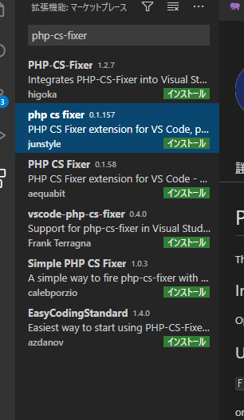

インストール後、VSCodeのユーザー設定を変える。

1つ目は`php-cs-fixer.bat`の場所。

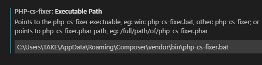

2つ目はHTMLタグも同時に整形するかどうか。

3つ目は整形するタイミング。

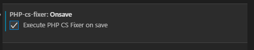

とりあえずこんなもんで。

## 実験

適当に

~~~php
<?php
function hogehoge(    ) {
    
    
    echo 'hoge';
}
~~~

余分なスペースや波かっこ`{`の位置が整形されるはず・・・と思ったらフォーマッターが複数あると言われた。

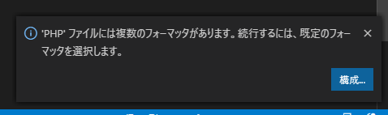

「構成」をクリックすると画面上部に選択肢が出てくるので、`php cs fixer`を選択。

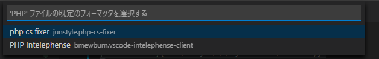

動いた。

~~~php
<?php

function hogehoge()
{
    echo 'hoge';
}
~~~

## 参考

[PHP CS Fixer を VS Codeで動かす（macos） \- Qiita](https://qiita.com/yujiroarai/items/e3e41785f5037e825414)