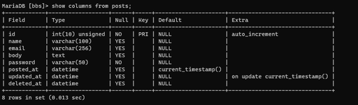

# postsテーブルの修正

[データベースを作成したとき](makedb.html)に、記事編集・削除用パスワードの保存場所を作り忘れてたので追加する。パスワードだけでなく作っていきながら色々付け足すかもしれないのでその練習も兼ねて。

## 環境

- ローカル
  - Windows 10
  - XAMPP 7.4.13
  - MariaDB 10.4.17
- リモート
  - Raspberry Pi 3B+
  - Raspberry Pi OS 10.4
  - MariaDB 10.3.23

## テーブル修正コマンド

文法はこう。

~~~mysql
alter table (テーブル名) add (追加するカラム名) (データ型) (オプション) after (追加するカラムを、どのカラムの次に入れるか);
~~~

今回はこのように打つ。

~~~mysql
alter table posts add password varchar(50) not null after body;
~~~

## ローカルのMySQLで修正

rootユーザーでMySQLへログイン。

~~~shell
> cd C:\xampp\mysql\bin
> ./mysql -u root -p
Enter password: 
Welcome to the MariaDB monitor.  Commands end with ; or \g.
Your MariaDB connection id is 20
Server version: 10.4.17-MariaDB mariadb.org binary distribution

Copyright (c) 2000, 2018, Oracle, MariaDB Corporation Ab and others.

Type 'help;' or '\h' for help. Type '\c' to clear the current input statement.

MariaDB [(none)]>
~~~

bbsデータベースを使用。

~~~mysql
MariaDB [(none)]> use bbs
Database changed
MariaDB [bbs]>
~~~

テーブル変更コマンドを打つ。

~~~mysql
MariaDB [bbs]> alter table posts add password varchar(50) not null after body;
Query OK, 0 rows affected (0.025 sec)
Records: 0  Duplicates: 0  Warnings: 0
~~~

確認。

~~~mysql
MariaDB [bbs]> show columns from posts;
+------------+------------------+------+-----+---------------------+-------------------------------+
| Field      | Type             | Null | Key | Default             | Extra                         |
+------------+------------------+------+-----+---------------------+-------------------------------+
| id         | int(10) unsigned | NO   | PRI | NULL                | auto_increment                |
| name       | varchar(100)     | YES  |     | NULL                |                               |
| email      | varchar(256)     | YES  |     | NULL                |                               |
| body       | text             | YES  |     | NULL                |                               |
| password   | varchar(50)      | NO   |     | NULL                |                               |
| posted_at  | datetime         | YES  |     | current_timestamp() |                               |
| updated_at | datetime         | YES  |     | NULL                | on update current_timestamp() |
| deleted_at | datetime         | YES  |     | NULL                |                               |
+------------+------------------+------+-----+---------------------+-------------------------------+
8 rows in set (0.013 sec)
~~~

OK。

## リモートのMySQLで修正

Raspberry Pi上のMySQLはUNIXソケット認証がある（[ここ](../wordpress/install.html)の解説参照）ので、以下のコマンドを打てばパスワードを入力する必要がない。マジ便利。

~~~shell
$ sudo mysql -u root
~~~

同様にコマンドを打つ。

~~~mysql
> use bbs
> alter table posts add password varchar(50) not null after body;
> show columns from posts;
~~~

OK。

## HTMLファイルの修正

パスワード入力欄を作成。

`view/post.php`

~~~php+HTML
    <!-- 記事入力エリア -->
    

        <form action="./index.php" method="post" id="post_form">
            

                名前： 
                <input type="text" name="name" id="name">
            

            

                メールアドレス： 
                <input type="email" name="email" id="email">
            

            

                本文： 
                <textarea name="post_body" id="post_body" cols="30" rows="10">本文を入力してください。</textarea>
            

            <!-- 以下を挿入 -->
            

                パスワード： 
                <input type="password" name="password" id="password">
            

            <!-- ここまで -->
            

                <input type="hidden" name="eventId" value="save">
                <input type="submit" value="送信">
            

        </form>
    

    <!-- 記事入力エリア終了 -->
~~~

