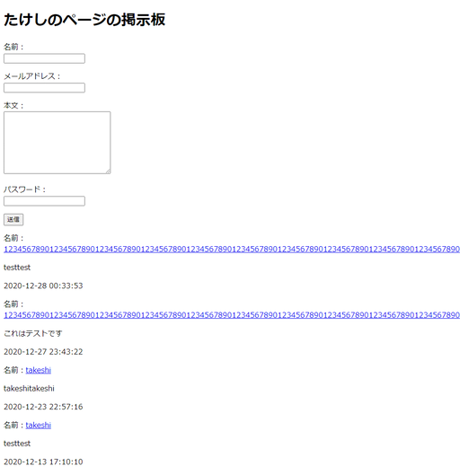
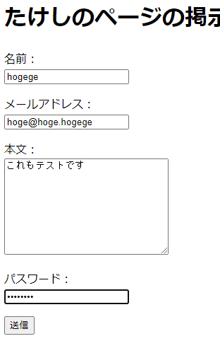
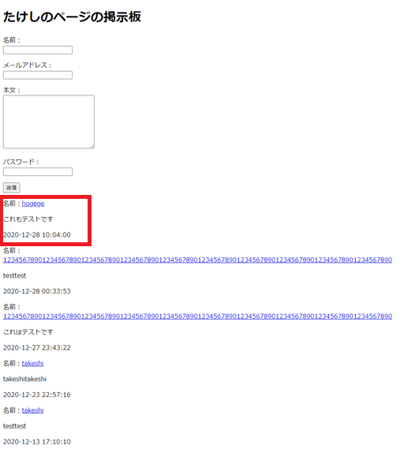

# 記事表示機能

今度はDBに保存しているデータを取得してHTMLに配置していく部分。先にテストを書こうと思ったけど、記事投稿機能よりさらに簡単なので先に実装をする。

以下のサイトを参考にする。

[【プログラミング構築】データベースにアクセスして投稿データを抽出しよう \| 株式会社LIG](https://liginc.co.jp/282262)

## 環境

- ローカル
  - Windows 10
  - VSCode 1.51.1
  - XAMPP 7.4.13
  - MariaDB 10.4.17
- リモート
  - Raspberry Pi 3B+
  - Raspberry Pi OS 10.4
  - Nginx 1.14.2
  - PHP 7.3.19-1~deb10u1
  - MariaDB 10.3.23

## モデル作成

DBから記事を取得するメソッド`GetDBPostData`を`model/GetFormAction.php`に追記する。

~~~php
public function GetDBPostData(){
    $stm = $this->pdo->prepare('select * from posts order by posted_at DESC');
    $stm->execute();
    $result = $stm->fetchAll(PDO::FETCH_ASSOC);

    return $result;
}
~~~

これで`$result`に2次元配列で記事データが入ることになる。

## ビューを作成

`view/post.php`の先頭、`<!DOCTYPE html>`よりも前に以下を追記。

~~~php+HTML
<?php
$post_data = $action->GetDBPostData();
?>
~~~

これでHTMLファイル上で、DBから取ってきた記事データを扱うことができる。

記事表示エリアも以下のように変更。

~~~php+HTML
    <!-- 記事表示エリア -->
    

        <?php if (!empty($post_data)) : ?>
        

            <?php foreach ($post_data as $post) :?>
            

                
名前：<a
                        href="mailto:<?php echo $post['email']; ?>"><?php echo $post['name']; ?></a>
                

            

            

                
<?php echo $post['body']; ?>
                

            

            

                
<?php echo $post['posted_at']; ?>
                

            

            <?php if ($post['posted_at'] != $post['updated_at']) : ?>
            

                <?php echo $post['updated_at']; ?>
            

            <?php endif;?>
            <?php endforeach; ?>
        

        <?php endif; ?>
    

    <!-- 記事表示エリア終了 -->
~~~

保存終了し、XAMPPが動いていることを確認して、ブラウザで`localhost`にアクセス。

相変わらず見た目がひどい。でも一応記事データが取得できている。

試しにこのページ上から記事を投稿してみる。

送信ボタンを押すと、スーパー地味だけど一応投稿できている。

