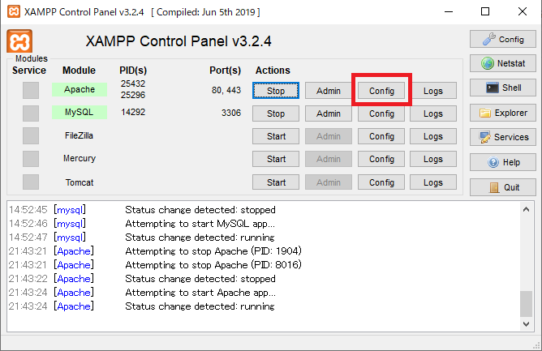

# PHPファイルにDBへのログインパスワードを直書きしないようにする

実は[Raspberry Pi上でもデータベースが動くことを確認](onraspberrypi.html)で、仮とはいえ、かつ権限の制限されたbbsユーザーのものとはいえ、DBへのログインパスワードを直書きした状態でRaspberry Piにアップしてしまったので、その対策の記録。

※現在では対象の記事を修正済み。

## まずはリモート上のMySQLのbbsユーザーのパスワードを変更する

MySQLにrootユーザーでログインし、以下を打つ。

~~~mysql
[(none)]> set password for bbs@localhost = password('(新しいパスワード)');
~~~

## Nginxの設定値に書き込む

リモート上のNginxの設定の中に、確かPHPに引き渡すパラメーターの設定があったはず。

~~~shell
$ sudo nano /etc/nginx/fastcgi.conf
~~~

以下を追記。

~~~
fastcgi_param  PHP_BBS            (新しいパスワード);
~~~

特にダブル・シングルクォーテーションで囲まなくてもよい。

## PHPファイルを書き換え

ローカルで作業。`checkdb.php`に直書きしていたので、書き換え。

~~~php
$password = '(パスワード直書き)';
↓
$password = $_SERVER['PHP_BBS'];
~~~

## コミット＆プッシュ＆リモート上からプル

これでとりあえずOK。

ただし、今の状態だとローカル環境でテストできない。

## ローカル上でApacheの設定ファイルに追記

リモートはNginxなのに、ローカルだとXAMPPだからApacheという、とても勉強になる良い環境。

XAMPPのコントロールパネルから「httpd.conf」を開く。

`SetEnv PHP_BBS '(ローカルのMySQLのbbsユーザーのパスワード)'`を以下に追記。ドキュメントルートのパスはそれぞれの環境によって読み替えること。

~~~
<Directory "D:\work\HTML\raspberrypi-server\test\html\bbs">
    #
    # Possible values for the Options directive are "None", "All",
    # or any combination of:
    #   Indexes Includes FollowSymLinks SymLinksifOwnerMatch ExecCGI MultiViews
    #
    # Note that "MultiViews" must be named *explicitly* --- "Options All"
    # doesn't give it to you.
    #
    # The Options directive is both complicated and important.  Please see
    # http://httpd.apache.org/docs/2.4/mod/core.html#options
    # for more information.
    #
    Options Indexes FollowSymLinks Includes ExecCGI

    #
    # AllowOverride controls what directives may be placed in .htaccess files.
    # It can be "All", "None", or any combination of the keywords:
    #   AllowOverride FileInfo AuthConfig Limit
    #
    AllowOverride All

    #
    # Controls who can get stuff from this server.
    #
    Require all granted
    SetEnv PHP_BBS '(ローカルのMySQLのbbsユーザーのパスワード)' #←ここに追記
</Directory>
~~~

保存終了し、忘れずにApacheを再起動しておく。

ローカルのMySQLはテスト環境で外部に公開しているわけではないので、パスワードを変える必要は無い。でも変えても良い。ローカルとリモートでMySQLのbbsユーザーのパスワードが違っても良い。