# Emmetを使ってHTMLの準備

とりあえず簡単なフォームを作成する。

## 環境

- ローカル
  - Windows 10
  - VSCode 1.51.1
  - XAMPP 7.4.13

## 準備

今までVSCodeの拡張機能の実験のために書いた色々なコードは全部消しておく。

ワークフォルダの構造

~~~
bbs
├.vscodeフォルダ
├bbs.code-workspace
└index.php
~~~

`index.php`の中身

~~~php+HTML
<?php
    
~~~

`Start Developing`としてコミットしておく。

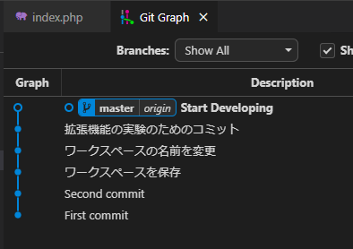

## フォルダ・ファイルの新規作成

ワークフォルダに、新たに`view`というフォルダを作りその中に`post.php`を新規作成する。VSCode上でやれば楽ちん。

フォルダの作成。

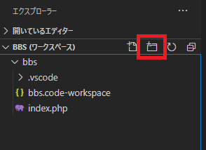

ファイルの作成。

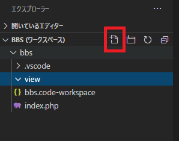

`post.php`をクリックすると、ファイルが開かれる。

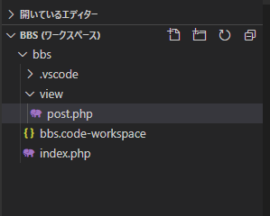

## HTMLコード

VSCodeで`!`と打つと候補が現れる。

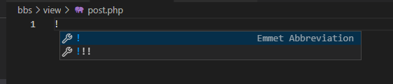

これでエンターを押すと、必要なタグが一気に作成される。

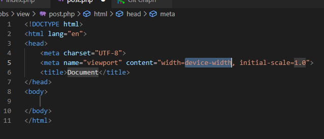

これは[Emmet](https://docs.emmet.io/)というツールがVSCodeに付属しているから。どんなコマンドが使えるのかは[Cheat Sheet](https://docs.emmet.io/cheat-sheet/)を見て雰囲気で学ぶ。多すぎるので必要なものを順番に使っていく。

とりあえずレスポンシブは後で考えることにするので、今は消す。`lang`は`ja`。`title`は「たけしのページの掲示板」

~~~html
<!DOCTYPE html>
<html lang="ja">
<head>
    <meta charset="UTF-8">
    <title>たけしのページの掲示板</title>
</head>
<body>
    
</body>
</html>
~~~

保存をしたら、php cs fixerの機能で強制的に間隔を開けられた。まあ`.php`ファイルだしな。

~~~php+HTML
<!DOCTYPE html>
<html lang="ja">

<head>
    <meta charset="UTF-8">
    <title>たけしのページの掲示板</title>
</head>

<body>

</body>

</html>
~~~

## Emmetを使ってHTMLコーディング

### 作成予定のコード

とりあえずの形はこう。

~~~php+HTML
<body>
    <h1>たけしのページの掲示板</h1>
    <!-- 記事入力エリア -->
    

        <form action="./index.php" method="post" id="post_form">
            

                名前： 
                <input type="text" name="name" id="name">
            

            

                メールアドレス： 
                <input type="email" name="email" id="email">
            

            

                本文： 
                <textarea name="post_body" id="post_body" cols="30" rows="10">本文を入力してください。</textarea>
            

            

                <input type="hidden" name="eventId" value="save">
                <input type="submit" value="送信">
            

        </form>
    

    <!-- 記事入力エリア終了 -->

    <!-- 記事表示エリア -->
    

        

            

                
投稿者　表示場所

            

            

                
投稿日時　表示場所

            

            

                
記事本文　表示場所

            

        

        

            

                
投稿者　表示場所

            

            

                
投稿日時　表示場所

            

            

                
記事本文　表示場所

            

        

    

    <!-- 記事表示エリア終了 -->
</body>
~~~

### 見出し：`h1`

`h1`と打ってエンター（またはTab）を押せば、`<h1></h1>`を自動で入れてくれる。

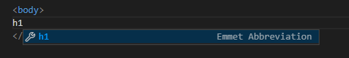

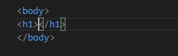

### コメント：`c`

`c`と打ってエンター（またはTab）を押せば、`<!--  -->`を入れてくれる。Emmet Abbreviationと表示されているものがEmmetで自動入力してくれるもの。と言っても表示されている候補全部Emmetなんだけど。

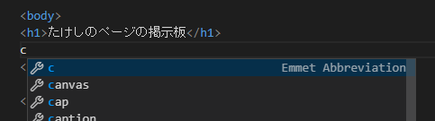

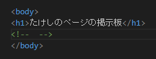

### divタグ：`div.(クラス名)`

divタグは大体クラス名をセットで書くので、CSS的な書き方で`.(クラス名)`と打てばクラスが付与されたdivタグを入れてくれる。

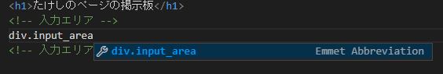

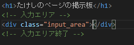

### formタグ：`form:(メソッド名)#(ID)`

※メソッドとか送信先とかは後で解説。

POST送信する入力フォームを作るには`form:post`と打ちエンターを押す。

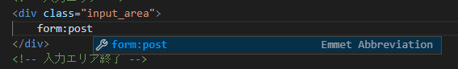

すると、`action`属性にカーソルが自動で移動するので、送信先ファイルを指定する。

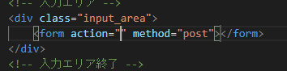

`form:post#post_form`と打てばIdまで自動で付与してくれる。

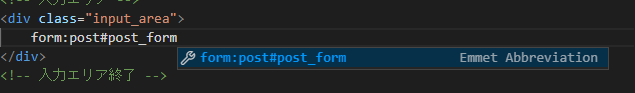

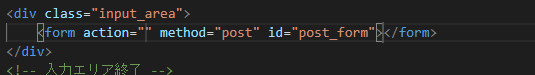

### 段落：`p`

`p`→`

`

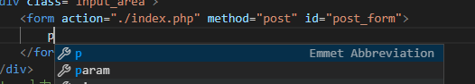

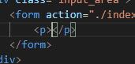

### 改行：`br`

`br`→` `

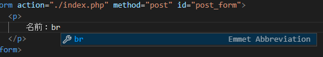

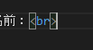

### 入力欄（汎用：1行）：`inp`

`inp`→`<input type="text" name="" id="">`

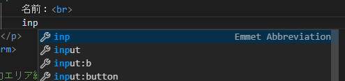

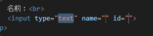

### 入力欄（Email用）：`input:email`

`input:email`→`<input type="email" name="" id="">`

### 入力欄（汎用：複数行）：`textarea`

`textarea`→`<textarea name="" id="" cols="30" rows="10"></textarea>`

### 隠しパラメーター：`input:h`

`input:h`→`<input type="hidden" name="">`

### 送信ボタン：`input:s`

`input:s`→`<input type="submit" value="">`

## 見た目を確認

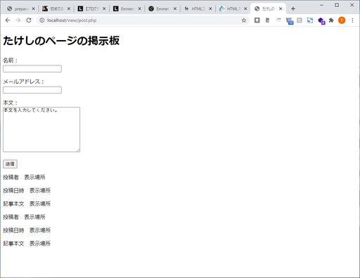

これはひどい。まあ、デザインは後から。

## コミット＆プッシュ

とりあえずここまでをコミットしてGitHubにプッシュしておく。

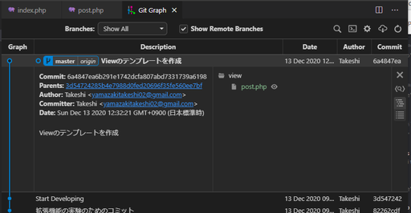