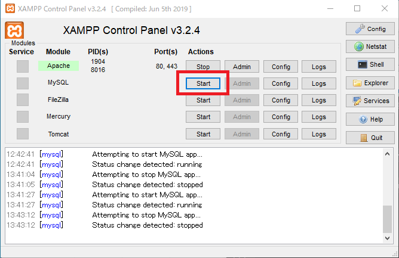
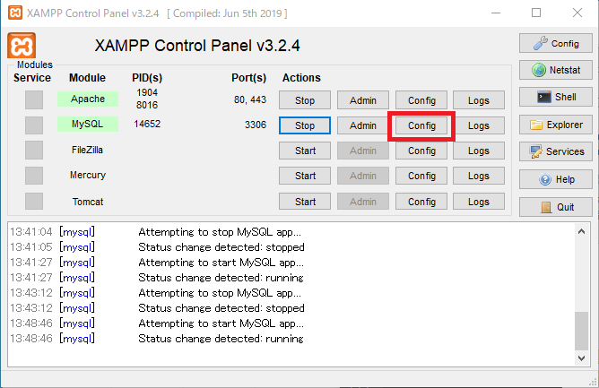
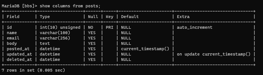
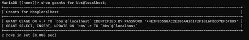
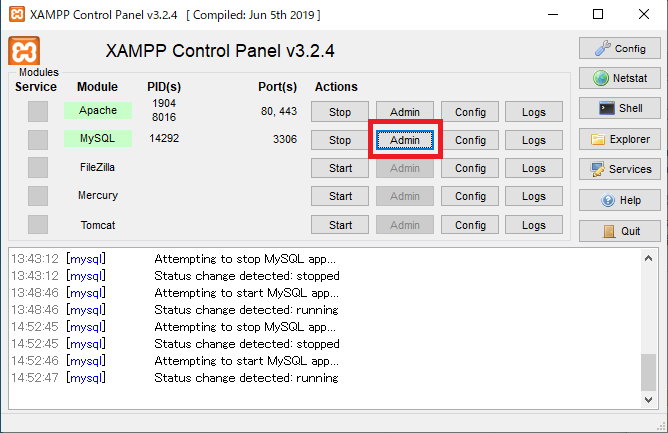
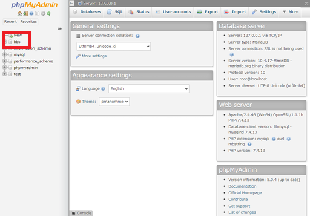
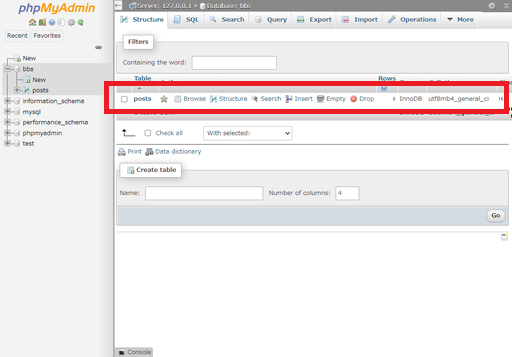
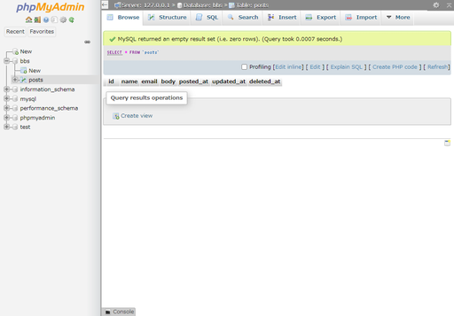
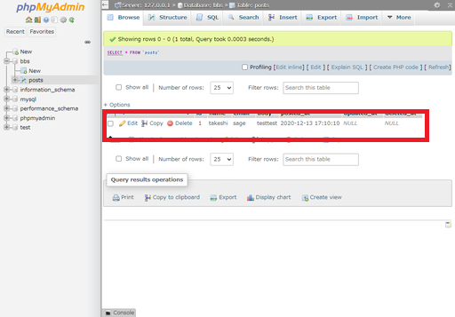
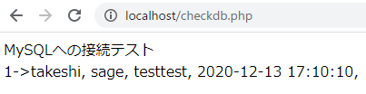

# データベースの準備と動作確認

掲示板用のデータベースを作成する。今回はデータベースの勉強も兼ねているのでXAMPP付属のphpMyAdminは使わずに進める。

そう、手打ち。

## 環境

- ローカル
  - Windows 10
  - VSCode 1.51.1
  - XAMPP 7.4.13

## 参考サイト

以下のサイトを参考に進める。

[XAMPPの使い方](https://www.adminweb.jp/xampp/)
この中の「MariaDBの設定と利用」を参考とする。

[XAMPPを用いてデータベースシステムを作成する4　MySQL編 \| ぼのからのお届けモノ](https://bonokara.com/xampp-4-mysql/)
上記サイトとよく似ている。どちらがどちらかを参考にしたのかな。

[MySQLの使い方](https://www.dbonline.jp/mysql/)
本を買わなくてもいいレベル。

## MySQLの起動と接続

XAMPPのコントロールパネル上でMySQLを立ち上げる。

PowerShellを立ち上げ、`C:\xampp\mysql\bin`に移動して`mysql -u root`と打つ。

~~~shell
> cd c:\xampp\mysql\bin
> mysql -u root

Suggestion [3,General]: コマンド mysql は見つかりませんでしたが、現在の場所に存在します。Windows PowerShell は、既定では、現在の場所からコマンドを読み込みません。このコマンドを信頼する場合は、".\mysql" と入力してください。詳細については、"get-help about_Command_Precedence" と入力してヘルプを参照してください。

~~~

む、なんか`.\mysql`と打てと言っている。なんかPowerShellのポリシーの問題っぽい。

`.\mysql -u root`と打つと、[以前WordPressのときにDBの中を覗いたような状態になった。](../wordpress/checkdb.html)

~~~shell
> .\mysql -u root
Welcome to the MariaDB monitor.  Commands end with ; or \g.
Your MariaDB connection id is 8
Server version: 10.4.17-MariaDB mariadb.org binary distribution

Copyright (c) 2000, 2018, Oracle, MariaDB Corporation Ab and others.

Type 'help;' or '\h' for help. Type '\c' to clear the current input statement.

MariaDB [(none)]>
~~~

XAMPPのコントロールパネルではMySQLって書いてあったけど、正体はMariaDBなのね。

## MySQLの設定

### rootユーザーのパスワードを変更

テスト環境とは言え、一応設定しておく。

一度MySQLの接続を切る。

~~~sql
MariaDB [(none)]> quit
Bye
~~~

PowerShellに戻ってきたら以下のコマンドを打ってrootユーザーのパスワードを設定する。

~~~shell
> .\mysqladmin -u root password
New password: ****************
Confirm new password: ****************
~~~

もう一度入るときは`-p`オプションを付けるとパスワードを聞かれるので、入力してログインする。

~~~shell
> .\mysql -u root -p
Enter password:
~~~

### `my.ini`ファイルの修正

XAMPPコントロールパネルから`my.ini`ファイルを開く。

`[mysqld]`の設定を以下の様にする。

~~~
## UTF 8 Settings
init-connect=\'SET NAMES utf8\'
collation_server=utf8_unicode_ci
character_set_server=utf8
skip-character-set-client-handshake
character_sets-dir="C:/xampp/mysql/share/charsets"
~~~

`[client][mysqldump][mysql]`の各最後に次の行を追加。

~~~
default-character-set=utf8
~~~

以下の様にする。

~~~
[client]
# password       = your_password 
port=3306
socket="C:/xampp/mysql/mysql.sock"
default-character-set=utf8

[mysqldump]
max_allowed_packet=16M
default-character-set=utf8

[mysql]
# Remove the next comment character if you are not familiar with SQL
#safe-updates
default-character-set=utf8
~~~

保存終了。一応MySQLも再起動。

## データベースの作成

### 簡単な概要

データベースというのはExcelによく似ている。概念をごちゃごちゃにするのは良くないけど、全く分からないという人は以下のように考えればよい。

| 用語         | Excelに例えると                      |
| ------------ | ------------------------------------ |
| データベース | Excelファイル                        |
| テーブル     | Excelファイルの中の1つのワークシート |
| カラム       | ワークシートの中の縦1列              |
| レコード     | ワークシートの中の横1行              |

### データベースの作成

rootユーザーでログインして以下を打つ。

~~~mysql
[(none)]> create database bbs;
Query OK, 1 row affected (0.001 sec)
~~~

できたかどうか確認をする。ちゃんと表示されている。

~~~mysql
[(none)]> show databases;
+--------------------+
| Database           |
+--------------------+
| bbs                |
| information_schema |
| mysql              |
| performance_schema |
| phpmyadmin         |
| test               |
+--------------------+
6 rows in set (0.004 sec)
~~~

今のままでは作っただけで、開いてはいない。bbsデータベースを選択する。

~~~mysql
[(none)]> use bbs
Database changed
[bbs]>
~~~

### テーブルの作成

#### データ構造

テーブルの作成で一番大事なのは「どんなカラムを持つテーブルなのかを考えてから作る」ということ。レコードはどんどん溜まっていくだけだけど、1つのレコードはどんな情報を持っているのかというのは全レコードに共通することになる。（後から変えられるけど）

とりあえず今回は以下のようにする。

| カラム名   | データ型       | その他                                     |
| ---------- | -------------- | ------------------------------------------ |
| id         | `int`          | `unsigned primary key auto_increment`      |
| name       | `varchar(100)` |                                            |
| email      | `varchar(256)` |                                            |
| body       | `text`         |                                            |
| posted_at  | `datetime`     | `default current_timestamp`                |
| updated_at | `datetime`     | `default null on update current_timestamp` |
| deleted_at | `datetime`     | `default null`                             |

※日時関連の微妙な違いについて

* 投稿時や更新時、PHPからわざわざ日時を渡すようなことはしたくない。
* 投稿時はposted_atのみ値が代入され、updated_atとdeleted_atは何もない（NULL）状態にしたい。
* レコードが更新されたら、updated_atのみ自動更新してほしい。
* 削除されたら明示的にdeleted_atに日時を入れ、論理削除とする。

参考：[MySQLのDATETIME型とTIMESTAMP型の違いを検証してみた \- Qiita](https://qiita.com/ykawakami/items/2449a24e3b82ff0cbab6)

#### 作成コマンド

~~~mysql
[bbs]> create table posts(
    -> id int unsigned primary key auto_increment,
    -> name varchar(100),
    -> email varchar(256),
    -> body text,
    -> posted_at datetime default current_timestamp,
    -> updated_at datetime default null on update current_timestamp,
    -> deleted_at datetime default null
    -> );
Query OK, 0 rows affected (0.019 sec)
~~~

セミコロン`;`を入れずにエンターを押すと、コマンドが実行されずに改行されるので入力が分かりやすくなる。

確認してみる。

~~~mysql
[bbs]> show tables;
+---------------+
| Tables_in_bbs |
+---------------+
| posts         |
+---------------+
1 row in set (0.001 sec)
~~~

カラムの状態も確認してみる。

~~~mysql
[bbs]> show columns from posts;
+------------+------------------+------+-----+---------------------+-------------------------------+
| Field      | Type             | Null | Key | Default             | Extra                         |
+------------+------------------+------+-----+---------------------+-------------------------------+
| id         | int(10) unsigned | NO   | PRI | NULL                | auto_increment                |
| name       | varchar(100)     | YES  |     | NULL                |                               |
| email      | varchar(256)     | YES  |     | NULL                |                               |
| body       | text             | YES  |     | NULL                |                               |
| posted_at  | datetime         | YES  |     | current_timestamp() |                               |
| updated_at | datetime         | YES  |     | NULL                | on update current_timestamp() |
| deleted_at | datetime         | YES  |     | NULL                |                               |
+------------+------------------+------+-----+---------------------+-------------------------------+
7 rows in set (0.005 sec)
~~~

多分これで大丈夫。

### 新たなユーザーの作成

新たなユーザー「bbs」を作成する。`(bbsユーザー用のパスワード)`は適宜書き換える。

~~~mysql
[bbs]> create user bbs@localhost identified by '(bbsユーザー用のパスワード)';
Query OK, 0 rows affected (0.003 sec)
~~~

一度ログアウトして、bbsユーザーでログインできるか試してみる。

~~~shell
> .\mysql -u bbs -p
Enter password: ****************
Welcome to the MariaDB monitor.  Commands end with ; or \g.
Your MariaDB connection id is 13
Server version: 10.4.17-MariaDB mariadb.org binary distribution

Copyright (c) 2000, 2018, Oracle, MariaDB Corporation Ab and others.

Type 'help;' or '\h' for help. Type '\c' to clear the current input statement.

MariaDB [(none)]>
~~~

OK。

### bbsユーザーに権限を付与

`INSERT`、`SELECT`、`UPDATE`が最低限必要なので、それだけ与える。

~~~mysql
[(none)]> grant insert, select, update on bbs.* to bbs@localhost;
Query OK, 0 rows affected (0.003 sec)
~~~

確認してみる。

~~~mysql
[(none)]> show grants for bbs@localhost;
+------------------------------------------------------------------------------------------------------------+
| Grants for bbs@localhost                                                                                   |
+------------------------------------------------------------------------------------------------------------+
| GRANT USAGE ON *.* TO `bbs`@`localhost` IDENTIFIED BY PASSWORD '*4E3F83550AC2E286A4151F2F1816FBDD7EF5FB89' |
| GRANT SELECT, INSERT, UPDATE ON `bbs`.* TO `bbs`@`localhost`                                               |
+------------------------------------------------------------------------------------------------------------+
2 rows in set (0.000 sec)
~~~

※見えているパスワードは暗号化されている。

## 確認

### phpMyAdminで確認

確認のみphpMyAdminを使う。

`C:\xampp\phpMyAdmin\config.inc.php`を開く。

~~~php
/* Authentication type and info */
$cfg['Servers'][$i]['auth_type'] = 'config';
$cfg['Servers'][$i]['user'] = 'root';
$cfg['Servers'][$i]['password'] = '';
$cfg['Servers'][$i]['extension'] = 'mysqli';
$cfg['Servers'][$i]['AllowNoPassword'] = true;
$cfg['Lang'] = '';
~~~

この`password`に、設定したrootユーザーのパスワードを書いて保存終了。

XAMPPのコントロールパネルのMySQLのAdminをクリック。

あら、英語。左側に「bbs」があるのでクリック。

「posts」というテーブルがあるよ、と示しておる。名前がリンクになっているのでクリック。

まだ何もデータが入っていないけど、一応確認はできてるみたい。

### 試しに何か手動で入れてみる

rootユーザーでMySQLにログインしてbbsデータベースを選択。その後、`INSERT`文を打つ。

~~~mysql
[(none)]> use bbs
Database changed
[bbs]> insert into posts (name, email, body) values ('takeshi', 'sage', 'testtest');
Query OK, 1 row affected (0.003 sec)
~~~

phpMyAdminから確認すると、ちゃんとデータが入っている。

ということはちゃんと作れたし、PHPからもアクセスできるようになっているということかな？

### PHPコードからアクセス確認

ワークフォルダのトップに`checkdb.php`という名前でファイルを新規作成し、以下を貼り付け。`(bbsユーザーのパスワード)`を書き換える。

※パスワードの直書きはよろしくない。（後述）

~~~php
<?php
 $dsn = 'mysql:dbname=bbs;host=localhost';
 $user = 'bbs';
 $password = '(bbsユーザーのパスワード)';

 print('MySQLへの接続テスト'.' ');
 try {
     $dbh = new PDO($dsn, $user, $password);
     $sql = 'select * from posts';
     foreach ($dbh->query($sql) as $row) {
         print($row['id'].'->');
         print($row['name'].', ');
         print($row['email'].', ');
         print($row['body'].', ');
         print($row['posted_at']);
         print(' ');
     }
 } catch (PDOException $e) {
     print('Error:'.$e->getMessage());
     die();
 }
$dbh = null;

~~~

OK。

## コミット＆プッシュ

DBに対する作業は記録されないけど、`checkdb.php`だけ記録しておく。

（以下追記）

※このときDBへのログインパスワードを`checkdb.php`に直書きしてしまっているので、対策してからプッシュすること。

対策

1. `checkdb.php`のパスワード直書き部分を`$_SERVER['PHP_BBS']`に書き換える。

   ~~~php
    $password = $_SERVER['PHP_BBS'];
   ~~~

2. Apacheの設定ファイル`httpd.conf`をXAMPPのコントロールパネルから開き`SetEnv PHP_BBS '(bbsユーザーのパスワード)'`を以下の場所に書き加える。

   ~~~
   <Directory "D:\work\HTML\raspberrypi-server\test\html\bbs">
       #
       # Possible values for the Options directive are "None", "All",
       # or any combination of:
       #   Indexes Includes FollowSymLinks SymLinksifOwnerMatch ExecCGI MultiViews
       #
       # Note that "MultiViews" must be named *explicitly* --- "Options All"
       # doesn't give it to you.
       #
       # The Options directive is both complicated and important.  Please see
       # http://httpd.apache.org/docs/2.4/mod/core.html#options
       # for more information.
       #
       Options Indexes FollowSymLinks Includes ExecCGI
   
       #
       # AllowOverride controls what directives may be placed in .htaccess files.
       # It can be "All", "None", or any combination of the keywords:
       #   AllowOverride FileInfo AuthConfig Limit
       #
       AllowOverride All
   
       #
       # Controls who can get stuff from this server.
       #
       Require all granted
       SetEnv PHP_BBS '(bbsユーザーのパスワード)' #←ここに追記
   </Directory>
   ~~~

   