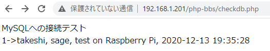

# Raspberry Pi上でもデータベースが動くことを確認

[前回](makedb.html)と同様のデータベースをRaspberry Pi上のMySQLサーバーにも作成し、`checkdb.php`を動かすまで。

実は今まですべてローカル上でやっていたということに気付いてびっくり。

## 環境

- ローカル
  - Windows 10
  - VSCode 1.51.1
  - XAMPP 7.4.13
- リモート
  - Raspberry Pi 3B+
  - Raspberry Pi OS 10.4
  - Nginx 1.14.2
  - PHP 7.3.19-1~deb10u1
  - MariaDB 10.3.23

## DB作成

はい、[前回](makedb.html)の内容をもう一度やりましょう。

1. MySQLへのログインは`sudo`を付ければパスワード無しで入れるはず。詳しくは[Raspberry PiにMySQLとWordPressをインストールし、セットアップする](../wordpress/install.html)の解説を参照。

   ~~~shell
   $ sudo mysql -u root
   Welcome to the MariaDB monitor.  Commands end with ; or \g.
   Your MariaDB connection id is 2256
   Server version: 10.3.23-MariaDB-0+deb10u1 Raspbian 10
   
   Copyright (c) 2000, 2018, Oracle, MariaDB Corporation Ab and others.
   
   Type 'help;' or '\h' for help. Type '\c' to clear the current input statement.
   
   MariaDB [(none)]>
   ~~~

2. `my.ini`ファイルはWindows用で、Linuxでは`/etc/mysql/`の中のファイルがそれにあたるらしい。でも中身を見たけど、文字セットがUTF-8にすでに設定されている雰囲気だったので触らないでおく。

3. bbsデータベース作成

4. postsテーブル作成

5. bbsユーザーの作成

6. bbsユーザーに権限を付与

7. テスト用レコードをpostsテーブルに作成

調べながらやってたらかなり時間かかったけど、2回目自分の記録を見ながらやったら早い。

## ファイルを配置

[現状ローカルからリモートへHTMLファイルをアップロードするときはGitを使っているが](../webserver/syncgit.html)、そのアイディアを流用してGitHubから引っ張ってくることでファイルを配置する。

ということはすべて`upload`ユーザー（[以前作成](../webserver/update2.html)）の所有物とした方がいいのでRaspberry Piに`upload`ユーザーでログインする。

めちゃめちゃ久しぶり。こんなこともあろうかと`upload`ユーザー用の[PowerShellのエイリアス](../startup/powershellalias.html)を作っておいてよかった。

~~~shell
upload@takeshipi:~ $
~~~

### `upload`ユーザーがGitHubにSSH接続できるようにする

#### 公開鍵と秘密鍵の作成

何回目やろこれ・・・

~~~shell
$ cd ~/.ssh
$ ssh-keygen -t rsa
~~~

#### GitHubの自分のアカウントに`upload`ユーザーの公開鍵を登録

GitHubのアカウントが無い場合はググりながら作る。

[SSH and GPG keys](https://github.com/settings/keys)にアクセスし、

1. 「New SSH key」ボタンを押す。
2. 「Title」欄に「uploadユーザー用公開鍵」と入力。
3. 「Key」欄に今作成した公開鍵をコピペする。
4. 「Add SSH key」をクリック。

ユーザーパスワードの入力を求められた後に追加が完了する。

#### GitHubに接続できるかどうか確認

初めてのサーバーにSSH接続するときの「初めてやけど、ええか？」みたいなことを聞かれて「yes」と打てば以下が表示される。

~~~
Hi take5553! You've successfully authenticated, but GitHub does not provide shell access.
~~~

できない場合は[GitHubにSSH接続できるようにする \- Qiita](https://qiita.com/shimisunet/items/1b9568ff62a1550a931b)を参照、またはググる。

### GitHubからクローンする

クローンした場所に新たなディレクトリを作成するから、ドキュメントルート内でクローンする。

~~~shell
$ cd /home/takeshi/www/html
$ git clone git@github.com:take5553/php-bbs.git
Cloning into 'php-bbs'...
remote: Enumerating objects: 26, done.
remote: Counting objects: 100% (26/26), done.
remote: Compressing objects: 100% (17/17), done.
remote: Total 26 (delta 3), reused 25 (delta 2), pack-reused 0
Receiving objects: 100% (26/26), done.
Resolving deltas: 100% (3/3), done.
~~~

しまった、これだと`php-bbs`という名前でディレクトリができてしまう。ローカルでは`bbs`という名前にしてるけど、大丈夫かな？

中身確認。

~~~shell
$ cd php-bbs
$ ls
bbs.code-workspace  checkdb.php  index.php  view
~~~

あ、しまった。`bbs.code-workspace`はいらない。

ローカルでPowerShellを開いてワークフォルダに移動し以下を打つ。

~~~shell
> git rm --cached bbs.code-workspace
~~~

そして`.gitignore`を作成し、

~~~
bbs.code-workspace
~~~

と記入し、コミット＆プッシュし、Raspberry Pi上でPullをする。

~~~shell
$ git pull origin master
$ ls
checkdb.php  index.php  view
~~~

おっけー。

最後に、見られるとややこしいやつは権限を削除しておく。

~~~shell
$ chmod -R 770 .git
$ chmod 640 .gitignore
$ chmod -R 770 .vscode
~~~

※Nginxの設定で隠しファイルや隠しディレクトリへのアクセスを禁止できると思うけど、また今度。

## Nginxの設定値に書き込む

`sudo`コマンドが必要なので`takeshi`ユーザーでログインしなおして以下のコマンドを打つ。

```
$ sudo nano /etc/nginx/fastcgi.conf
```

以下を末尾に追記。

```
fastcgi_param  PHP_BBS            (DBのbbsユーザーのパスワード);
```

特にダブル・シングルクォーテーションで囲まなくてもよい。

## 動作確認

ブラウザから`http://192.168.1.201/php-bbs/checkdb.php`にアクセスする。



無事動いている。


