# VSCodeの拡張機能⑤「その他いろいろ」

必須ではないけど、使いそうな機能をどんどん入れてみる。

## 環境

- ローカル
  - Windows 10
  - VSCode 1.51.1
  - XAMPP 7.4.13

## Bracket Pair Colorizer 2

かっこを色分けしてくれる。

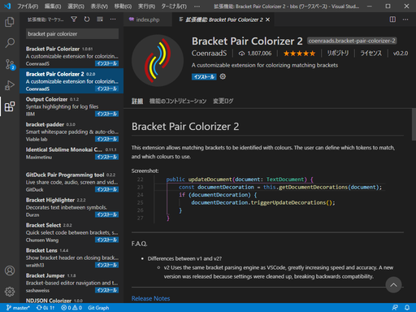

かっこのネストが続くと威力を発揮するかも。でもちょっと色が派手派手しい？

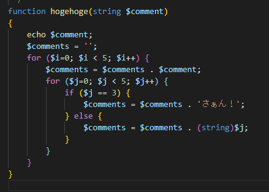

Bracket Pair Colorizer 2を外すとこう。

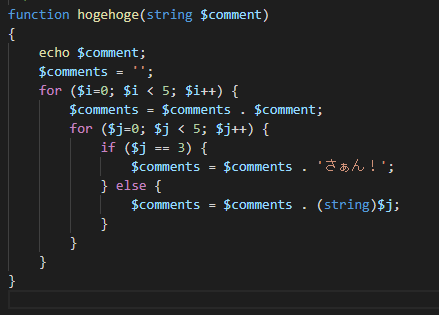

好みの問題か？

ネストが欲しいから適当に書いたけど、絶対に実行したくねーなこれ。

## TODO Highlight

`TODO:`や`FIXME:`というコメントを目立つようにしてくれる。

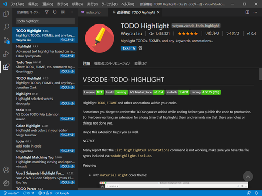

やべえ。

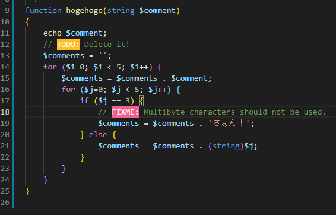

## GitLens

Gitとの連携が高機能すぎてヤバいらしい拡張機能。とりあえず入れてみる。

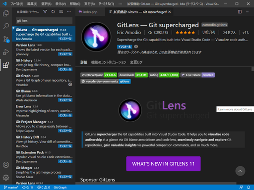

なんか、「GitHubに接続するとめちゃいいことあるよ」的な表示が出たけど消してしまった。Issueやプルリクなんかが分かる的なことが書かれていたような気がする。

とりあえず画面左にGitLensのアイコンが表示されるようになったから、その中の「Quick Setup」を始めてみる。

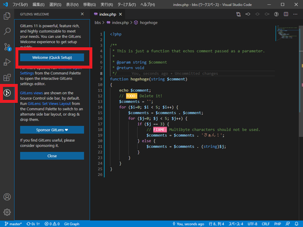

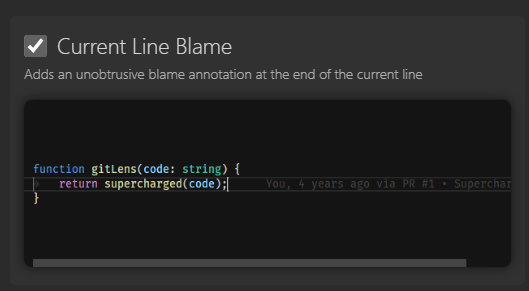

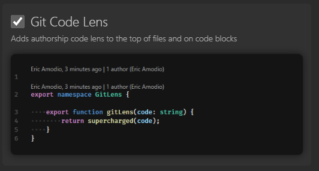

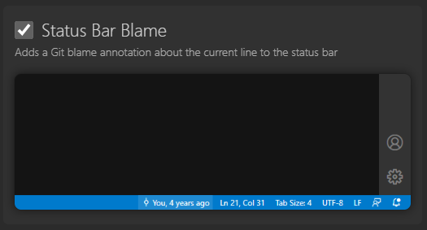

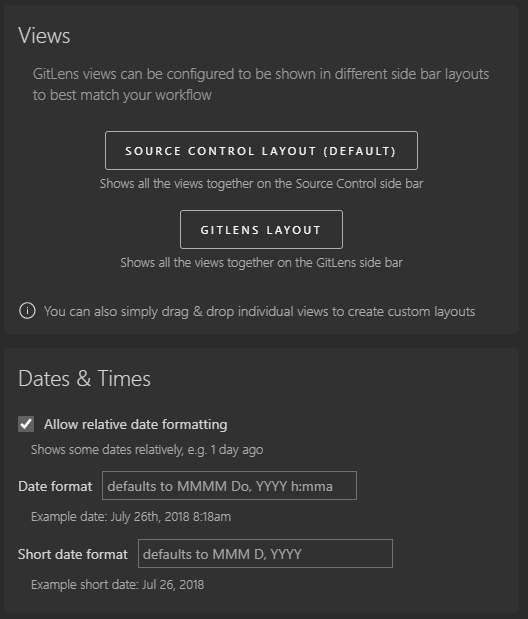

変えるとこ無かった。

行の右側に「編集者、保存した日時、コミット」なんかが表示される。

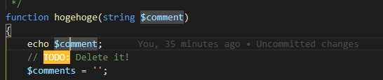

マウスを「You, 35 minutes ago ・ Uncommitted changes」の上に乗せるとさらに詳細情報が表示される。

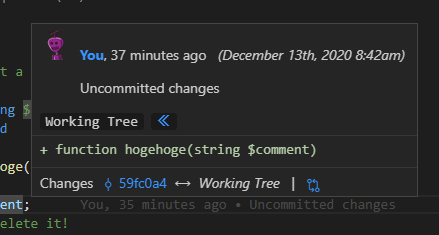

試しにコミットしてみると、反映された。

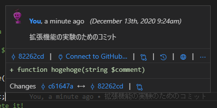

試しにこのポップアップの真ん中の「Connect to GitHub...」をクリックしてGitHubに接続してみると、GitHubで登録している自分のアイコンと「You」のリンクに自分のメールアドレスが入るようになった。

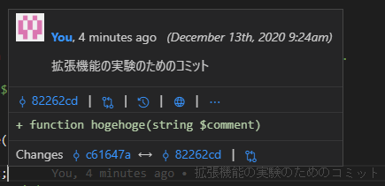

個人開発では・・・いるかな？