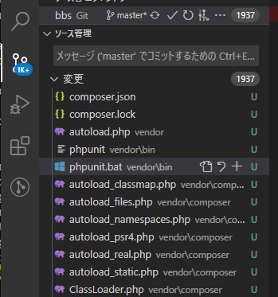

# PHPUnitでテスト試し書き

PHPのテストフレームワークであるというPHPUnitを導入してテストを書いてみる。

## 環境

- ローカル
  - Windows 10
  - VSCode 1.51.1
  - XAMPP 7.4.13
  - Composer version 2.0.8

## テストとは

そもそもプログラミングで「テストする」とは、作ったコードを意図的に動かして意図する結果が出力されたらOKと判断するようなコードを書くこと。

例えば

~~~php
function add($a, $b){
    return $a + $b;
}
~~~

に対して

~~~php
function test_add($var_a, $var_b, $answer){
    if ($answer == add($var_a, $var_b)){
        return true;
    } else {
        return false;
    }
}
~~~

と書き、以下を実行する。これがテスト。

~~~php
test_add(2, 3, 5); // true
test_add(2, 0, 2); // true

if (test_add(0, 1, 2) == false){
    echo true;
} else {
	echo false;
}
// true
~~~

この例は簡単すぎてテストのメリットが実感できないけど、規模が大きくなってきて関数とかクラスが何十個とか何百個とかになってきたときに威力を発揮する。手作業で全部チェックするのは難しいけど、テストを書いておけば自動でやってくれる。

ただ、大体はテストフレームワークを使ってテストを書く。PHPの場合、メジャーなのはPHPUnitというフレームワーク。他の種類があるのかは知らん。

## インストール

[Getting Started with Version 9 of PHPUnit – The PHP Testing Framework](https://phpunit.de/getting-started/phpunit-9.html)

Composerがインストールされていれば、コマンドを打つだけでインストールされるらしい。PHP7.4を使っているならPHPUnit9をダウンロードせよとのこと。

PowerShellで以下を打つ。

~~~shell
> cd (ワークフォルダ)
> composer require --dev phpunit/phpunit ^9
> ./vendor/bin/phpunit --version
PHPUnit 9.0.0 by Sebastian Bergmann and contributors.
~~~

インストール途中で`Package phpunit/php-token-stream is abandoned, you should avoid using it. No replacement was suggested.`（php-token-streamっていうパッケージは採用されてないから使ったらあかんで）と言われた。覚えているかどうかは分からないけど使わないでおこう。

ということで、現在のフォルダ配下に`vendor`フォルダが作成され、そこにPHPUnitを動かすための依存パッケージが全部入って、Gitが「新しく作成されたファイルが1000個以上あるけど・・・」と言ってきている。実際は1937個あるみたい。

こんなに管理してられないので全部Git管理から外す。`.gitignore`に以下を追記。

~~~
bbs.code-workspace
vendor          ←追記
~~~

これでほとんどが管理から外れた。`composer.json`と`composer.lock`というファイルは管理下に残したが、これは「これさえ共有しておけば、違うPC上でも`composer install`というコマンドを打つだけでComposerが必要なパッケージをDLしてくれて環境を再現してくれる」というもの。

Composer経由で別のパッケージをインストールしない限り`composer.json`は更新されない。逆にパッケージをインストールした場合は`composer.json`にその情報が書かれるので、これがあれば環境をそろえられる、という訳。

ただし、`composer.json`には依存先のパッケージ情報は書かれない。例えばPHPUnitなら「バージョン9をDLせよ」と書かれているので違う環境に移してもバージョン9をDLしてくれるけど、PHPUnitを動かすのに必要な他のパッケージについては指定が無ければ最新版をDLしてくる。例えばデスクトップPCで環境を作り作業をある程度進めて時間が経った後、ノートPCにも同じ環境を用意して出先でも作業しようとなったとき、デスクトップPCで環境を作った後に依存先パッケージのどれかにバージョンアップがあった場合、ノートPCには完全に同じ環境が再現されるわけではない。それを、依存先まで含めてばっちり固定するのが`composer.lock`というわけ。`composer.lock`も共有しておけば、依存パッケージも含めて環境を共有できる。

## 「PATHを通す」まがいのこと

現状だと、ワークフォルダに移動してから

~~~
> ./vendor/bin/phpunit (オプション)
~~~

と打たないとPHPUnitは動かない。

理想的には、ワークフォルダに移動してから

~~~
> phpunit (オプション)
~~~

で動いてほしい。

じゃあPATHを通してしまえというのは乱暴で、Windows上のどこでも「この」PHPUnitが動いてしまう。別プロジェクトで別のバージョンのPHPUnitを入れたいときに困る。

で、`./vendor/bin/phpunit`とは実際に何が動いているのかと言うと、`./vendor/bin/phpunit.bat`であり、その中身は

~~~
@ECHO OFF
setlocal DISABLEDELAYEDEXPANSION
SET BIN_TARGET=%~dp0/../phpunit/phpunit/phpunit
php "%BIN_TARGET%" %*
~~~

となっている。1行目、2行目はググってもらうとして、3行目でPHPUnitの本体ファイルのパスをセットし、4行目でそれをPHPに投げているだけ。ならばこれを改造してワークフォルダのトップに置いとけばいいじゃん。

ということで、

1. `(ワークフォルダ)/vendor/bin/phpunit.bat`をワークフォルダトップにコピー

2. 3行目を以下のように変えて保存終了。

   ~~~
   @ECHO OFF
   setlocal DISABLEDELAYEDEXPANSION
   SET BIN_TARGET=%~dp0/vendor/phpunit/phpunit/phpunit
   php "%BIN_TARGET%" %*
   ~~~

よし、これで動くはずだ。

~~~shell
> phpunit --version
Warning:なんたらかんたら
Warning:なんたらかんたら
Warning:なんたらかんたら
PHPUnit 3.7.21 by Sebastian Bergmann.
~~~

あれ？

こうか？

~~~shell
> ./phpunit --version
PHPUnit 9.0.0 by Sebastian Bergmann and contributors.
~~~

どうやらXAMPPにもPHPUnit（スーパー古いバージョン）が入っていて、XAMPPのPHPのフォルダにはPATHが通っているから、ただ単に`phpunit`と打つと、そのスーパー古い方が動いてしまう。でもスーパー古いからPHPが「こんなクソ古いコード動かせるわけないやろ！どないなっとんのや！」と怒る。

仕方がないのでこのまま`./phpunit`で動かすことにする。

`phpunit.bat`もGit管理をするつもりはないので、`.gitignore`にそう書いておこう。

`.gitignore`

~~~
bbs.code-workspace
vendor
phpunit.bat ←追記
~~~

## テストを書く

[2\. PHPUnit 用のテストの書き方 — PHPUnit latest Manual](https://phpunit.readthedocs.io/ja/latest/writing-tests-for-phpunit.html)

公式マニュアルがスーパー分かりにくい。

### 準備

テストができるかどうかテストするので、ワークフォルダにTtestTest.php`という名前で以下の内容を保存する。テストをするにはクラスを作らないといけないらしい。

~~~php
<?php

class TestTest
{
    public function testHoge()
    {
        return 'hogehoge';
    }

    public function testAdd(int $a, int $b)
    {
        return $a + $b;
    }
}
~~~

これがちゃんと動くかテストする。

### テストコードの作成

とりあえずワークフォルダに`tests`という名前のフォルダを作り、そこにテストコードを入れていくことにする。

テストコード作成にはいくつかルールがあるらしい。

1. `(テスト対象のクラス名)Test.php`という名前で保存。

   →`TestTestTest.php`

2. その中に`(テスト対象のクラス名)Test`というクラスを、`TestCase`というクラスを継承して作る。

   →`class TestTestTest extends TestCase`

3. そのクラスの中に、テストメソッドとして`test(任意の文字列)`を作成する。

   →`public function testtesthoge()`と`public function testtestadd()`を作成

やばい、testだらけ。

`tests/TestTestTest.php`の内容。

~~~php
<?php

use PHPUnit\Framework\TestCase;

require('TestTest.php');

class TestTestTest extends TestCase
{
    public function testtestHoge()
    {
        $testtest = new TestTest;
        $this->assertEquals('hogehoge', $testtest->testHoge());
    }

    public function testtestAdd()
    {
        $testtest = new TestTest;
        $this->assertEquals(5, $testtest->testAdd(2, 3));
    }
}
~~~

なんで`TestTest`なんてクラス名で、`testHoge`とかいうメソッド名にしたんだ自分は。

最初の`use`文のバックスラッシュは円マーク（￥）。`require`はテストコードが書かれたファイルからの相対パスではなく、`phpunit.bat`の場所から見た相対パス。

`assertEquals(想定値, テストしたいメソッド)`の形で書くと、「テストしたいメソッドの出力が想定値とイコールか」ということをテストできる。

## テスト実行

ワークフォルダ内で以下を打つ。`tests`フォルダ内のテストコードをすべて実行。（と言っても今は`TestTestTest.php`しかないけど）

~~~shell
> ./phpunit tests/
PHPUnit 9.0.0 by Sebastian Bergmann and contributors.

..                                                                  2 / 2 (100%)

Time: 00:00.528, Memory: 4.00 MB

OK (2 tests, 2 assertions)
~~~

無事テストが通ったらしい。

`..                    2 / 2 (100%)`の行の`.`はテスト成功を示すらしい。2個あるので2個とも成功している。

## コード修正後のテスト

試しに`testAdd()`を複雑に修正してテストが通るか実験する。

`TestTest.php`（修正後）

~~~php
<?php

class TestTest
{
    public function testHoge()
    {
        return 'hogehoge';
    }

    public function testAdd(int $a, int $b)
    {
        $number = $this->makeNumberArray($a);

        for ($i = 1; $i <= $b; $i++) {
            $number[] = 1;
        }

        return count($number);
    }

    private function makeNumberArray(int $number)
    {
        $numberArray = array(1);

        for ($i = 1; $i <= $number; $i++) {
            $numberArray[] = 1;
        }

        return $numberArray;
    }
}
~~~

[ペアノの公理](https://ja.wikipedia.org/wiki/%E3%83%9A%E3%82%A2%E3%83%8E%E3%81%AE%E5%85%AC%E7%90%86)風に変えてみた。

テスト実行。

~~~shell
> ./phpunit tests/
PHPUnit 9.0.0 by Sebastian Bergmann and contributors.

.F                                                                  2 / 2 (100%)

Time: 00:00.547, Memory: 4.00 MB

There was 1 failure:

1) TestTestTest::testtestAdd
Failed asserting that 6 matches expected 5.

D:\work\HTML\raspberrypi-server\test\html\bbs\tests\TestTestTest.php:18

FAILURES!
Tests: 2, Assertions: 2, Failures: 1.
~~~

失敗した。

`Failed asserting that 6 matches expected 5.`ということは、「5のはずなのに6が出力されてるよ」ということか。

よし、デバッグだ。

[続く](testanddebug.html)