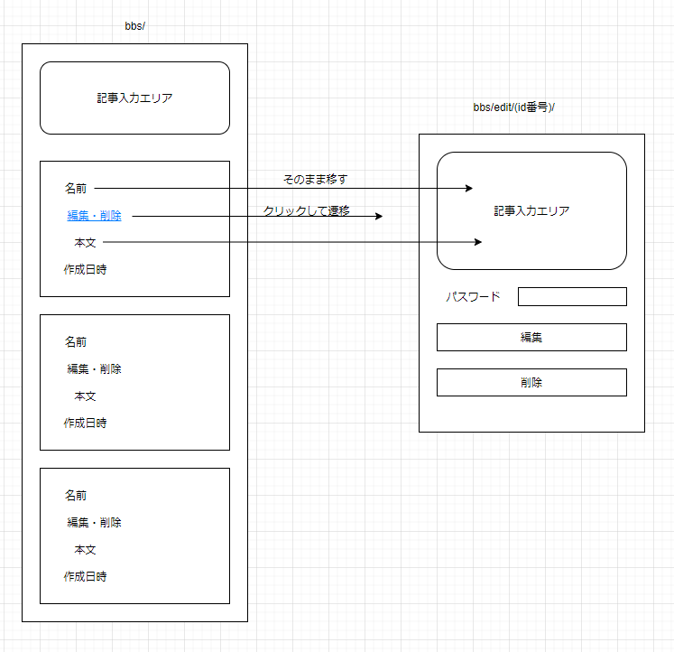

# 記事編集機能の設計

ここでは記事編集機能をどうやって実装するか考える。参考にしているサイトは「利用者の誰も記事編集・削除ができず、管理者のみが管理者モードに入ることによって編集・削除ができる」という形をとっているので、そこを少し変えたい。

## イメージ

こんな感じ。別ページに遷移する形をとる。

ただページを移るだけならいいけど、問題はBBS上の情報を引き継ぎながら移動し、移動先でのデータを返してもらわないといけない。

## リクエストパラメーター

[\[PHP] リクエストパラメータ・セッションに関するまとめ \- Qiita](https://qiita.com/mpyw/items/7852213f478e8c5a2802)

詳しすぎてヤバい。

イメージとしては

* `https://arcticstreet.ddns.net/bbs/`で掲示板にアクセス
* `https://arcticstreet.ddns.net/bbs/edit/(id番号)/`でそのID番号を持つ記事の編集ページにアクセス

という風にしたい。ここで`edit/(id番号)/`をリクエストパラメーターという扱いにする。

ただし、勝手にそういう扱いになるのではなく、サーバーの設定との合わせ技でそれが実現できる。