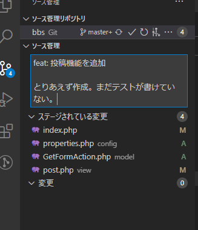

# 投稿

前置きが長かったが、いよいよ実際に作っていく。

なお、参考サイトとして以下のサイトをベースに作っていき、必要なところは適宜変えていくスタイル。

[【プログラミング構築】入力したデータをPOST送信でデータベースに登録しよう \| 株式会社LIG](https://liginc.co.jp/272916)

## 環境

- ローカル
  - Windows 10
  - VSCode 1.51.1
  - XAMPP 7.4.13
  - MariaDB 10.4.17
- リモート
  - Raspberry Pi 3B+
  - Raspberry Pi OS 10.4
  - Nginx 1.14.2
  - PHP 7.3.19-1~deb10u1
  - MariaDB 10.3.23

## フォルダ構成

~~~
ワークフォルダ
　├configフォルダ
　├modelフォルダ
　├viewフォルダ
　│　└post.php
　├testsフォルダ
　└index.php
~~~

他にもいろいろ作ったが、今回の制作物に関わるものは以上とする。

`controller`フォルダを作っても良かったがとりあえずMVCのコントローラーは`index.php`が担当するものとする。見通しが悪くなってきたら変更する。

`config`フォルダは定数を定義したファイルを格納し、`index.php`の最初に読み込みに行くことにする。

## 設定作成

`config/properties.php`

~~~php
<?php
define('DATABASE_NAME', 'bbs');
define('DATABASE_USER', 'bbs');
define('DATABASE_PASSWORD', $_SERVER['PHP_BBS']);
define('DATABASE_HOST', 'localhost');

define('PDO_DSN', 'mysql:dbname=' . DATABASE_NAME . ';host=' . DATABASE_HOST . ';charset=utf8');

~~~

データベース接続のための定数。作ってしまえばほぼ変えることは無いかな。

`PDO_DSN`というのは自分で勝手に付ける名前だけど、意味は

* `PDO`

  「PHP Data Object」の略。PHPの組み込みクラスにPDOというものがあって、それを後で使う予定だから。

* `DSN`（＝どすん）

  「Data Source Name」の略。PDOインスタンスを作成するときに渡さないといけない。

## モデル作成

`model/GetFormAction.php`

~~~php
<?php
class GetFormAction
{
    private $pdo;

    public function __construct()
    {
        try {
            $this->pdo = new PDO(PDO_DSN, DATABASE_USER, DATABASE_PASSWORD);
            $this->pdo->setAttribute(PDO::ATTR_ERRMODE, PDO::ERRMODE_EXCEPTION);
            $this->pdo->setAttribute(PDO::ATTR_EMULATE_PREPARES, false);
        } catch (PDOException $e) {
            header('Content-Type: text/plain; charset=UTF-8', true, 500);
            exit($e->getMessage());
        }
    }

    public function SaveDBPostData($data)
    {
        // 投稿された記事をDBに保存

        $smt = $this->pdo->prepare('insert into posts (name,email,body,password,posted_at,updated_at) values(:name,:email,:body,:password,now(),now())');
        $smt->bindParam(':name', $data['name'], PDO::PARAM_STR);
        $smt->bindParam(':email', $data['email'], PDO::PARAM_STR);
        $smt->bindParam(':body', $data['post_body'], PDO::PARAM_STR);
        $smt->bindParam(':password', $data['password'], PDO::PARAM_STR);
        $smt->execute();
    }
}
~~~

クラスを作成。クラス名に特に意味はない。参考サイトがそう書いていたからそう書いただけ。

クラスとは何ぞやとか、コンストラクタとは何ぞやなんてことはここでは解説しない。必要であればサイトを参考にする。

[【PHP超入門】クラス～例外処理～PDOの基礎 \- Qiita](https://qiita.com/7968/items/6f089fec8dde676abb5b#%E3%82%A4%E3%83%B3%E3%82%B9%E3%82%BF%E3%83%B3%E3%82%B9%E5%8C%96%E3%81%99%E3%82%8B%E3%81%A8%E3%81%8D%E3%81%AB%E5%AE%9F%E8%A1%8C%E3%81%95%E3%82%8C%E3%82%8B%E7%89%B9%E5%88%A5%E3%81%AA%E3%83%A1%E3%82%BD%E3%83%83%E3%83%89)

### PDOインスタンス生成

PDOインスタンスを生成してプロパティとして持たせてしまえば、以降はこの`$pdo`をいじることでデータベースとのやり取りができる。

PDOインスタンス生成に必要な引数は以下の通り。

* `PDO_DSN = 'mysql: dbname=bbs; host=localhost; charset=utf8'`

  * `mysql:`

    PDOドライバ。要は「どの種類のDB使うか」を指定する。他にもOracleとかPostgreSQLとかSQL Serverとかもサポートされているらしいが、いずれも`php.ini`で設定したうえで必要なライブラリのようなものを入れないといけないらしい。XAMPPでもRaspberry Pi上でもMySQL用の設定を開放したことは無いから、デフォルトでMySQL（MariaDB）は有効になっているのかな。

    PDOドライバの後ろはコロン。

  * `dbname=bbs`

    MySQLの中でどのデータベースに接続するか。

  * `host=localhost`

    どこからMySQLに接続するか。`localhost`と書いちゃうからにはきっと外部ネットワークのIPとかも指定できるんだろうけど、当然MySQL内で設定が必要。大体の場合においてPHPとMySQLは同一サーバー内に居るはずなので、`localhost`から変えることは無い。

  * `charset=utf8`

    文字セット。これを指定しないとセキュリティホールができるらしい。

* `DATABASE_USER = bbs`

  MySQLに接続する際のユーザー名。

* `DATABASE_PASSWORD = $_SERVER['PHP_BBS']`

  上記ユーザーのパスワード。ここではサーバーの環境変数にパスワードをセットしているのでPHPコード上には書かない。詳しくは[こちら](hidepassword.html)。

つまりDSN（どすん）、ユーザー名、パスワードがあればDBに接続できるということか。

何らかの理由でDBに接続できない場合例外が投げられるので、`try-catch`構文でそれをキャッチしてなぜなのかを表示するようにする。

### 接続オプション

「普通はこうする」みたいなものがあるらしい。詳しくは以下を参照。

[PHPでデータベースに接続するときのまとめ \- Qiita](https://qiita.com/mpyw/items/b00b72c5c95aac573b71)

### 投稿された記事をDBに保存

DBに保存するためには、SQL文を書いて実行すればよい。`$data`にはユーザーがHTML上で入力したデータが入ってくる予定。データをテーブルに追加するためには「INSERT文」を書けばよい。

[データを追加する\(INSERT文\) \| MySQLの使い方](https://www.dbonline.jp/mysql/insert/index1.html)

ただし、PDOを通じてINSERT文を実行するには

1. INSERT文を準備
2. パラメーターのバインド
3. INSERT文を実行

という手順を踏まないといけない。

#### なんで？

本来なら直接SQL文を作って実行すればよくて、それには

~~~php
$pdo->query(SQL文をここに書く);
~~~

という形でコードを書けばいいんだけど、これだと本当にそのままSQL文が実行されてしまうから、SQLインジェクションが可能になってしまう。

[IPA ISEC　セキュア・プログラミング講座：Webアプリケーション編　第6章 入力・注入対策：SQL注入攻撃: \#1 実装における対策](https://www.ipa.go.jp/security/awareness/vendor/programmingv2/contents/502.html)

自分もあまり詳しくないけど、SQLインジェクションのことを調べると大体みんな「プリペアードステートメントを使って書け」みたいなことを言ってるサイトが多いことから察するに、

SQLインジェクション ＝ SQL文を意図しないところで強制終了させられて、その後攻撃者の都合のいいようにコマンドを実行されてしまう

ということなのかな。それで、プリペアードステートメントで「ここからここまでがSQL文ですよ」というのを先に宣言しておいて後から値を結び付ければ、意図しないところでSQL文を切られない、ということ？

よく分からん。

とりあえず、ユーザーの入力が必要のないSQL文は`query`メソッドで実行してもいいらしい。

### `bindParam`メソッドとPDOクラス定数

使い方は見ての通り。`PDO::PARAM_STR`については以下を参照。

[PHP: 定義済み定数 \- Manual](https://www.php.net/manual/ja/pdo.constants.php)

## コントローラー作成

`index.php`

~~~php
<?php
require_once('./config/properties.php');
require_once('./model/GetFormAction.php');

$action = new GetFormAction();

$eventId = null;

// イベントIDを取得

if (isset($_POST['eventId'])) {
    $eventId = $_POST['eventId'];
}

switch ($eventId) {
    case 'save':
        $action->SaveDBPostData($_POST);
        require('./view/post.php');
        break;
    
    default:
        require('./view/post.php');
        break;
}
~~~

コントローラーとは、ユーザーの入力を一旦受け取って、その内容に応じて適切なモデルを選択し、適切なビューを選択するというものだけど、ここでの`switch`文がまさにそのことをストレートにやっている。

とりあえず今は記事投稿しか考えていないけどそのうち増やしていく予定。

### ユーザーの入力の受け取り方

`view/post.php`を作った時に、次のように入力フォームを作った。

~~~HTML
<form action="./index.php" method="post" id="post_form">
    

        名前： 
        <input type="text" name="name" id="name">
    

    

        メールアドレス： 
        <input type="email" name="email" id="email">
    

    

        本文： 
        <textarea name="post_body" id="post_body" cols="30" rows="10">本文を入力してください。</textarea>
    

    

        パスワード： 
        <input type="password" name="password" id="password">
    

    

        <input type="hidden" name="eventId" value="save">
        <input type="submit" value="送信">
    

</form>
~~~

このとき、

* `action`・・・送り先
* `method`・・・GETかPOSTか

を指定し、`submit`ボタンを作ってぽちっとクリックすると、PHPには`$_POST`というグローバル変数にそれぞれの値が格納される。つまり

* `$_POST['name']`
* `$_POST['email']`
* `$_POST['post_body']`
* `$_POST['password']`

という形で取り出せる。もちろんフォームを増やせば`$_POST`の要素数も増える。

[PHP: $\_POST \- Manual](https://www.php.net/manual/ja/reserved.variables.post.php)

この`$_POST`をそのまま`SaveDBPostData`の引数として渡しているから、`SaveDBPostData`内では`$data['name']`というような形でユーザーの入力値を取り出せる、というわけ。

`eventId`については、記事送信ボタンをクリックした時点で「記事を保存したい」ということは決まっているわけで、そういう意味でユーザーの入力は必要ない。だからHTMLでは

~~~HTML
<input type="hidden" name="eventId" value="save">
~~~

という形で書かれていて、`type="hidden"`でフォームコントロールを特に表示することなく、`$_POST['eventId'] = 'save'`がセットできる。

## 実験

全てを保存し、`localhost`へアクセス。相変わらず見た目がひどい。

適当に中身を入力して「送信」ボタンをクリック。今の段階ではまだ表示は変わらない。とりあえず[前に作った](makedb.html)DBチェック用の`checkdb.php`にアクセスする。

うむ、ちゃんとDBには記事が保存されているようだ。

## コミット＆プッシュ

とりあえず一区切りがついたのでコミット＆プッシュ。

「feat: 」はPrefixで、[僕が考える最強のコミットメッセージの書き方 \- Qiita](https://qiita.com/konatsu_p/items/dfe199ebe3a7d2010b3e)を参考にした。別に何でもいいと思うけど、こうするって決めるのは大事。もっとちゃんとするべきなんだろうけど、考えすぎると始まらないのでとりあえずPrefixだけマネする。