# 準備１（ワークフォルダ作成、VSCode準備）

PHPで掲示板システムを作るための準備をしていく。

## 環境

* ローカル
  * Windows 10

## 用語

### ドキュメントルート（ローカル）

自分の環境。ローカル、つまり自PC内の適当なフォルダ。中には今まで作ったHTMLファイルやMarkdownファイルが詰まっている。

~~~
ドキュメントルート（←適当な場所に適当な名前で作ったフォルダ）
　├.git
　├startup
　│　└ファイル色々
　├webserver
　│　└ファイル色々
　├wordpress
　│　└ファイル色々
　├wordpressblog
　│ └wordpressの実行ファイル等
　├（その他色々なフォルダ）
　├index.html
　├index.md
　└.gitignore
~~~

必ずしも同じようにしておく必要は無いけど、自分の環境はこうだよと示しておくことでこれから紹介していく手順やコードも把握しやすくなるんじゃないかな？と思っただけ。

現状では、このドキュメントルートの中身を[Gitを使って丸ごとRaspberry Piにアップ](../webserver/syncgit.html)している。

## ワークフォルダ

ローカルのドキュメントルートに`bbs`という名前でフォルダを作りそこで全ての作業をする。

ただし、最終的にはRaspberry Piにアップするので、[WordPressでやったように](../wordpress/wordpressdirectory.html)`bbs`フォルダはアップロードに使用しているGitの管理外とする。※完全に自分の都合。

よって、`.gitignore`に以下を追記。

~~~
wordpressblog/
bbs/ ←追記
~~~

これで`bbs`フォルダは他の管理からは外れる。コミットしてRaspberry Piにプッシュしておく。

## エディタ準備

VSCodeを使うことにする。エディタ＝宗教みたいなところがあって、どれがいい・悪いを語り始めると戦争が起こるらしいので詳しくは言及しないけど、まあ流行ってるし使ってみる感じ。

インストールはググって調べる。こんな画面までたどり着けたらとりあえずOK。

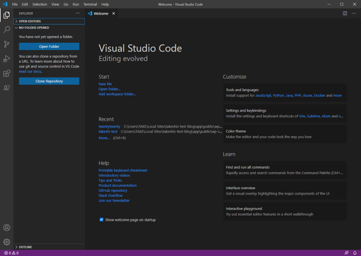

プラグインは最低限しか入れない。日本語化ぐらいは入れておこうか。

一番左のアイコンが並んでいるところの、「Extensions」をクリックして、検索欄に「Japanese」と打てば、「Japanese Language Pack for Visual Studio Code」があるので、そこの緑の「Install」ボタンをクリックするとインストールされる。再起動すれば日本語化される。

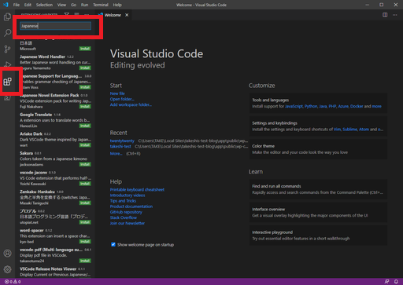

できた。

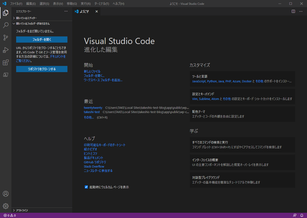

続いて、左側に見えている「フォルダーを開く」をクリック。さっき作った`bbs`フォルダを選択すると、VSCodeが再起動する。

む、下側が青い。Gitのアイコンと「master」という表記があるので、ドキュメントルートのGitリポジトリが影響してるのか？とりあえずこの`bbs`フォルダは、新たにGitリポジトリを作る予定なので、今は放置しておく。

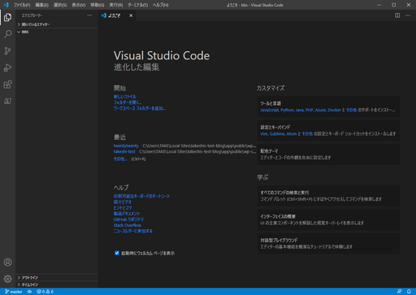

適当にファイルを新規作成してみよう。左側の「BBS」と書かれているドロップダウンメニュー風な場所にマウスを近づけるといくつかアイコンが出てくるので、新規作成っぽいアイコンをクリックする。

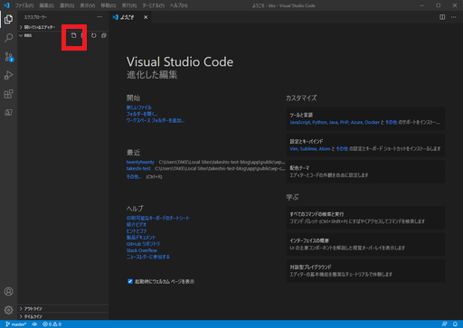

名前を適当に`index.php`としてエンターキーを押せば、ファイルが新規作成される。いちいちExploreを開かなくていいので便利。ただし、右下に何か出てくる。

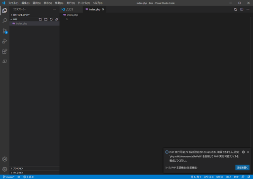

> PHP 実行可能ファイルが設定されていないため、検証できません。なんたらかんたら・・・

どうもこれはPHPの実行ファイルを指定してあげたらPHPの文法チェックをやってくれるらしい。

[WordPressのローカル環境としてLocalを入れた時](../wordpress/localenvironment.html)に一緒に入ったと思うんだけど・・・　探しても見つからなかった。なんでや。

まあLocalはあくまでもWordPress用ということにしといて、後で新たにXAMPP入れようか。どうせMySQLも必要になってくるんだし。

## Gitリポジトリ（ローカル）作成

とりあえずVSCode上でGitの操作をしたい。左側のGitのアイコンをクリックしてみる。

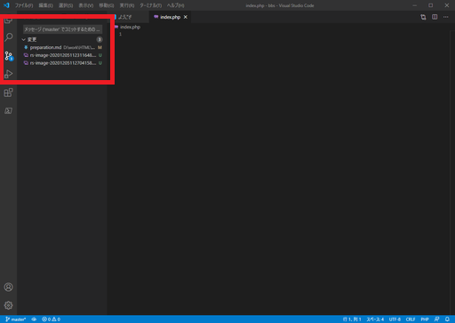

何もしていないのに変更が記録されているのは、やっぱり一階層上のドキュメントルートのGitリポジトリを読んでいる。PowerShellを開いて無理矢理`bbs`フォルダ内で`git init`を実行してみる。

~~~shell
> cd (ドキュメントルートまでのパス)/bbs
> git init
~~~

上手くいかない。

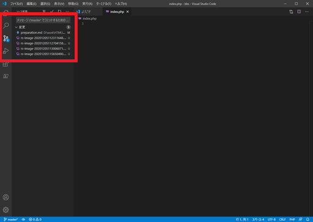

`git init`後にVSCodeで別のフォルダを開き、再度`bbs`フォルダを開きなおしたらちゃんと読み込んでくれた。VSCodeよりも先にGitを準備しといたらよかった。

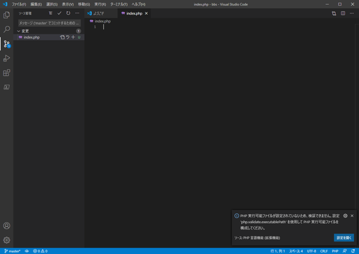

`index.php`に適当に「Hello world!」とか書いて保存。左側のソース管理ペインのメッセージ欄に適当に「First commit」とか書いてチェックマーク（コミット）をクリックしてみる。

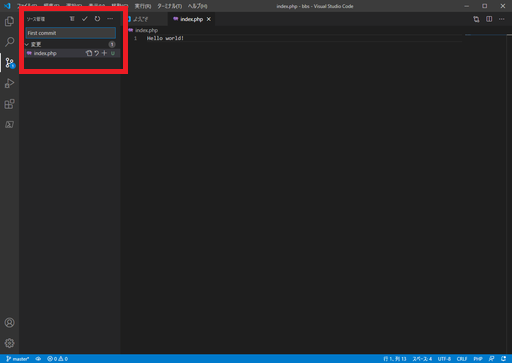

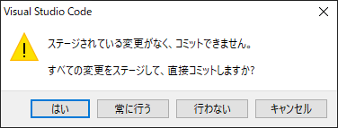

怒られた。初心者か。

正しいやり方としては、ファイル名の横に現れる「＋」マークをクリックするとステージングされる。

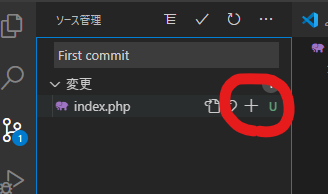

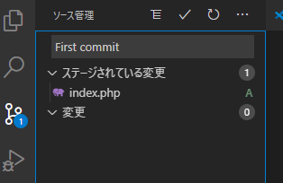

その後、チェックマークをクリックしてコミット。

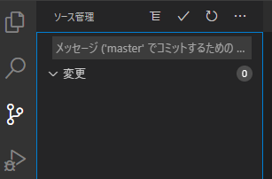

履歴を見るには・・・標準機能には無いようだ。

Git Graphという拡張機能をインストールすればいいらしい。すげぇ。

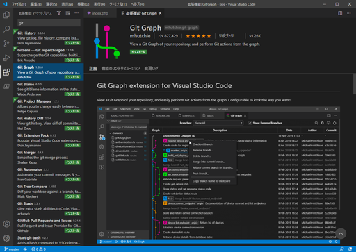

インストール後、下の青いバー（アクティビティーバーっていう名前らしい）に「Git Graph」って出るから、それをクリックすると履歴が見れる。

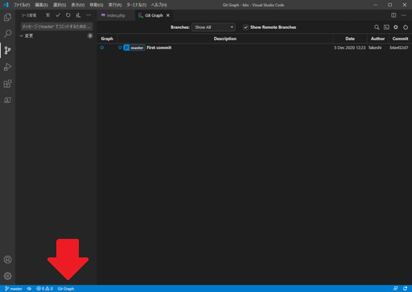

適当に`index.php`の内容を変えてみると、変更した行の左側が青くなり、一番左のGitマークに1個変更があるよというサインが出た。

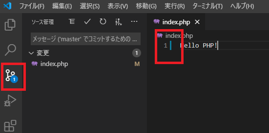

「M」というマークをクリックしてみると、差分が表示された。どこが変更されたか一発で分かる。

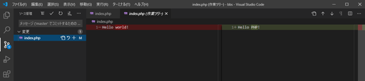

適当に「Second commit」とかいうメッセージを書いてコミット。

* 1行目・・・変更の概要
* 2行目・・・（空ける）
* 3行目・・・変更の詳細

と書くのがお作法。

今気づいたけど、Git Graphのマークが更新マークの右に出てる。

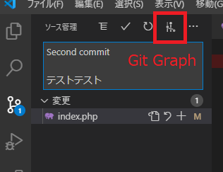

よし、コミット。

初心者か。

ステージングをしてコミットし、Git Graphで確認。コミットをクリックすれば詳細が表示される。素晴らしすぎるやろこれ。

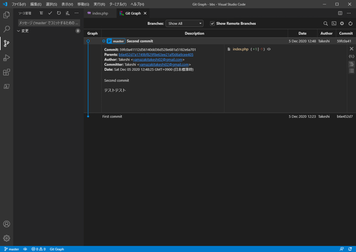

続く。

