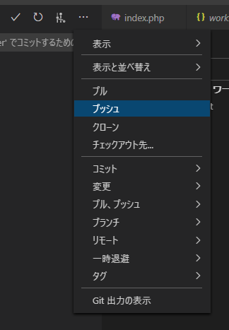
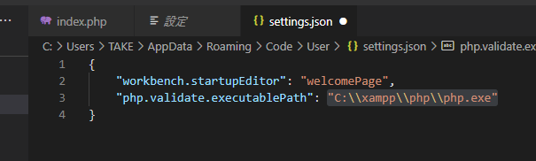

# 準備2（GitHubにリモートリポジトリ作成、XAMPPインストール）

## 環境

* ローカル
  * Windows 10

## GitHubにリモートリポジトリを作成

自分はもうすでにGitHubのアカウントを持っているので、まだの人は適当にググってアカウントを作ろう。

頑張って「新しいリポジトリを作成する」ところまでたどり着く。

Repository nameを`php-bbs`とし、後は適当にそのままにして作成。

その後表示されるページの中段部分で、「SSH」をクリックし、その右に表示されている文字列をクリップボードにコピー。

VSCode上のGitペインでリモートの追加をする。

画面上部に何やら出てきた。どうも「GitHubからリモートを追加する」でいけるっぽい。

VSCode上でGitHubにサインインするのか。

許可して何回かGitHubからの問い合わせにもポチポチしたら、自分のアカウントに紐づいているリポジトリが表示されるようになった。`php-bbs`を選択。

リモート名は`origin`で。おそらくこれで大丈夫なはず。

プッシュしてみる。

よく分からんけどOK。

GitHubへのログインを求められる。

ログインしてしばらくしたらGit Graphに`origin`も表示されるようになった。

ちゃんとアップされている。

これでVSCode上でGitHubへのプッシュもできるようになったのか。便利。

## XAMPPインストール

[XAMPP Installers and Downloads for Apache Friends](https://www.apachefriends.org/jp/index.html)

Windows向けをDL。PHP8.0.0ってなってるけど、Raspberry Piに入っているPHPは7.3だったかな？まあいいか。不具合が出たら立ち向かっていこう。

※[不具合が出たのでXAMPP 7.4.13をオススメする。](troubleshooting1.html)

インストーラーをダウンロードして起動したら「ウィルスソフト動いてるみたいだけど、インストール遅くなるかも。」と言われた。ウィルスソフトを一時停止して再度やってみる。

今度は「ユーザーアカウントコントロール（UAC）が動いてる！`C:\Program Files`へのインストールを避けるか、このセットアップ後にUACを切ってね」って言われた。インストールフォルダを別のところにしたらいいのか。

インストール、始まるよー。

とりあえず必要なのは「Apache、MySQL、PHP」だけど全部入れよう。で、必要があったら使っていくことにしよう。

インストールフォルダ。なんや、このままでええやん。

言語は英語かドイツ語か。その2択なら英語しかない。

「Bitnamiをよろしく！」

いきまーす。

※途中で勝手に再起動するみたい。未保存のものは保存しておこう。

インストールが終わって、XAMPPのコントロールパネルを立ち上げる。

このままApacheを立ち上げてもいいけど、Apacheのドキュメントルートを今自分が作ってるドキュメントルートに設定しておこう。

Apacheの右にある「Config」をクリック。メモ帳が立ち上がるので、`DocumentRoot`という項目を探す。`DocumentRoot`とその下の`<Directory>`の中に書かれているパスを自分のドキュメントルートに書き換える。

自分の場合は`D:\work\HTML\raspberrypi-server\test\html`。

然らばスタート。

ブラウザを立ち上げ、アドレスバーに`localhost/bbs`と打ち込めば「Hello PHP！」と表示されるはず。

これで、テスト環境は整った。こんなんだったら、[WordPressのローカル環境を整えるとき](../wordpress/localenvironment.html)にLocalを使わずにXAMPPを使っておけばよかったね。

※後日追記：`bbs/`を付けるのが面倒だったからapacheのドキュメントルートの場所をワークフォルダ（自分の場合は`D:\work\HTML\raspberrypi-server\test\html\bbs`）に設定した。今後はブラウザから`localhost`にアクセスすれば、ワークフォルダのファイルが表示される、ということにする。

## VSCodeにPHP実行ファイルの場所を教える

[前回](preparation.html)VSCodeから「PHP実行ファイルの場所を教えてくれ」と言われていたので教える。

VSCodeを開いて、`index.php`を開いたらまだ警告を出してくれているので、それに乗っかる。

「設定を開く」ボタンをクリックすると、「setting.jsonで編集」とあるので、クリック。

ここに書けばいいのね。

PHPの実行ファイルの場所は`C:\xampp\php\php.exe`なんだけど、`.json`ファイル上では`\`はエスケープ文字扱いになるので、書くときは`C:\\xampp\\php\\php.exe`とする。

保存して終了。これで`.php`を開いたときに文法をチェックしてくれるようになった。多分。