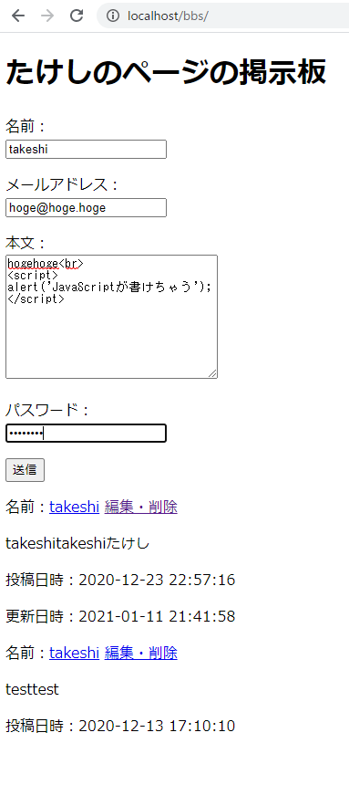
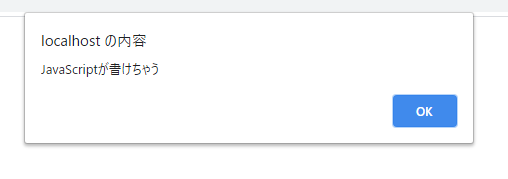
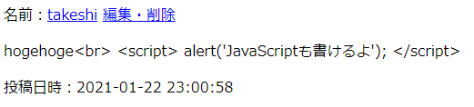

# コード見直し　～セキュリティを考慮する①～

セキュリティは何が正解なのかよく分かっていないけど、とりあえずすぐできるやつから。

## 環境

- ローカル
  - Windows 10
  - VSCode 1.51.1
  - XAMPP 7.4.13
  - MariaDB 10.4.17
- リモートにはアップしない

## HTML文字のエスケープ

例えば

という内容にして送信をクリックすると、メッセージボックスが出せる。

簡単にJavaScriptが埋め込めてしまうのでセキュリティ的によろしくない。

これをどうするかと言うと、HTMLタグに使われるような文字`<`とか`>`とかをエスケープして保存をすればよい。

`model/GetFormAction.php`

新たに`$escapedData`という配列を用意して、エスケープ済みのデータを入れるようにし、それをDBに保存。

~~~php
public function SaveDBPostData($data)
{
    // 渡されたデータが正当なものかどうか
    if ($this->IsDataIncorrect($data)) {
        return false;
    }

    // 投稿データのエスケープ
    foreach ($data as $key => $value) {
        $escapedData[$key] = htmlentities($value, ENT_HTML5 | ENT_QUOTES, "UTF-8");
    }

    // 投稿された記事をDBに保存
    $smt = $this->pdo->prepare('insert into posts (name,email,body,password,posted_at,updated_at) values(:name,:email,:body,:password,now(),now())');
    $smt->bindParam(':name', $escapedData['name'], PDO::PARAM_STR);
    $smt->bindParam(':email', $escapedData['email'], PDO::PARAM_STR);
    $smt->bindParam(':body', $escapedData['body'], PDO::PARAM_STR);
    $smt->bindParam(':password', $escapedData['password'], PDO::PARAM_STR);
    return $smt->execute();
}
~~~

そうするとちゃんとエスケープされるので、投稿として書かれたものが書かれたとおりに表示される。

テストも大丈夫・・・じゃなかった。

~~~shell
> ./phpunit tests/
PHPUnit 9.0.0 by Sebastian Bergmann and contributors.

F.FFF...........                                                  16 / 16 (100%)

Time: 00:01.536, Memory: 4.00 MB

There were 4 failures:

1) GetFormActionTest::testSaveDBPostData with data set "Successful" (array('testpost', 'hoge@hoge.hoge', 'これはテストです', 'password'), true)
Failed asserting that two strings are equal.
--- Expected
+++ Actual
@@ @@
-'hoge@hoge.hoge'
+'hoge&commat;hoge&period;hoge'

D:\work\HTML\raspberrypi-server\test\html\bbs\tests\GetFormActionTest.php:60

2) GetFormActionTest::testSaveDBPostData with data set "withoutEmail" (array('testpost', '', 'これはテストです', 'password'), false)
Failed asserting that true matches expected false.

D:\work\HTML\raspberrypi-server\test\html\bbs\tests\GetFormActionTest.php:56

3) GetFormActionTest::testSaveDBPostData with data set "withoutBody" (array('testpost', 'hoge@hoge.hoge', '', 'password'), false)
Failed asserting that true matches expected false.

D:\work\HTML\raspberrypi-server\test\html\bbs\tests\GetFormActionTest.php:56

4) GetFormActionTest::testSaveDBPostData with data set "withoutPassword" (array('testpost', 'hoge@hoge.hoge', 'これはテストです', ''), false)
Failed asserting that true matches expected false.

D:\work\HTML\raspberrypi-server\test\html\bbs\tests\GetFormActionTest.php:56

FAILURES!
Tests: 16, Assertions: 54, Failures: 4.
~~~

これはどうも最初のテストでコケてDB内のデータが削除されずに残ってしまったから、後のテストにも影響が出てしまったようだ。

テストを変える。

`tests/GetFormActionTest.php`

比較するときに元データもエスケープするようにした。

~~~php
public function testSaveDBPostData($data, $expected)
{
    
    (略)
    
    // 5. アサーションメソッドで確認
    $this->assertEquals($expected, is_array($actual_fetch));
    if (is_array($actual_fetch) == true) {
        // $actual_fetchが配列なら記事が取得できているはず
        $this->assertEquals(htmlentities($data['name'], ENT_HTML5 | ENT_QUOTES, "UTF-8"), $actual_fetch['name']);
        $this->assertEquals(htmlentities($data['email'], ENT_HTML5 | ENT_QUOTES, "UTF-8"), $actual_fetch['email']);
        $this->assertEquals(htmlentities($data['body'], ENT_HTML5 | ENT_QUOTES, "UTF-8"), $actual_fetch['body']);
        $this->assertEquals(htmlentities($data['password'], ENT_HTML5 | ENT_QUOTES, "UTF-8"), $actual_fetch['password']);
    }
    
    (略)
    
}
~~~

これで大丈夫。

~~~shell
> ./phpunit tests/
PHPUnit 9.0.0 by Sebastian Bergmann and contributors.

................                                                  16 / 16 (100%)

Time: 00:00.602, Memory: 4.00 MB

OK (16 tests, 56 assertions)
~~~

テストを通すためにテストを改造するのはどうなのかと思うけど、今回のはこういう風に変えないと絶対通らなくなっちゃったから仕方ないね。

`model/UpdateDBPostData`とそのテストも同じように修正しておく。

`model/UpdateDBPostData`

~~~php
public function UpdateDBPostData(array $data)
{
    // 渡されたデータが正当なものかどうか
    if ($this->IsDataIncorrect($data)) {
        return false;
    }

    // 以下を追記
    // 投稿データのエスケープ
    foreach ($data as $key => $value) {
        $escapedData[$key] = htmlentities($value, ENT_HTML5 | ENT_QUOTES, "UTF-8");
    }
    // ここまで
    
    // 以降、$dataを使っていたところを$escapedDataに変える

    // パスワードを確認
    $old_data = $this->GetDBOnePostData((int)$data['id']);
    if ($escapedData['password'] != $old_data['password']) {
        return false;
    }

    // 編集された記事をDBに保存
    $smt = $this->pdo->prepare('update posts set name=:name, email=:email, body=:body where id=:id');
    $smt->bindParam(':name', $escapedData['name'], PDO::PARAM_STR);
    $smt->bindParam(':email', $escapedData['email'], PDO::PARAM_STR);
    $smt->bindParam(':body', $escapedData['body'], PDO::PARAM_STR);
    $id = (int)$escapedData['id'];
    $smt->bindParam(':id', $id, PDO::PARAM_INT);
    return $smt->execute();
}
~~~

`tests/GetFormActionTest.php`

~~~php
public function testUpdateDBPostData($originalPostData)
{
    // 1. GetFormActionインスタンスを生成
    $action = new GetFormAction();

    // 2. 変更後のデータを準備
    $data = array(
        'id' => (string)$originalPostData['id'],
        'name' => 'UpdatePostData',
        'email' => 'update@update',
        'body' => 'updateupdate',
        'password' => $originalPostData['password']
    );

    // 3. 更新
    $result = $action->UpdateDBPostData($data);
    $this->assertTrue($result);

    // 4. SQL文で直接記事を取得を試みる
    $sql = "select * from posts where id = $originalPostData[id]";
    $stmt = self::$pdo->query($sql);
    $actual_fetch = $stmt->fetch();

    // 以下のhtmlentitiesを追加
    // 5. 評価
    $this->assertEquals(htmlentities($data['name'], ENT_HTML5 | ENT_QUOTES, "UTF-8"), $actual_fetch['name']);
    $this->assertEquals(htmlentities($data['email'], ENT_HTML5 | ENT_QUOTES, "UTF-8"), $actual_fetch['email']);
    $this->assertEquals(htmlentities($data['body'], ENT_HTML5 | ENT_QUOTES, "UTF-8"), $actual_fetch['body']);
    $this->assertNotEquals(htmlentities($originalPostData['name'], ENT_HTML5 | ENT_QUOTES, "UTF-8"), $actual_fetch['name']);
    $this->assertNotEquals(htmlentities($originalPostData['email'], ENT_HTML5 | ENT_QUOTES, "UTF-8"), $actual_fetch['email']);
    $this->assertNotEquals(htmlentities($originalPostData['body'], ENT_HTML5 | ENT_QUOTES, "UTF-8"), $actual_fetch['body']);

    // 6. パスワードが違うと失敗する
    $wrongData = $originalPostData;
    $wrongData['password'] = "hugahuga";
    $result = $action->UpdateDBPostData($wrongData);
    $this->assertFalse($result);

    // 以下のhtmlentitiesを追加
    // 7. 記事データが更新されていないことを確認
    $sql = "select * from posts where id = $wrongData[id]";
    $stmt = self::$pdo->query($sql);
    $actual_fetch = $stmt->fetch();
    $this->assertEquals(htmlentities($data['name'], ENT_HTML5 | ENT_QUOTES, "UTF-8"), $actual_fetch['name']);
    $this->assertEquals(htmlentities($data['email'], ENT_HTML5 | ENT_QUOTES, "UTF-8"), $actual_fetch['email']);
    $this->assertEquals(htmlentities($data['body'], ENT_HTML5 | ENT_QUOTES, "UTF-8"), $actual_fetch['body']);
    $this->assertNotEquals(htmlentities($wrongData['name'], ENT_HTML5 | ENT_QUOTES, "UTF-8"), $actual_fetch['name']);
    $this->assertNotEquals(htmlentities($wrongData['email'], ENT_HTML5 | ENT_QUOTES, "UTF-8"), $actual_fetch['email']);
    $this->assertNotEquals(htmlentities($wrongData['body'], ENT_HTML5 | ENT_QUOTES, "UTF-8"), $actual_fetch['body']);

    // 8. testDeleteDBPostDataへ引き継ぐ
    return $data;
}
~~~

テスト通りました。

~~~shell
> ./phpunit tests/
PHPUnit 9.0.0 by Sebastian Bergmann and contributors.

................                                                  16 / 16 (100%)

Time: 00:00.604, Memory: 4.00 MB

OK (16 tests, 56 assertions)
~~~

[続く。](security2.html)