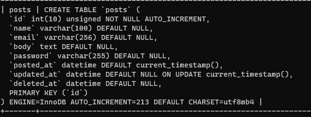

# コード見直し　～セキュリティを考慮する②～

パスワードの暗号化。

## 環境

- ローカル
  - Windows 10
  - VSCode 1.51.1
  - XAMPP 7.4.13
  - MariaDB 10.4.17
- リモートにはアップしない

## パスワード保存時の暗号化

現状ではパスワードは平文で保存している。

これがスーパーよろしくないのは、今の世の中では当たり前に分かってもらえると思う。

なので、パスワード保存時に暗号化するようにする。

参考：
[PHP: パスワードのハッシュ \- Manual](https://www.php.net/manual/ja/faq.passwords.php#faq.passwords.fasthash)←FAQ
[PHP: パスワードのハッシュ \- Manual](https://www.php.net/manual/ja/book.password.php)←`password_hash`関係の公式ドキュメント

今回は暗号化のために`password_hash`を使う

## DBの`password`カラムの変更

`password_hash`を使うと60文字のハッシュ文字列が出力されるけど、現状のDBでは`password`カラムは50文字しか入らない仕様になっている。なので、公式ドキュメントオススメの255文字に拡張する。

MySQLにログイン。PowerShell上で以下を打つ。

~~~shell
> cd c:\xampp\mysql\bin
> .\mysql -u root -p
~~~

パスワードを入力してMySQLにログインしたら以下を打つ。

~~~mysql
> use bbs;
> alter table posts modify password varchar(255) default null;
~~~

ちゃんと変更できたか確認したい場合は以下。

~~~mysql
> show create table posts;
~~~

## コード変更

`model/GetFormAction.php`

`SaveDBPostData`→パスワードのハッシュ化を追記。

~~~php
public function SaveDBPostData($data)
{
    // 渡されたデータが正当なものかどうか
    if ($this->IsDataIncorrect($data)) {
        return false;
    }

    // 投稿データのエスケープ
    foreach ($data as $key => $value) {
        $escapedData[$key] = htmlentities($value, ENT_HTML5 | ENT_QUOTES, "UTF-8");
    }

    // 以下を追記
    // パスワードのハッシュ化
    $escapedData['password'] = password_hash($escapedData['password'], PASSWORD_DEFAULT);
    if ($escapedData['password'] === false) {
        return false;
    }
    // ここまで

    // 投稿された記事をDBに保存
    $smt = $this->pdo->prepare('insert into posts (name,email,body,password,posted_at,updated_at) values(:name,:email,:body,:password,now(),now())');
    $smt->bindParam(':name', $escapedData['name'], PDO::PARAM_STR);
    $smt->bindParam(':email', $escapedData['email'], PDO::PARAM_STR);
    $smt->bindParam(':body', $escapedData['body'], PDO::PARAM_STR);
    $smt->bindParam(':password', $escapedData['password'], PDO::PARAM_STR);
    return $smt->execute();
}
~~~

`UpdateDBPostData`→パスワード確認条件を変更。

~~~php
public function UpdateDBPostData(array $data)
{
    // 渡されたデータが正当なものかどうか
    if ($this->IsDataIncorrect($data)) {
        return false;
    }

    // 投稿データのエスケープ
    foreach ($data as $key => $value) {
        $escapedData[$key] = htmlentities($value, ENT_HTML5 | ENT_QUOTES, "UTF-8");
    }

    // パスワードを確認
    $old_data = $this->GetDBOnePostData((int)$data['id']);
    // 確認条件を変更
    if (! password_verify($escapedData['password'], $old_data['password'])) {
        return false;
    }

    // 編集された記事をDBに保存
    $smt = $this->pdo->prepare('update posts set name=:name, email=:email, body=:body where id=:id');
    $smt->bindParam(':name', $escapedData['name'], PDO::PARAM_STR);
    $smt->bindParam(':email', $escapedData['email'], PDO::PARAM_STR);
    $smt->bindParam(':body', $escapedData['body'], PDO::PARAM_STR);
    $id = (int)$escapedData['id'];
    $smt->bindParam(':id', $id, PDO::PARAM_INT);
    return $smt->execute();
}
~~~

`DeleteDBPostData`→同様にパスワード確認条件を変更。ついでに投稿データのエスケープも追加。

~~~php
public function DeleteDBPostData($data)
{
    // 渡されたデータが正当なものかどうか
    if ($this->IsDataIncorrect($data)) {
        return false;
    }

    // 以下を追記
    // 投稿データのエスケープ
    foreach ($data as $key => $value) {
        $escapedData[$key] = htmlentities($value, ENT_HTML5 | ENT_QUOTES, "UTF-8");
    }
    // ここまで

    // パスワードを確認
    $old_data = $this->GetDBOnePostData((int)$data['id']);
    // 確認条件を変更
    if (! password_verify($escapedData['password'], $old_data['password'])) {
        return false;
    }

    $smt = $this->pdo->prepare('update posts set deleted_at=now() where id=:id');
    $postId = (int)$data['id'];
    $smt->bindParam(':id', $postId, PDO::PARAM_INT);
    return $smt->execute();
}
~~~

## テスト変更

テスト内容も変更しないといけない。

`tests/GetFormActionTest.php`

`testSaveDBPostData`→パスワードの照合条件を変更。

~~~php
(略)

// 5. アサーションメソッドで確認
$this->assertEquals($expected, is_array($actual_fetch));
if (is_array($actual_fetch) == true) {
    // $actual_fetchが配列なら記事が取得できているはず
    $this->assertEquals(htmlentities($data['name'], ENT_HTML5 | ENT_QUOTES, "UTF-8"), $actual_fetch['name']);
    $this->assertEquals(htmlentities($data['email'], ENT_HTML5 | ENT_QUOTES, "UTF-8"), $actual_fetch['email']);
    $this->assertEquals(htmlentities($data['body'], ENT_HTML5 | ENT_QUOTES, "UTF-8"), $actual_fetch['body']);
    // ↓ここを変更
    $this->assertTrue(password_verify(htmlentities($data['password'], ENT_HTML5 | ENT_QUOTES, "UTF-8"), $actual_fetch['password']));
}

(略)
~~~

`testGetDBOnePostData`→SQL文での記事の直接登録のやり方

~~~php
(略)

// 3. SQL文で直接記事を登録
$hashed_password = password_hash($data['password'], PASSWORD_DEFAULT);  //　←ここを変更
$smt = self::$pdo->prepare('insert into posts (name,email,body,password,posted_at,updated_at) values(:name,:email,:body,:password,now(),now())');
$smt->bindParam(':name', $data['name'], PDO::PARAM_STR);
$smt->bindParam(':email', $data['email'], PDO::PARAM_STR);
$smt->bindParam(':body', $data['body'], PDO::PARAM_STR);
$smt->bindParam(':password', $hashed_password, PDO::PARAM_STR);  // ←ここも変更
$smt->execute();

(略)

// 7. testUpdateDBPostDataへ引き継ぎ
$actual_fetch['password'] = $data['password'];  // ←これを追記
return $actual_fetch;
~~~

テストは大丈夫。

~~~shell
> ./phpunit tests/
PHPUnit 9.0.0 by Sebastian Bergmann and contributors.

................                                                  16 / 16 (100%)

Time: 00:01.233, Memory: 4.00 MB

OK (16 tests, 56 assertions)
~~~

実際に直接投稿して、DBの中を覗いてみるとちゃんと暗号化されている。

