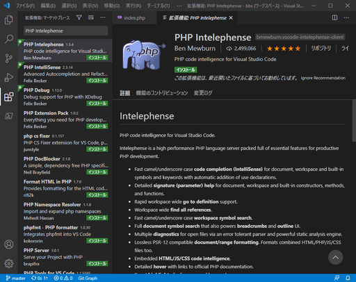
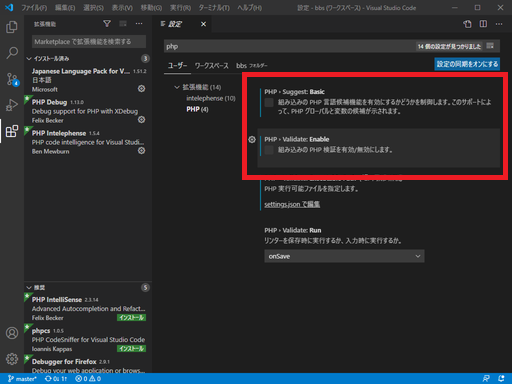
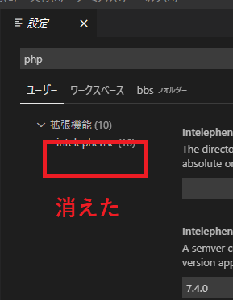
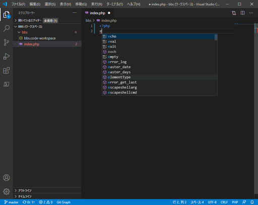
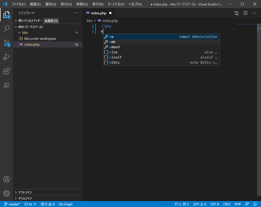
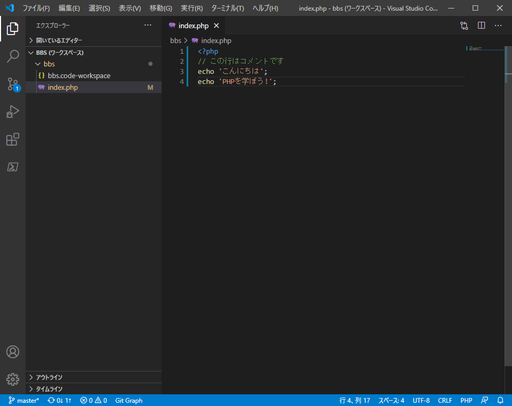
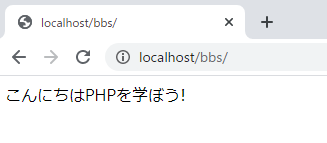
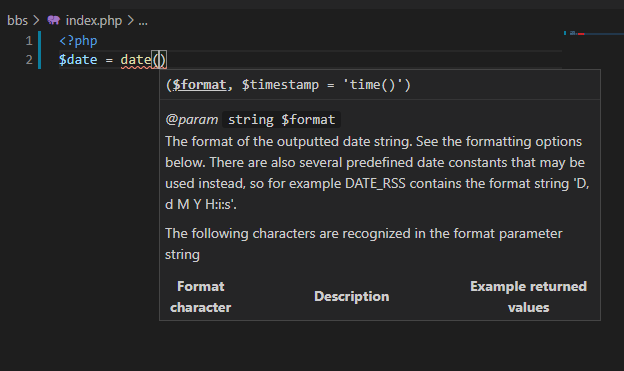
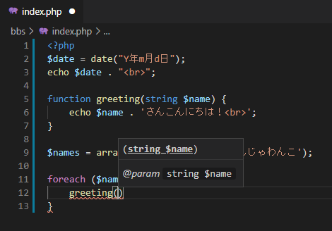

# VSCodeの拡張機能①「PHP Intelephense」とPHP書初め

[WordPress編](../wordpress/)ではさもPHP知ってるぜ的な雰囲気を出しながら書いてたけど、PHPコードを一から書き起こすのはすごい久しぶりなので、どういう風に書けばいいのか思い出す。

コーディングサポートをしてくれる拡張機能「PHP Intelephense」の使い方も一緒に見ていく。

## 環境

* ローカル
  * Windows 10
  * VSCode 1.51.1
  * XAMPP 7.4.13

## PHP Intelephense

なんか「要php-language-server」と言っているサイトもあるけど、先にインストールするべきものが見当たらないので、インストールボタンをぽちっとな。特に問題なくインストールされた。

標準で有効になっているPHPのコーディングサポート機能を切る。「ファイル」→「ユーザー設定」→「設定」に入り、検索欄にPHPと打ち、「PHP > Suggest: Basic」と「PHP > Validate: Enable」のチェックを外す。

さらに、説明書きに「拡張機能の検索欄に`@builtin php`と打ち、`PHP Language Features`を無効にせよ（`PHP Language Basics`はそのままでいい）」と書いてあるからそうする。

※ただし、これをすると「ファイル」→「ユーザー設定」→「設定」、検索欄にPHPと打ってもPHP用の設定が出てこなくなるので、するかしないかは好みで。

もう一つ、「標準的なPHPファイルの拡張子ではないファイル（例えば`.module`とか）にもPHPコーディングサポートを適用したかったら設定の`files.associations`に追加してね」って書いてあるけど、とりあえずは不要なので放置。

そしてVSCodeを再起動。

これで拡張機能がインストールされた。

## 何か書く

`index.php`にPHPコードを書く。

「e」と入力するだけで候補がずらっと出てきた。しかもPHPコードとしては不完全な状態なので左のエクスプローラーの`index.php`が赤い。

試しにPHP Intelephenseを無効にして再起動して同じことをしてみる。

出てくる候補が変わった。`echo`を打ちたいのにこれでは最後まで打たないといけない。

再度PHP Intelephenseを有効化して適当に最後までコードを打ってみる。

ほほう。

これをブラウザで表示させると

ほほう。

組み込み関数を入れるとヒントが表示される。これはいいね。

自作関数もちゃんと定義した通りにヒントを出してくれる。

なるほど。