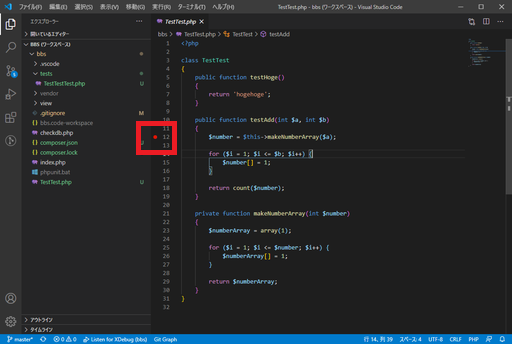

# デバッグでテスト失敗を乗り越える

[前回](phpunit.html)、足し算をするだけのしょーもないメソッドを、「ペアノの公理風」とか言って調子に乗って作り替えたらテストに失敗したので、デバッグ機能を使って失敗の原因を突き止める。

※コードを読めば大体分かるけど、ここではデバッグの練習としてあえてブレークポイント設定し、実行中に処理を止めて変数の状態を追いかけることにする。

## 環境

- ローカル
  - Windows 10
  - VSCode 1.51.1
  - XAMPP 7.4.13
  - XDebug 2.8.1
  - PHPUnit 9.0.0

## ブレークポイントの設定

`TestTest`クラスの`testAdd`メソッドの一番最初に設定する。設定の仕方は、行番号のすぐ左をクリック。

デバッグモードに入る。デバッグペインの実行ボタンをクリック。

そしてPowerShellでテストを実行。

~~~shell
> ./phpunit tests/
~~~

そうすると処理が途中で止まり、現在止まっている場所をハイライトしてくれる。ちゃんとブレークポイントで止まっている。

左側には現在の変数の状況が表示されている。

処理を一つ進めるにはステップインをする。`F11`キーを押すか、画面上部のをクリック。

処理を一つ進めると`makeNumberArray`が呼び出されるので、ハイライトがそちらに移る。

さらにステップインすると、`$numberArray`に配列が格納される。

何回かステップインを繰り返し、`for`文を終えたところまで行くとこんな状態になった。

む、ここでは2個の要素を持つ配列を作ってほしいのに`$numberArray`が3個の要素を持ってしまっている。この原因は・・・ここだ！

ループを回す前に最初に余計な要素を入れてしまったから1個多くなってしまった。ということで、デバッグを停止。`Shift + F5`または画面上部のをクリック。

`array()`の引数を何もなしにして再度デバッグを回す。再度`for`文の終了時まで進めたところ。

`$numberArray`の要素数が`$number`と同じになった。よし、これでよい。

デバッグを停止し、ブレークポイントを解除して再度テスト。

~~~
> ./phpunit tests/
PHPUnit 9.0.0 by Sebastian Bergmann and contributors.

..                                                                  2 / 2 (100%)

Time: 00:00.521, Memory: 4.00 MB

OK (2 tests, 2 assertions)
~~~

通った。

[続く](testcoverage.html)