# トラブルシューティング１：VSCode上でPHP Debugが動かない問題

具体的には、ブレークポイントが止まらないという現象。

## いきなり結論

7.4以下のXAMPPの、付属の`php_xdebug.dll`を試してみると動いたよ。

## 環境

* ローカル
  * Windows 10
  * VSCode 1.51.1

## 問題の再現

### スタート地点

* VSCodeの完全アンインストール
  1. アンインストーラーでVSCodeをアンインストール
  2. `C:\Users\(ユーザー名)\.vscode`フォルダを削除
  3. `C:\Users\TAKE\AppData\Roaming\Code`フォルダを削除
* XAMPPのアンインストール

からスタートし、余計なもの入れずに最短で問題の現象までたどり着く。

### VSCodeのインストール

[Visual Studio Code – コード エディター \| Microsoft Azure](https://azure.microsoft.com/ja-jp/products/visual-studio-code/)

ここから1.51.1をダウンロード。

設定らしい設定はこれか。でも関係なさそう。

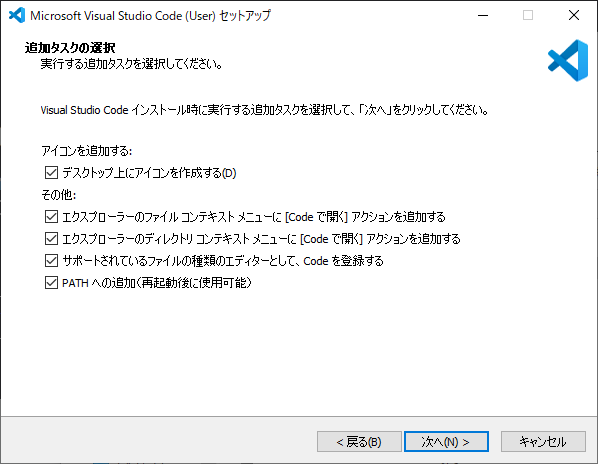

普通にインストール完了。

### XAMPPをインストール

[XAMPP Installers and Downloads for Apache Friends](https://www.apachefriends.org/jp/index.html)

ここから8.0.0版をダウンロード。

ウィルスソフトを解除してインストールする。

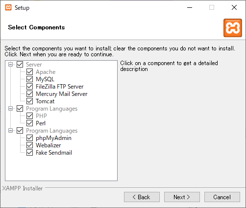

全部入れ。

`C:\xampp`にインストール。

### VSCodeを開き、テスト用の`.php`ファイルを作成

ここから`Ctrl + N`でファイルを新規作成し、

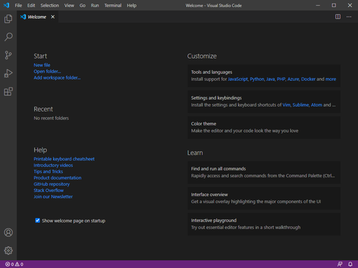

以下のコードを書き

~~~php
<?php
phpinfo();
~~~

名前を付けて保存。「File」メニューの「Save as...」で保存できる。`C:\xampp\htdocs`に`test.php`という名前で保存。

### XAMPPを開きApacheを起動、PHPの情報を表示

何の設定も変えずそのままApacheの「Start」をクリック。

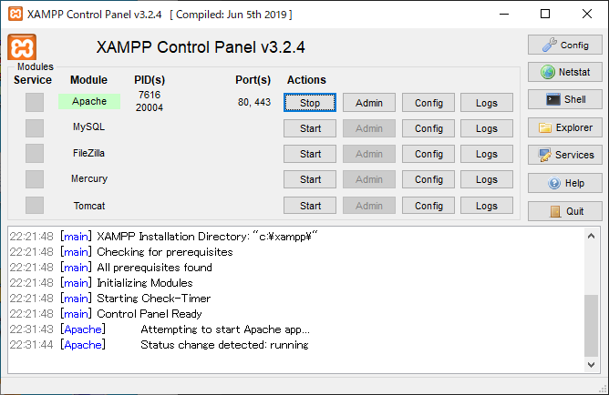

ブラウザのアドレスバーに`localhost/test.php`と打ち、PHPの情報が表示されることを確認。これは後で使うので、表示したまま置いておく。

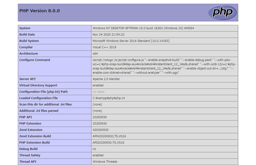

### VSCodeの設定をする

「File」メニューの「Preferrence」→「Settings」に進み、「Search settings」に`php`と打ち、「PHP > Validate: Executable Path」の項目から「Edit in settings.json」をクリック。

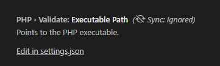

以下のように打つ。バックスラッシュが2個並んでいるのはわざと。

~~~json
{
    "php.validate.executablePath": "C:\\xampp\\php\\php.exe"
}
~~~

保存して閉じる。

### XDebugを入手

[Xdebug: Support — Tailored Installation Instructions](https://xdebug.org/wizard)

ウィザードに先ほど表示した`phpinfo()`の情報を丸ごとコピペ。できたXDebugをダウンロード。

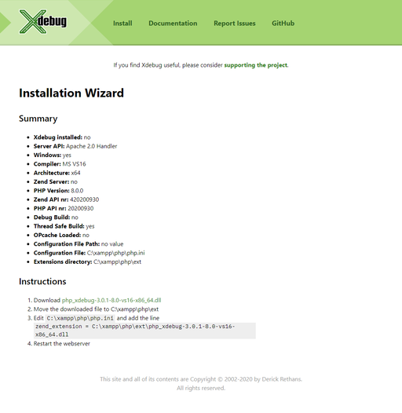

`C:\xampp\php\ext`に保存。

### `php.ini`を編集

以下を末尾に追記。

~~~ini
[XDebug]
xdebug.remote_enable=1
xdebug.remote_autostart=1
zend_extension=C:\xampp\php\ext\php_xdebug-3.0.1-8.0-vs16-x86_64.dll
~~~

保存終了した後、XAMPPでApacheを再起動。XDebugの情報が載っている。

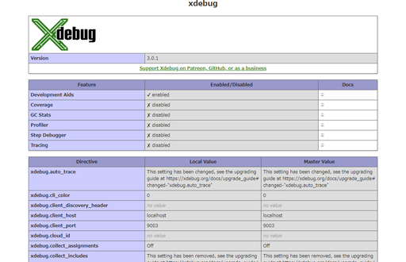

### VSCode上でPHP Debugをインストール

バッタもんじゃなくてちゃんとDL数が300万を超えるやつをインストール。

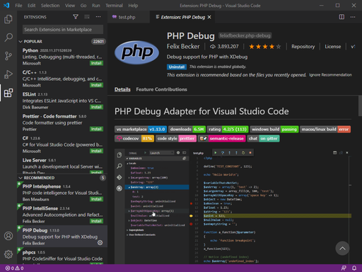

RUNペインを開くと「フォルダを開け」と言われるので、`C:\xampp\htdocs`を開く。

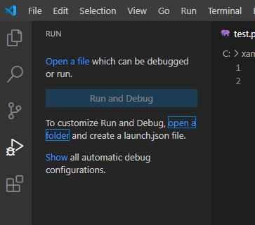

フォルダを開いてからもう一度RUNを開くと今度は「launch.jsonを作れ」と言われるので、クリックして作る。

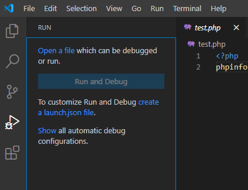

環境はPHPを選択。

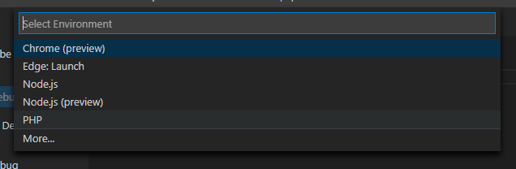

自動で以下のように作成されるのでそのまま閉じる。

~~~json
{
    // Use IntelliSense to learn about possible attributes.
    // Hover to view descriptions of existing attributes.
    // For more information, visit: https://go.microsoft.com/fwlink/?linkid=830387
    "version": "0.2.0",
    "configurations": [
        {
            "name": "Listen for XDebug",
            "type": "php",
            "request": "launch",
            "port": 9000
        },
        {
            "name": "Launch currently open script",
            "type": "php",
            "request": "launch",
            "program": "${file}",
            "cwd": "${fileDirname}",
            "port": 9000
        }
    ]
}
~~~

### `test.php`を再編集

`phpinfo()`を消して以下のように書く。

~~~php
<?php
echo 1;
echo 2;
echo 3;
~~~

そして`echo 2`にブレークポイントを設定。

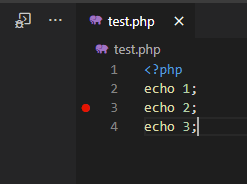

### デバッグを実行

RUNペインの上部の選択欄から「Listen for XDebug」を選び、左の緑の再生ボタン（実行ボタン）をクリック。

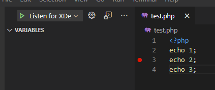

デバッグモードに入る。

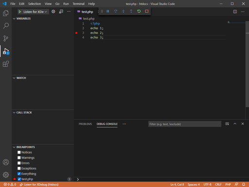

ブラウザで`localhost/test.php`をリロード。

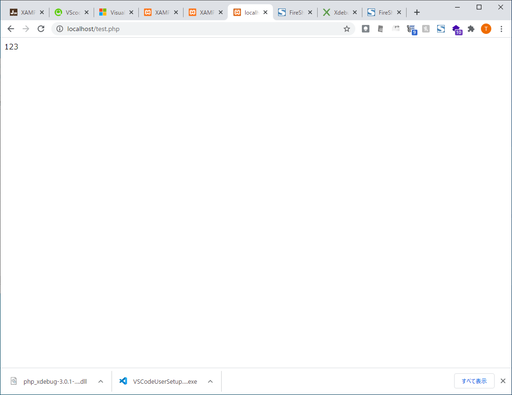

はいブレークポイントで止まらなーい。

## 問題の解決

### XAMPP 8.0.0ではダメ

色々試した。

* XDebugをウィザードではなくDownloadページ（[Xdebug: Downloads](https://xdebug.org/download#releases)）からDLして使う。32bit版とかnts版とか試した。
* ポートを9000番から9001番に変えた（もちろん`php.ini`とVSCodeの設定両方とも）
* DLLを他所からDLしたときに右クリックプロパティに表示される「ロック解除」
* その他いろいろ設定変えてみた

### XAMPP 7.4.13と付属の`php_xdebug.dll`

一旦XAMPP 8.0.0を、htdocsを残しアンインストール。VSCodeも一旦閉じておく。

再度、今度はXAMPP 7.4.13版をDLし、同じ設定でインストール。

ここでXDebugをDLする代わりに、XAMPP付属のXDebugを使う。`php.ini`に以下のように追記する。

~~~ini
[XDebug]
xdebug.remote_enable=1
xdebug.remote_autostart=1
zend_extension=C:\xampp\php\ext\php_xdebug.dll
~~~

さらに`C:\xampp\htdocs`に、8.0.0版で残した`htdocs`の中から

* `.vscode`フォルダ
* `info.php`
* `test.php`

を移す。

VSCode起動。先ほどと同様に`test.php`の`echo 2`の行にブレークポイントを設定して、デバッグモードに入り、ブラウザから`localhost/test.php`をリロード。

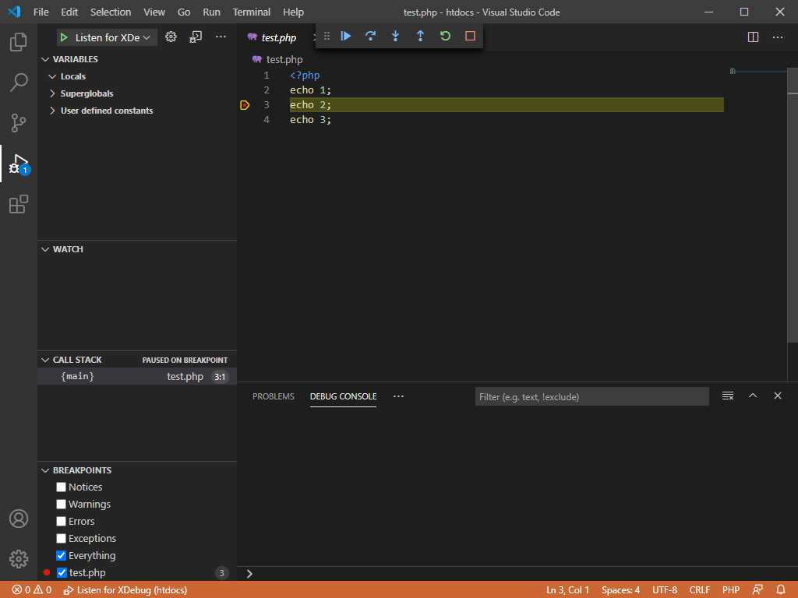

ブレークポイントで止まっちゃう。

ちなみにXDebugをDLした場合はやっぱりブレークポイントで止まらない。

### XAMPP 8.0.0では本当にダメなのか？

XAMPPに`php_xdebug.dll`が付いてこない。だから7.4.13に下げざるを得ない。ただそれだけ。

XAMPPにこだわらなければ、つまりどうしてもPHP8を試したいなら、PHP単体でDLして上手く動くようにVSCodeの設定をして、DL版XDebugを使ってやってみたら動くかもね。試してないから知らんけど。

## その他の解決策

[VisualStudioCodeのデバッグでどうしてもブレークで止まらない場合 \(PHP Xdebug\) \- Qiita](https://qiita.com/R_TES_/items/c08f667f20de6abf482f)
[Visual Studio Codeで「PHP Debug」を動かすための最低限の設定について \| Gonzブログ](https://yamanekosuke.com/202006/phpdebug-install/)
[VSCodeでリモートでPHP Debugをブレークできないのをできるようにした。：元ハイパーメディアクリエイターのウェブログ：So\-net blog](https://miff.blog.ss-blog.jp/2020-01-24-1)
[PHP \- VSCodeでPHPデバッグ時のブレークポイントが止まらない｜teratail](https://teratail.com/questions/273313)
[PHP \- VS　Codeのブレイクポイントが止まらない（ｐｈｐ）｜teratail](https://teratail.com/questions/235029)
[vscode:PHPデバッグ設定項目にpathMappingが間違うとブレイクポイントに止まらない \| 古松](https://old-pine.net/Visual-Studio-Code/vscodePHP%E3%83%87%E3%83%90%E3%83%83%E3%82%B0%E8%A8%AD%E5%AE%9A%E9%A0%85%E7%9B%AE%E3%81%ABpathMapping%E3%81%8C%E9%96%93%E9%81%95%E3%81%86%E3%81%A8%E3%83%96%E3%83%AC%E3%82%A4%E3%82%AF%E3%83%9D%E3%82%A4%E3%83%B3%E3%83%88%E3%81%AB%E6%AD%A2%E3%81%BE%E3%82%89%E3%81%AA%E3%81%84)
[\[XAMPP Mac]VSCodeでPHPのXdebugを使いデバッグ！しかしブレークポイントが止まらない \- Qiita](https://qiita.com/bitcoinjpnnet/items/dc94c79bd6a69925872d)

## おまけ

[VScodeを完全にアンインストールする方法\(windows10\)「拡張機能のホストが予期せずに終了しました。」を改善するために \- Qiita](https://qiita.com/sota0726/items/d2289332480ceac3b6cd)

## つぶやき

さらっと書いたけど、解決に丸2日潰れた・・・