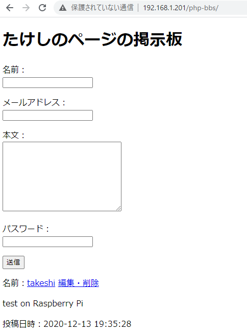
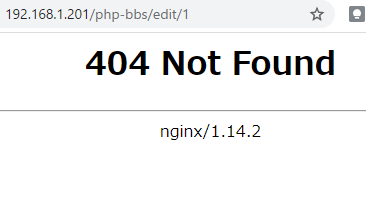
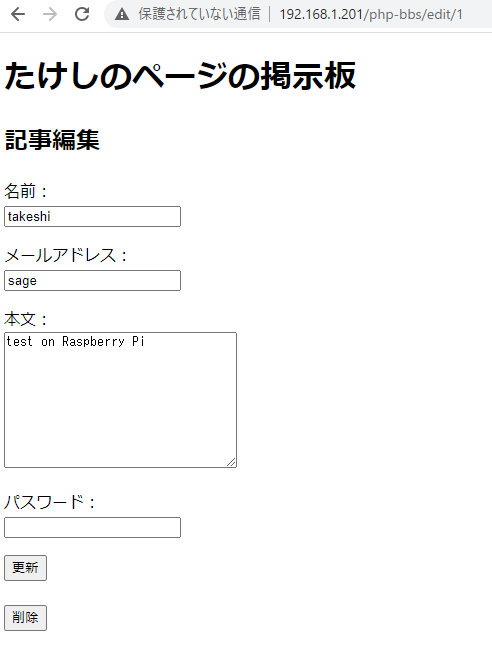
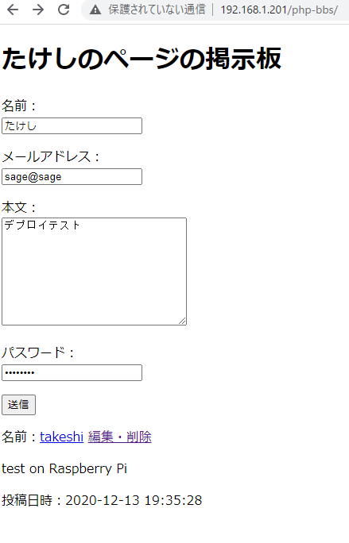
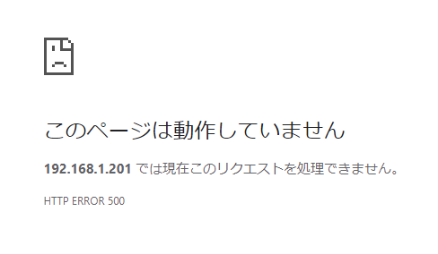
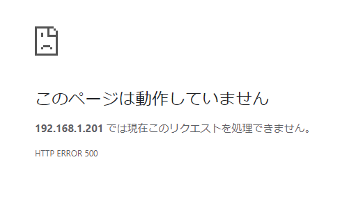
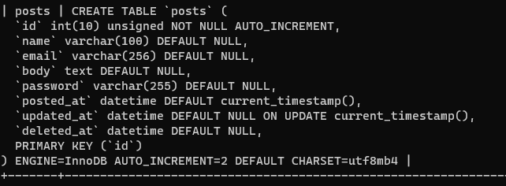
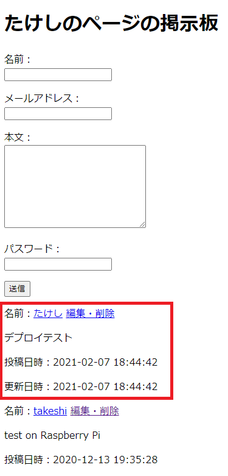

# アップロード＆デバッグ①

いよいよ公開する。

## 環境

- ローカル
  - Windows 10
  - XAMPP 7.4.13
  - MariaDB 10.4.17
- リモート
  - Raspberry Pi 3B+
  - Raspberry Pi OS 10.4
  - MariaDB 10.3.23

## 手順

### アップロード

アップロード自体は[以前にスクリプトを用意しておいた](autopull.html)おかげで、GitHubから自動でPullして一瞬で済んだ。

ちゃんと動いている。

### 「編集・削除」リンク

テスト投稿の「編集・削除」をクリックすると、

404が表示される。これは実際に`edit`ディレクトリの`1`という名前のファイルまたはディレクトリを探しに行っていて、見つからなかったので404を返している状態だけど、このURLはGETパラメーターのような使い方をしているので、Nginxの設定を変えないといけない。

Raspberry Piにログインし、以下を打つ。

~~~shell
$ sudo nano /etc/nginx/sites-available/default
~~~

Nginxの設定ファイルが開くので、`server`コンテキスト内に以下を書く。HTTP用（家の中からのアクセス用：ポート`80`）とHTTPS用（公開用：ポート`443`）があるのでHTTPS用に書く。HTTP用の方にも書けば、家の中からローカルIPでアクセスした時にも動くようになる。

~~~
location /php-bbs {
        try_files $uri $uri/ /php-bbs/index.php?$args;
}
~~~

後、スクリプト側でも対応しないといけない。

`lib/func.php`

~~~php
function GetParam()
{
    $ret = array(
        'mode' => '',
        'id' => ''
    );
    $params = explode('/', $_SERVER['REQUEST_URI'], 5);
    if ($params[1] != 'bbs' && $params[1] !='php-bbs') { // ←判断条件を追加
        return $ret;
    }
    if ($params[2] != 'edit') {
        return $ret;
    }
    if (! ctype_digit($params[3])) {
        return $ret;
    }

    $ret['mode'] = $params[2];
    $ret['id'] = (int)$params[3];

    return $ret;
}
~~~

やっぱりローカルとリモートで格納しているディレクトリ名が違うとややこしい。

とりあえずこれで動いた。

### 投稿

適当に投稿しようとすると、

内部エラーが出る。

デバッグをせねば。

とりあえずエラー箇所をチェックしたいので、PHPのログを見る。

~~~shell
$ sudo nano /var/log/nginx/error.log
~~~

そうすると一番最後に以下のように出ている。

~~~
2021/02/07 18:18:48 [error] 22296#22296: *8195 FastCGI sent in stderr: "PHP message: PHP Fatal error:  Uncaught Error: Call to undefined function mb_strlen() in /home/takeshi/www/html/php-bbs/model/Validator.php:14
Stack trace:
#0 /home/takeshi/www/html/php-bbs/model/GetFormAction.php(27): Validator->IsDataIncorrect(Array)
#1 /home/takeshi/www/html/php-bbs/index.php(57): GetFormAction->SaveDBPostData(Array)
#2 {main}
  thrown in /home/takeshi/www/html/php-bbs/model/Validator.php on line 14" while reading response header from upstream, client: 192.168.1.4, server: _, request: "POST /php-bbs/index.php HTTP/1.1", upstream: "fastcgi://unix:/run/php/php7.3-fpm.sock:", host: "192.168.1.201", referrer: "http://192.168.1.201/php-bbs/"
~~~

注目は

~~~
Uncaught Error: Call to undefined function mb_strlen() in /home/takeshi/www/html/php-bbs/model/Validator.php:14
~~~

ということで、`mb_strlen()`が定義されていないよと言っている。`mb`シリーズはマルチバイト処理で、`mbstring`というモジュールを別で入れないといけない。

というわけでインストール。

~~~shell
$ sudo apt install php-mbstring
~~~

さらにこいつを使うようにPHPの設定をする。以下のコマンドでPHPの設定ファイルを開き、

~~~shell
$ sudo nano /etc/php/7.3/fpm/php.ini
~~~

`Ctrl + W`で検索ボックスを開き、`mbstring`で検索をかけ、以下を探す。

~~~
;;;;;;;;;;;;;;;;;;;;;;
; Dynamic Extensions ;
;;;;;;;;;;;;;;;;;;;;;;

(略)

;extension=mbstring ←先頭のセミコロンを外す
~~~

保存終了し、PHP-FPMとNginxを再起動。

~~~shell
$ sudo service php7.3-fpm restart
$ sudo nginx -s reload
~~~

そしてもう一度トライするも、またダメ。

今度は何だ。

~~~shell
$ sudo nano /var/log/nginx/error.log
~~~

今度は

~~~
2021/02/07 18:29:35 [error] 22748#22748: *8205 FastCGI sent in stderr: "PHP message: PHP Fatal error:  Uncaught PDOException: SQLSTATE[22001]: String data, right truncated: 1406 Data too long for column 'password' at row 1 in /home/takeshi/www/html/php-bbs/model/GetFormAction.php:43
Stack trace:
#0 /home/takeshi/www/html/php-bbs/model/GetFormAction.php(43): PDOStatement->execute()
#1 /home/takeshi/www/html/php-bbs/index.php(57): GetFormAction->SaveDBPostData(Array)
#2 {main}
  thrown in /home/takeshi/www/html/php-bbs/model/GetFormAction.php on line 43" while reading response header from upstream, client: 192.168.1.4, server: _, request: "POST /php-bbs/index.php HTTP/1.1", upstream: "fastcgi://unix:/run/php/php7.3-fpm.sock:", host: "192.168.1.201", referrer: "http://192.168.1.201/php-bbs/"
~~~

抜粋。

~~~
Uncaught PDOException: SQLSTATE[22001]: String data, right truncated: 1406 Data too long for column 'password' at row 1 in /home/takeshi/www/html/php-bbs/model/GetFormAction.php:43
~~~

あっ、そういえば[DB内のPasswordの文字列の長さを増やしたわ](security2.html)。

ということで、同じようにしてRaspberry Pi内のDBの設定を変える。

~~~shell
$ sudo mysql
~~~

で、MySQLにログイン。`sudo`で入れば勝手にrootユーザーとして入れる（[ここ](../wordpress/install.html)の解説を参照）。postsテーブルの設定を変える。

~~~mysql
> use bbs;
> alter table posts modify password varchar(255) default null;
~~~

ちゃんと変わったか確認。

~~~mysql
> show create table posts;
~~~

OK。

投稿するとちゃんと反映されるようになった。

あれ、更新していないのに更新日時が出ている。

こういうのはログファイルでは追いかけられないのでXDebugで追いかける。

[続く。](upload2.html)