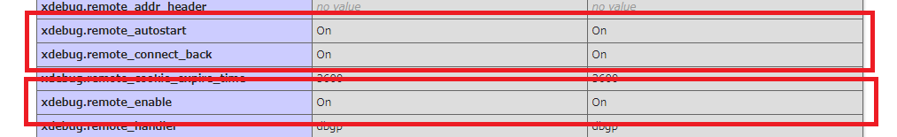
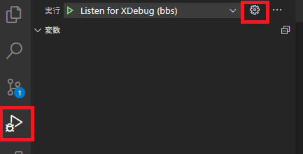
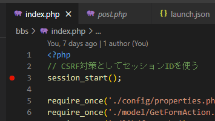
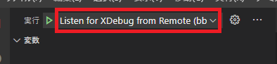
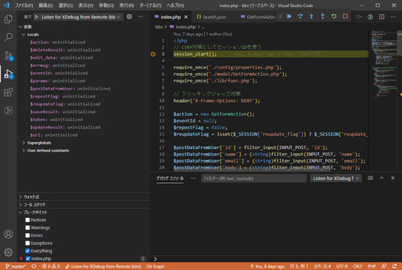
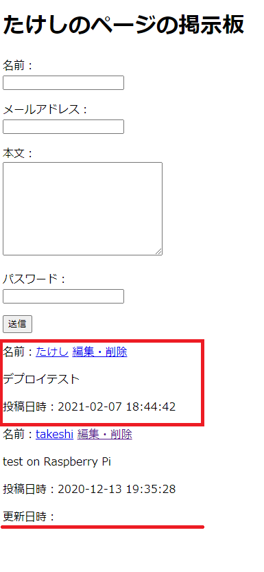

# アップロード＆デバッグ②

XDebugを使って本格的にデバッグ作業をする。

## 環境

- ローカル
  - Windows 10
  - XAMPP 7.4.13
  - MariaDB 10.4.17
- リモート
  - Raspberry Pi 3B+
  - Raspberry Pi OS 10.4
  - MariaDB 10.3.23

## XDebugをインストールして有効化

最初に言っておくと、本番環境でXDebugを入れるのはオススメではない。でもテスト環境というものを作っていないので、インストールしてデバッグ作業をし、終わったら無効化しておくことにする。

インストールは`apt`にやってもらう。

~~~shell
$ sudo apt install php-xdebug
~~~

どこにインストールしたのかを調べる。

~~~shell
$ dpkg -L php-xdebug

(略)
/usr/lib/php/20180731/xdebug.so #←xdebug.soがあるところがインストール場所
~~~

そしてPHPの設定を開いて

~~~shell
$ sudo nano /etc/php/7.3/fpm/php.ini
~~~

末尾に以下を追加。

~~~
zend_extension=/usr/lib/php/20180731/xdebug.so ;←さっき調べたパス
xdebug.remote_enable=1
xdebug.remote_autostart=1
xdebug.remote_connect_back=1
~~~

`phpinfo()`を仕込んだ`.php`ファイルをリモートに上げてブラウザからアクセスするとPHPの設定が見れるのでそれでXDebugが有効化されていることを確認。

ただし、確認したらすぐ消すこと。（PHPの設定情報を公開するのはセキュリティ的によろしくない）

## VSCodeの設定

VSCodeのデバッグペインから設定を開くと、

`launch.json`が開かれるので、以下のように追記。

~~~json
{
    // IntelliSense を使用して利用可能な属性を学べます。
    // 既存の属性の説明をホバーして表示します。
    // 詳細情報は次を確認してください: https://go.microsoft.com/fwlink/?linkid=830387
    "version": "0.2.0",
    "configurations": [
        {
            "name": "Listen for XDebug",
            "type": "php",
            "request": "launch",
            "port": 9000,
        },
        
        // 以下を追記
        
        {
            "name": "Listen for XDebug from Remote",
            "type": "php",
            "request": "launch",
            "port": 9000,
            "pathMappings": {
                "/home/takeshi/www/html/php-bbs": "${workspaceRoot}"
            }
        },
        
        // ここまで
        
        {
            "name": "Launch currently open script",
            "type": "php",
            "request": "launch",
            "program": "${file}",
            "cwd": "${fileDirname}",
            "port": 9000
        }
    ]
}
~~~

要は`pathMappings`を

~~~
"リモート上のプロジェクトディレクトリ": "ローカル上のプロジェクトフォルダ"
~~~

にする。`${wordspaceRoot}`にすると現在VSCodeで開いている場所を指定することになる。

## ブレークポイントを仕込んでデバッグ開始

一番最初にブレークポイントを設定すれば処理の全てが見れる。

この状態でデバッグペインから`Listen for XDebug from Remote`を選択してデバッグモード起動。これ結構選び忘れがち。

ちゃんと止まった。

後は今までローカルでやっていたのと同じ操作でデバッグ作業ができる。

## バグの場所を発見

元凶は`model/Post.php`にあった。

~~~php
<?php
require_once('./lib/func.php');

class Post
{

    (略)

    public function IsUpdated()
    {
        return $this->posted_at === $this->updated_at;
    }
    
    (略)

}
~~~

"Is (the post) updated?" → "Yes."

ということにしたいからアップデートされていたら`true`を返すんだけど、これではアップデート「されていないとき」に`true`を返すやん・・・

以下のように修正。

~~~php
<?php
require_once('./lib/func.php');

class Post
{

    (略)

    public function IsUpdated()
    {
        return $this->posted_at !== $this->updated_at; // ←判断を修正
    }
    
    (略)

}
~~~

コミット＆プッシュ＆リモートでプル。

ちゃんと更新日時は表示されなくなったけど、今度は最初のころにテスト投稿した記事の表示がおかしい。

テスト投稿なので残す価値は無い。パスワードも設定したかどうか怪しいので、MySQLに直接ログインして削除する。

~~~shell
$ sudo mysql
~~~

~~~mysql
> use bbs;
> delete from posts where id = 1;
~~~

OK。

## XDebugを無効化

`php.ini`で追加した設定を全てコメントアウトすればよい。

~~~shell
$sudo nano /etc/php/7.3/fpm/php.ini
~~~

~~~
;zend_extension=/usr/lib/php/20180731/xdebug.so
;xdebug.remote_enable=1
;xdebug.remote_autostart=1
;xdebug.remote_connect_back=1
~~~

OK。