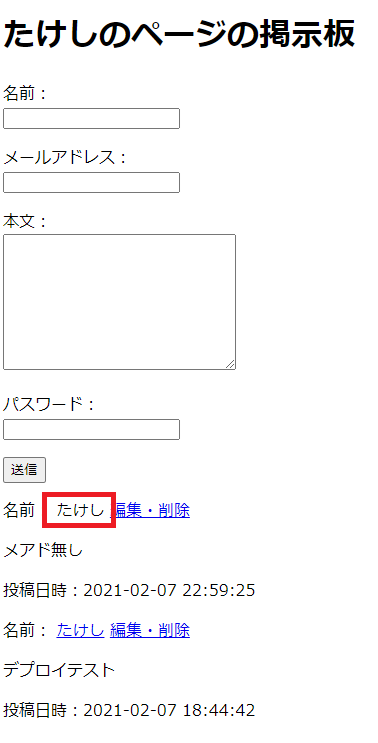

# アップロード＆デバッグ③

デバッグというほどではないけど、この際だから修正しておく。

## 環境

- ローカル
  - Windows 10
  - XAMPP 7.4.13
  - MariaDB 10.4.17
- リモート
  - Raspberry Pi 3B+
  - Raspberry Pi OS 10.4
  - MariaDB 10.3.23

## メアド記入の強制を外す

強制したところで適当にしか書かないでしょ。

`model/validator.php`

~~~php
<?php
class Validator
{
    public function IsDataIncorrect($data)
    {

        (略)
        
        // emailのチェックをコメントアウト

        // emailのチェック
        // if ($data['email'] === '' or ((mb_strlen($data['email']) > 256))) {
        //     return true;
        // }

        (略)
        
    }
}
~~~

`view/post.php`

~~~php+HTML
<!-- 記事表示エリア -->

    <?php if ($posts->HavePosts()) : ?>
    

        <?php foreach ($posts as $post) :?>
        

            
名前：
                
                <!-- 以下修正 -->
                
                <?php if ($post->TheEmail() !== "") : ?>
                <a
                   href="mailto:<?php echo $post->TheEmail(); ?>">
                    <?php endif; ?>
                    
                <!-- ここまで -->
                
                    <?php echo $post->TheName(); ?></a>
                <a
                   href="edit/<?php echo $post->TheId(); ?>">編集・削除</a>
            

        

        

            
<?php echo nl2br(h($post->TheBody())); ?>
            

        

        

            
投稿日時：<?php echo $post->ThePostedDate(); ?>
            

        

        <?php if ($post->IsUpdated()) : ?>
        

            更新日時：<?php echo $post->TheUpdatedDate(); ?>
        

        <?php endif;?>
        <?php endforeach; ?>
    

    <?php endif; ?>

<!-- 記事表示エリア終了 -->
~~~

OK。

