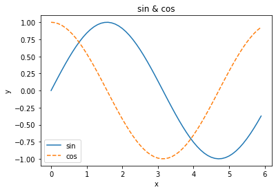
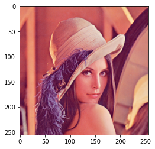

# Python 自分用チートシート

## リスト

~~~python
a = [[[1,2,3,4],[5,6,7,8],[9,10,11,12]],[[13,14,15,16],[17,18,19,20],[21,22,23,24]]]

len(a) 			#2
len(a[0]) 		#3
a[0] 			#[[1, 2, 3, 4], [5, 6, 7, 8], [9, 10, 11, 12]]
~~~

## Matplotlib

~~~python
import numpy as np
import matplotlib.pyplot as plt

x = np.arange(0, 6, 0.1)
y1 = np.sin(x)
y2 = np.cos(x)

plt.plot(x, y1, label="sin")
plt.plot(x, y2, linestyle = "--", label="cos")
plt.xlabel("x")
plt.ylabel("y")
plt.title('sin & cos')
plt.legend()
plt.show()
~~~

~~~python
from matplotlib.image import imread
img = imread('Lenna.png')
plt.imshow(img)
~~~

