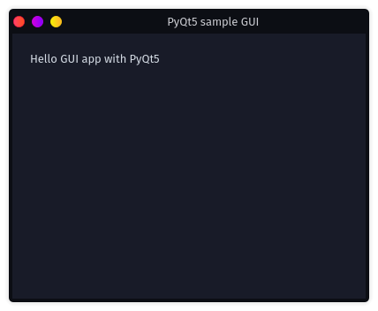
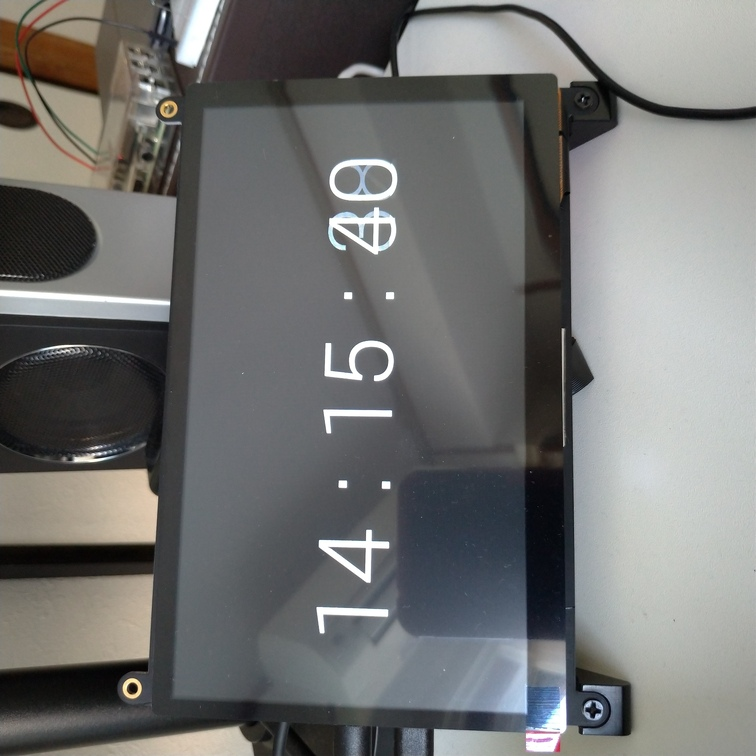

 # Python（GUIアプリ編）

会社で使う「15分調べてダメだったら聞け」ルールをサポートするアプリ。と言ってもほぼサンプルアプリレベルになる予定。

## 環境

* OS：Garuda Linux（Arch Linux）
* シェル：fish
* Python：3.9.4

## 準備

### 仮想環境の用意

~~~shell
$ mkdir ~/python/fifteen_timer
$ cd ~/python/fifteen_timer
$ python -m venv .venv
$ source .venv/bin/activate.fish
~~~

### ライブラリのインストール

~~~shell
$ python -m pip install SIP
$ python -m pip install PyQt5
~~~

### 実験コード

まずはHello world的なコードを書いて、動くかどうか実験。

`test_code.py`

~~~python
import sys
from PyQt5.QtWidgets import QApplication, QWidget, QLabel

class MainWindow(QWidget):
    def __init__(self, parent=None):
        super(MainWindow, self).__init__(parent)
        self.initUI()

    def initUI(self):
        self.resize(400, 300)
        self.move(400, 300)
        self.setWindowTitle('PyQt5 sample GUI')
        label = QLabel(self)
        label.move(20, 20)
        label.setText('Hello GUI app with PyQt5')

if __name__ == '__main__':
    app = QApplication(sys.argv)
    main_window = MainWindow()
    main_window.show()
    sys.exit(app.exec_())
~~~

保存終了して実行。

~~~shell
$ python test_code.py
~~~

なぜデフォルトでダークモード？（おそらく自分のデスクトップ環境のせい）

### ライブラリのバージョン管理

~~~shell
$ python -m pip freeze > requirements.txt
~~~

これでインストールしたライブラリのバージョンが固定される。

別の新たな環境でライブラリを復活させるには、仮想環境構築後のまっさらな状態かつ仮想環境を起動した状態で

~~~shell
$ python -m pip install -r requirements.txt
~~~

と打てばよい。

### Git管理

~~~shell
$ micro .gitignore
~~~

以下を記入。（参考：[gitignore/VirtualEnv.gitignore at master · github/gitignore · GitHub](https://github.com/github/gitignore/blob/master/Global/VirtualEnv.gitignore)）

~~~shell
# Virtualenv
# http://iamzed.com/2009/05/07/a-primer-on-virtualenv/
.Python
[Bb]in
[Ii]nclude
[Ll]ib
[Ll]ib64
[Ll]ocal
[Ss]cripts
pyvenv.cfg
.venv
pip-selfcheck.json
~~~

そしていつものやつ。

~~~shell
$ git init
$ git add .
$ git commit -m "first commit"
~~~

## コード

`main.py`

~~~python
import sys
from PyQt5.QtWidgets import QApplication, QWidget, QLabel
from ui_MainWindow import *

if __name__ == '__main__':
    app = QApplication(sys.argv)
    main_window = MainWindow()
    main_window.showFullScreen() #フルスクリーン
    #main_window.show()          #通常ウィンドウ
    sys.exit(app.exec_())
~~~

`ui_MainWindow.py`

~~~python
import sys, datetime, os
from PyQt5.QtWidgets import QWidget, QLabel, QSizePolicy, QGridLayout, QPushButton, QHBoxLayout, QFrame
from PyQt5.QtGui import QPalette, QColor
from PyQt5.QtCore import Qt, QTimer

from clickable_label import *

class MainWindow(QWidget):
    def __init__(self, parent=None):
        super(MainWindow, self).__init__(parent)
        self.initUI()

    def initUI(self):
        self.resize(1024,600)
        self.setWindowTitle('PyQt5 sample GUI')
        p = self.palette()
        p.setColor(self.backgroundRole(), QColor('#000000'))
        self.setPalette(p)
        
        self.setCursor(Qt.BlankCursor)
        
        self.style1 = "background-color: black; color: #EEEEEE; font-size: 220px"
        self.style2 = "background-color: white; color: black; font-size: 220px"
        self.stylebutton1 = "background-color: black; color: #000000; font-size: 220px"
        self.stylebutton2 = "background-color: white; color: #FFFFFF; font-size: 220px"
        
        self.cLabel1 = ClickableLabel(self)
        self.cLabel1.setSizePolicy(QSizePolicy.Minimum, QSizePolicy.Minimum)
        self.cLabel1.setStyleSheet(self.stylebutton1)
        self.cLabel1.setFrameStyle(QFrame.Box)
        self.cLabel1.clicked.connect(self.switchTimer)
        self.cLabel1.dblclicked.connect(self.MyShutDown)
        
        self.labelMinute = QLabel(self)
        self.labelMinute.setText('')
        self.labelMinute.setAlignment(Qt.AlignCenter)
        self.labelMinute.setStyleSheet(self.style1)
 
        self.labelColon1 = QLabel(self)
        self.labelColon1.setText('')
        self.labelColon1.setAlignment(Qt.AlignCenter)
        self.labelColon1.setStyleSheet(self.style1)
        
        self.labelSecond = QLabel(self)
        self.labelSecond.setText('')
        self.labelSecond.setAlignment(Qt.AlignCenter)
        self.labelSecond.setStyleSheet(self.style1)
        
        self.labelColon2 = QLabel(self)
        self.labelColon2.setText('')
        self.labelColon2.setAlignment(Qt.AlignCenter)
        self.labelColon2.setStyleSheet(self.style1)
        
        self.labelMilliSecond = QLabel(self)
        self.labelMilliSecond.setText('')
        self.labelMilliSecond.setAlignment(Qt.AlignCenter)
        self.labelMilliSecond.setStyleSheet(self.style1)
        
        hLayout = QHBoxLayout()
        hLayout.addWidget(self.labelMinute, 1)
        hLayout.addWidget(self.labelColon1)
        hLayout.addWidget(self.labelSecond, 1)
        hLayout.addWidget(self.labelColon2)
        hLayout.addWidget(self.labelMilliSecond, 1)
        self.cLabel1.setLayout(hLayout)

        grid1 = QGridLayout()
        grid1.setSpacing(100)
        grid1.addWidget(self.cLabel1, 0, 0)
        grid1.setContentsMargins(50,50,50,50)
        self.setLayout(grid1)

        self.td_timeSpan = datetime.timedelta(minutes=15, seconds=0)
        
        self.timer = QTimer(self)
        self.timer.timeout.connect(self.updateLabel)
        self.colorChanger = QTimer(self)
        self.colorChanger.timeout.connect(self.changeColor)
        self.colorMode = 0
        
    def switchTimer(self):
        if self.timer.isActive() or self.colorChanger.isActive():
            self.stopTimer()
        else:
            self.startTimer()
    
    def startTimer(self):
        self.labelColon1.setText(':')
        self.labelColon2.setText(':')
        self.dt_endTime = datetime.datetime.now() + self.td_timeSpan
        self.timer.start(10)
        
    def stopTimer(self):
        self.timer.stop()
        self.colorChanger.stop()
        self.labelMinute.setText("")
        self.labelColon1.setText("")
        self.labelSecond.setText("")
        self.labelColon2.setText("")
        self.labelMilliSecond.setText("")
        self.colorMode = 1
        self.changeColor()
        
    def updateLabel(self):
        td_timeLeft = self.dt_endTime - datetime.datetime.now()
        if td_timeLeft.days >= 0:
            m, s, tms = self.get_m_s_tms(td_timeLeft)
            self.labelMinute.setText(f"{m:02d}")
            self.labelSecond.setText(f"{s:02d}")
            self.labelMilliSecond.setText(f"{tms:02d}")
            self.update()
        else:
            self.timer.stop()
            self.labelMinute.setText("")
            self.labelColon1.setText("")
            self.labelSecond.setText("")
            self.labelColon2.setText("")
            self.labelMilliSecond.setText("")
            self.changeColor()
            self.colorChanger.start(500)
    
    def get_m_s_tms(self, td):
        tms = td.microseconds // 10000
        m, s = divmod(td.seconds, 60)
        return m, s, tms
    
    def changeColor(self):
        if self.colorMode == 0:
            self.colorMode = 1
            p = self.palette()
            p.setColor(self.backgroundRole(), QColor('#FFFFFF'))
            self.setPalette(p)
            self.cLabel1.setStyleSheet(self.stylebutton2)
            self.labelMinute.setStyleSheet(self.style2)
            self.labelColon1.setStyleSheet(self.style2)
            self.labelSecond.setStyleSheet(self.style2)
            self.labelColon2.setStyleSheet(self.style2)
            self.labelMilliSecond.setStyleSheet(self.style2)
            self.update()
        else:
            self.colorMode = 0
            p = self.palette()
            p.setColor(self.backgroundRole(), QColor('#000000'))
            self.setPalette(p)
            self.cLabel1.setStyleSheet(self.stylebutton1)
            self.labelMinute.setStyleSheet(self.style1)
            self.labelColon1.setStyleSheet(self.style1)
            self.labelSecond.setStyleSheet(self.style1)
            self.labelColon2.setStyleSheet(self.style1)
            self.labelMilliSecond.setStyleSheet(self.style1)
            self.update()
    
    def MyShutDown(self):
        #os.system("sudo shutdown -h now") #Raspberry Piで動かすときはこちらを実行
        sys.exit()                         #それ以外のときはこちら
~~~

`clickable_label.py`

~~~python
from PyQt5.QtWidgets import QLabel
from PyQt5.QtCore import Qt, pyqtSignal, QTimer
 
class ClickableLabel(QLabel):
    
    clicked = pyqtSignal()
    dblclicked = pyqtSignal()
    clickcount = 0
    
    def __init__(self, parent=None):
        super(ClickableLabel, self).__init__(parent)
        self.timer = QTimer(self)
        self.timer.timeout.connect(self.judgeClick)

    def mousePressEvent(self, event):
        if event.button() == Qt.LeftButton:
            self.clickcount += 1
            if self.clickcount >= 2:
                self.judgeClick()
            elif self.timer.isActive() != True:
                self.timer.start(200)
        return QLabel.mousePressEvent(self, event)
    
    def judgeClick(self):
        self.timer.stop()
        if self.clickcount >= 2:
            self.clickcount = 0
            self.dblclicked.emit()
        elif self.clickcount == 1:
            self.clickcount = 0
            self.clicked.emit()
~~~

### Raspberry Pi上で動かす

PyQt5を入れる。`apt`で入れたほうがいいらしい。

~~~shell
$ sudo apt install python3-pyqt5
~~~

上記のコードをRaspberry Piのどこかに入れて、実行。

~~~shell
$ python3 main.py
~~~

起動直後は画面が真っ暗（マウスカーソルも消える）。適当にクリックすると15分のカウントダウンが始まる。写真はタッチパネルモニターなので適当に指でトンと叩くとカウントダウンが始まる。

もう一度叩くとタイマーが止まって画面は再び真っ暗になる。時間が来たら文字が消えて、画面全体が白黒で点滅する。

なぜ真っ暗にしたのかというと、動かしてから画面焼けが起こったから。本当なら普段は時計表示にしておきたかった。

ダブルクリック（ダブルタップ）するとソフトが終了する。または、Raspberry Pi上であればシステムをシャットダウンするように上記のコードを変える。

### Raspberry Piで自動起動

最後に電源入れたらこのプログラムが走るようにする。

~~~shell
$ mkdir -p ~/.config/lxsession/LXDE-pi
$ cp /etc/xdg/lxsession/LXDE-pi/autostart ~/.config/lxsession/LXDE-pi/
$ echo 'python3 /home/takeshi/fifteen_timer/main.py' >> ~/.config/lxsession/LXDE-pi/autostart
~~~

これで電源投入時に自動でプログラムが立ち上がり、ダブルタップをしたらシャットダウンするので電源を抜けば良いことになる。

## 完成

### 理想形

会社にて、

「うーん、分からん」

タップ

（調べる）

15分過ぎ、画面がチカチカ

「あかん、聞こ」

### 現実

「うーん、分からん」

（調べる）

数時間溶ける

「あっ、タップするの忘れた」

## 参考

### Git管理

[python3のvenvでプロジェクト毎にライブラリを管理する - Akogare Blog](https://akogare-se.hatenablog.com/entry/2019/01/02/220330)

### PyQt

[Qt for Python — Qt for Python](https://doc.qt.io/qtforpython/index.html)

[【Python】GUIアプリを作ってみる【PyQt編】※初心者向け│しみゅろぐ](https://www.simugrammer.com/python_pyqt5_introduction/)
[【Python入門】PyQt5でGUIを作ろう！導入から使い方まで解説 | 侍エンジニアブログ](https://www.sejuku.net/blog/75467)
[PyQt5とpython3によるGUIプログラミング［０］ - Qiita](https://qiita.com/kenasman/items/55505654823e9d040e6e)
[PyQt5とpython3によるGUIプログラミング：実践編[0] - Qiita](https://qiita.com/kenasman/items/b9ca3beb25ecf87bfb06#qlabel%E3%81%A8qpushbutton%E3%82%92%E4%BD%BF%E3%81%A3%E3%81%9F%E3%82%A2%E3%83%97%E3%83%AA%E3%82%B1%E3%83%BC%E3%82%B7%E3%83%A7%E3%83%B3%E3%82%92%E4%BD%9C%E3%81%A3%E3%81%A6%E3%81%BF%E3%82%8B)

### 背景色

[PyQt でアプリの背景色やテキスト文字の色などの属性を設定する方法 \- Wizard Notes](https://www.wizard-notes.com/entry/python/dev/pyqt-palette-and-stylesheet)
[python : Qwidgetの背景色を設定する方法](https://www.fixes.pub/program/508308.html)
[How to Change the Background Color of QWidget/ja \- Qt Wiki](https://wiki.qt.io/How_to_Change_the_Background_Color_of_QWidget/ja)
[QLabelの文字色と背景色を変更する \- UbuntuでQtはじめました](https://sites.google.com/site/ubuntsdeqthajimemashita/qlabelno)
[PyQtのボタンやラベル（QPushButton、QLabel）の背景色を取得する方法 \- python、qt、pyqt、uibackgroundcolor](https://living-sun.com/ja/python/707277-how-to-get-the-background-color-of-a-button-or-label-qpushbutton-qlabel-in-pyqt-python-qt-pyqt-uibackgroundcolor.html)
[【PyQt】QLabelのテキストカラー変更 \- Qiita](https://qiita.com/grinpeaceman/items/7eae3dfe274b19e6549c)
[ウィンドウの背景色をつける \- TB\-code](https://code.tiblab.net/python/pyside/widget_color)

### ラベル

[【PythonでGUI】PyQt5 -ウィジェットⅡ- - Qiita](https://qiita.com/Nobu12/items/36bc4cc6cf4163b66847#%E5%85%A5%E5%8A%9B%E3%81%97%E3%81%9F%E3%83%86%E3%82%AD%E3%82%B9%E3%83%88%E3%82%92%E3%83%A9%E3%83%99%E3%83%AB%E3%81%AB%E8%A1%A8%E7%A4%BA)
[PyQt5 チュートリアル - ラベル Label | Delft スタック](https://www.delftstack.com/ja/tutorial/pyqt5/pyqt5-label/)
[QLabelクラス \- yu00’s blog](http://yu00.hatenablog.com/entry/2015/09/16/212824)

### ボタン

[PyQt5 チュートリアル \- プッシュボタン \| Delft スタック](https://www.delftstack.com/ja/tutorial/pyqt5/pyqt5-push-button/)

### レイアウト

[QHBoxLayout・QVBoxLayoutクラス \- yu00’s blog](http://yu00.hatenablog.com/entry/2015/09/17/191707)
[第2章 Layoutを使ってみよう \| densan\-labs\.net](https://densan-labs.net/tech/qt/chapter2.html)
[【PythonでGUI】PyQt5 \-レイアウト管理\- \- Qiita](https://qiita.com/Nobu12/items/81da82b8b984bf54f0a0)
[ウィジェットの自動伸縮の設定 \- yu00’s blog](http://yu00.hatenablog.com/entry/2015/09/06/223025)

### 全画面

[Pythonでウィンドウを全画面表示にする方法【初心者向け】 \| TechAcademyマガジン](https://techacademy.jp/magazine/21497)

### センタリング

[Qt Namespace \| Qt Core 5\.15\.3](https://doc.qt.io/qt-5/qt.html#AlignmentFlag-enum)
[QLabel Class \| Qt Widgets 5\.15\.3](https://doc.qt.io/qt-5/qlabel.html#alignment-prop)

### マージン

[Qt レイアウト 余白の処理](https://code-note-jp.blogspot.com/2019/02/qt.html)
[QLayout Class \| Qt Widgets 5\.15\.3](https://doc.qt.io/qt-5/qlayout.html#setContentsMargins)
[QMargins Class \| Qt Core 5\.15\.3](https://doc.qt.io/qt-5/qmargins.html)

### タイマー

[QTimer Class \| Qt Core 5\.15\.3](https://doc.qt.io/qt-5/qtimer.html#isActive)
[QTimer — Qt for Python](https://doc.qt.io/qtforpython/PySide6/QtCore/QTimer.html)
[QTimer example for PyQt5 \| Learn Python PyQt](https://pythonpyqt.com/qtimer/)

### 再描画

[python — QWidgetの更新](https://www.it-swarm-ja.com/ja/python/qwidget%E3%81%AE%E6%9B%B4%E6%96%B0/1053335672/)
[PyQtでの2Dグラフィックス その1 \(QWidgetに直接描画する\) \- bravo's blog](https://bravo.hatenablog.jp/entry/2016/02/07/084048)
[Python3とPyQt5を使ってのGUIプログラミング（２）～描画～ \- Qiita](https://qiita.com/tak0/items/6dcbfc70e9d583d12911)

### 時刻

[Pythonで現在時刻・日付・日時を取得 \| note\.nkmk\.me](https://note.nkmk.me/python-datetime-now-today/)
[datetime \-\-\- 基本的な日付型および時間型 — Python 3\.9\.4 ドキュメント](https://docs.python.org/ja/3/library/datetime.html#timedelta-objects)
[Pythonのdatetimeで日付や時間と文字列を変換（strftime, strptime） \| note\.nkmk\.me](https://note.nkmk.me/python-datetime-usage/)
[Pythonで経過時間や日時（日付・時刻）の差分を測定・算出 \| note\.nkmk\.me](https://note.nkmk.me/python-datetime-timedelta-measure-time/)
[Pythonで秒数と分・時間・日数を相互に変換 \| note\.nkmk\.me](https://note.nkmk.me/python-datetime-timedelta-conversion/)
[Pythonのdivmodで割り算の商と余りを同時に取得 \| note\.nkmk\.me](https://note.nkmk.me/python-divmod-quotient-remainder/)

### 文字列フォーマット

[Python \| formatメソッドを使った文字列の書式設定](https://www.javadrive.jp/python/string/index24.html)
[Python \| フォーマット済み文字列リテラル\(f文字列\)を使った文字列の書式設定](https://www.javadrive.jp/python/string/index25.html)

### ラベルにクリックシグナル（クリックイベント）を作成

[python \- pyqtで隠しボタンのようなものを作りたい \- スタック・オーバーフロー](https://ja.stackoverflow.com/questions/43311/pyqt%E3%81%A7%E9%9A%A0%E3%81%97%E3%83%9C%E3%82%BF%E3%83%B3%E3%81%AE%E3%82%88%E3%81%86%E3%81%AA%E3%82%82%E3%81%AE%E3%82%92%E4%BD%9C%E3%82%8A%E3%81%9F%E3%81%84)
[シグナルとスロット詳細 \- yu00’s blog](http://yu00.hatenablog.com/entry/2015/09/14/202729)

### ラベルに枠線

[QLabelクラス \- yu00’s blog](http://yu00.hatenablog.com/entry/2015/09/16/212824)
[PyQt5 – How to add border on QLabel ? \- GeeksforGeeks](https://www.geeksforgeeks.org/pyqt5-how-to-add-border-on-qlabel/)

### マウスカーソル変更

[python 3\.x \- Disable mouse pointer in QGraphicsView \- Stack Overflow](https://stackoverflow.com/questions/54429657/disable-mouse-pointer-in-qgraphicsview)
[QWidget Class \| Qt Widgets 5\.15\.3](https://doc.qt.io/qt-5/qwidget.html#cursor-prop)
[Qt Namespace \| Qt Core 5\.15\.3](https://doc.qt.io/qt-5/qt.html#CursorShape-enum)

### ダブルクリック判定

[シングル/ダブルクリック判定 \- Qiita](https://qiita.com/tetsurom/items/9da91567b61fdf6b6fde)

### 終了・シャットダウン

[物理ボタンで電源のON/OFFを制御する « ラズパイブログ](https://www.ratocsystems.com/products/triple_r/blog/?x=entry:entry200521-092141)
[Pythonでプログラムを終了させる：sys\.exit\(\) \| UX MILK](https://uxmilk.jp/12929)

### Raspberry PiにPyQt5を入れる

[Python 3\.x \- PyQt5のエラー文について教えてください｜teratail](https://teratail.com/questions/271352)
[Raspbian stretch に PyQt5 をインストールする1（概要） \- やってみる](http://ytyaru.hatenablog.com/entry/2019/11/13/000000)
[ラズパイデスクトップでPyQt5入門\(1\) \| 株式会社クローバーフィールド](https://www.cloverfield.co.jp/2019/08/06/%E3%83%A9%E3%82%BA%E3%83%91%E3%82%A4%E3%83%87%E3%82%B9%E3%82%AF%E3%83%88%E3%83%83%E3%83%97%E3%81%A7pyqt5%E5%85%A5%E9%96%801/?doing_wp_cron=1620526153.6402568817138671875000)
[ラズパイ\(raspberrypi3B\+\)でPyQt5を使いたいです！sudo\.\.\. \- Yahoo\!知恵袋](https://detail.chiebukuro.yahoo.co.jp/qa/question_detail/q13217504618)
[How to install PyQt5 v\.5\.5 or higher on Raspbian Buster \- Raspberry Pi Forums](https://www.raspberrypi.org/forums/viewtopic.php?t=257914)

### Raspberry Piでの自動起動

[Raspberry Piでプログラムを自動起動する5種類の方法を比較・解説 \- Qiita](https://qiita.com/karaage0703/items/ed18f318a1775b28eab4)

### その他

[PyQtのConnectで引数付きの関数を渡す方法 - drilldripper’s blog](http://drilldripper.hatenablog.com/entry/2016/08/06/175641)
[PyQtのsignalとconnectとlambda式について \- Qiita](https://qiita.com/Kanahiro/items/8075546b2fea0b6baf5d)
[Pythonで関数を引数として渡した場合の挙動のまとめ\(一部引数を省略した場合の挙動あり\) \- Qiita](https://qiita.com/smdask/items/2dfc40a7a60f65dcdb6c)

[第5章 Qt Designerを使ってみよう | densan-labs.net](https://densan-labs.net/tech/qt/chapter5.html)
[Qt for Python レイアウト方法 \- XSim](https://www.xsim.info/articles/PySide/how-to-layout.html#absolute)
[レイアウトのお話](http://vivi.dyndns.org/vivi/docs/Qt/layout.html)

[ボタンを右クリックした時のシグナル作成\!\! \| KIWAMIDEN](https://kiwamiden.com/create-a-signal-when-right-clicking-on-the-button)

[Python クラスについて \- Qiita](https://qiita.com/motoki1990/items/376fc1d1f3d59c960f5c)