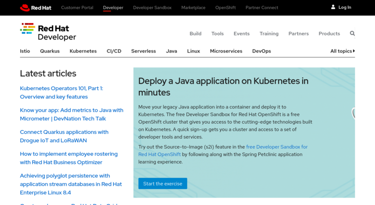
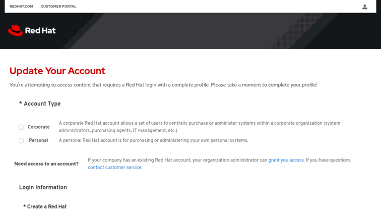
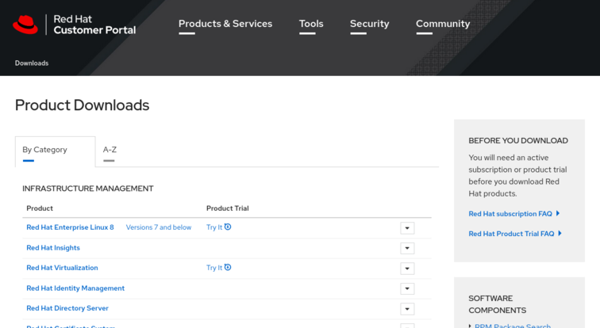
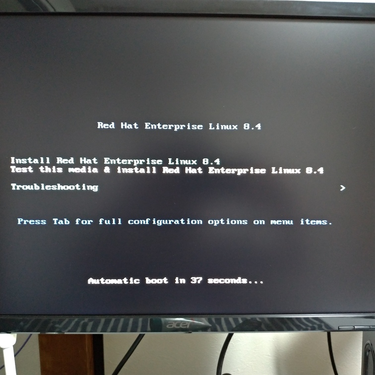
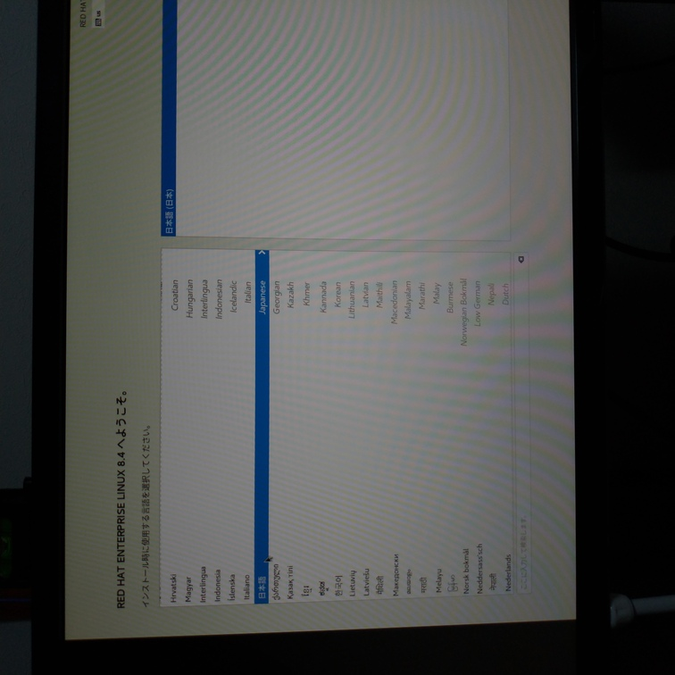
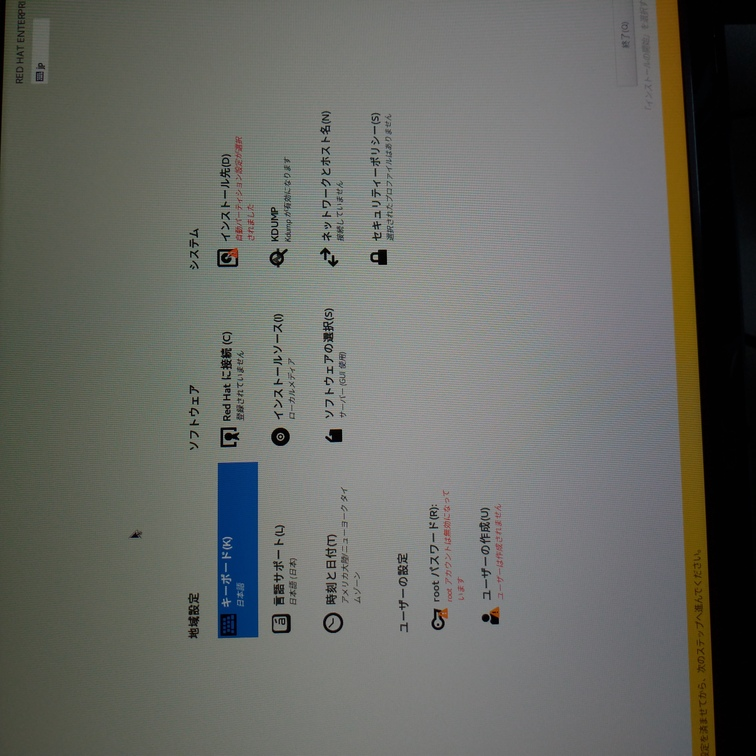
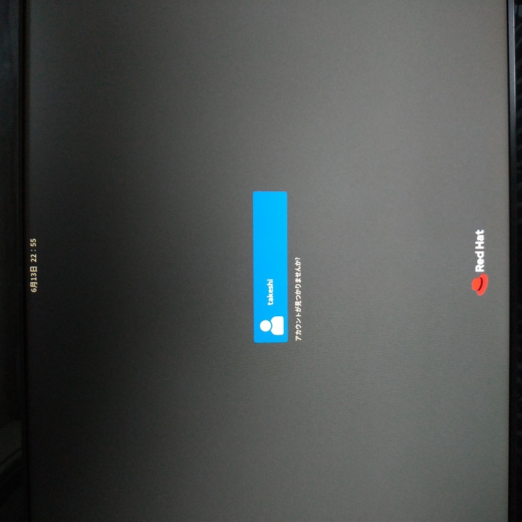
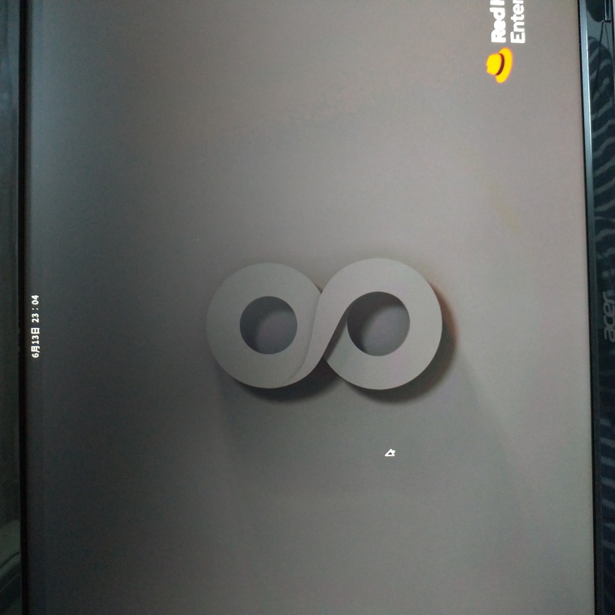
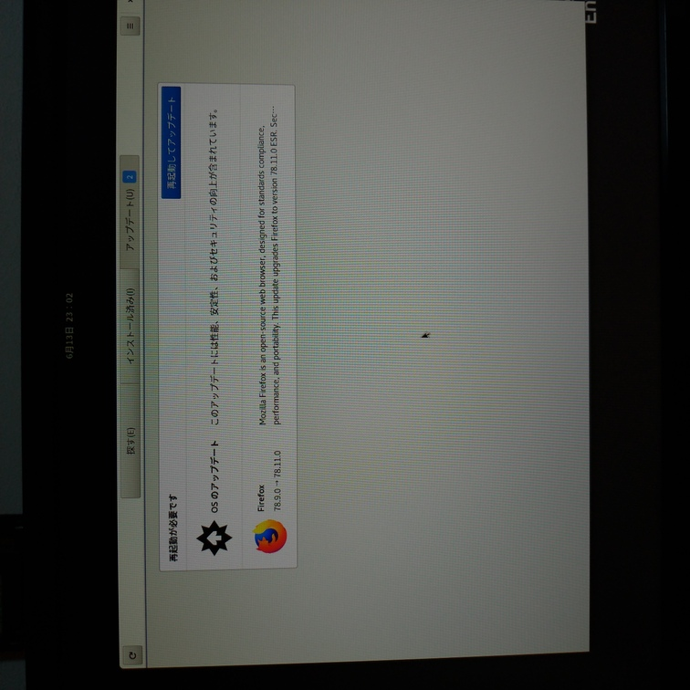

# Red Hat Enterprise Linuxをさくっとインストールしてみる

どちらかと言えば企業向けのLinuxであるRed Hat Enterprise Linux（通称：RHEL）を、今までのRaspberry Pi OSやUbuntuのノリでさくっとインストールしてみる。

ちなみに適当な知見でインストールするので詳しく色んなことを知りたい人はご自身でお調べください。

※アカウント作成時にRed Hat社に個人情報を提供することになるので注意。

## 準備

* PC
  * 4GB以上のメモリ
  * 20GB以上の空きがあるドライブ（新しく空のSSDなんかを用意すると良い）
  * インターネット接続環境
* 8GB以上のUSBメモリ

## 手順

### Red Hat Developerプログラムへのサインイン

https://developers.redhat.com/

右上の「Log In」をクリックすると、よくあるログインするかアカウントを作るかと聞かれるのでアカウントを作れば良い。

聞かれるのは

* Red Hat login：IDのようなもの。一度作ると変更不可
* メールアドレス
* Job role：身分。「Developer」を選んでおけばよいかと。
* パスワード
* 利用規約の同意
* ニュースレターの購読

その後、メールアドレス認証して無事作れる。

### 詳細の提供

インストールガイド

https://access.redhat.com/documentation/ja-jp/red_hat_enterprise_linux/7/html/installation_guide/index

インストールガイドに沿ってRHELをインストールしていくけど、ログイン後に上のページに飛ぶと個人情報の提供を求められる。

聞かれるのは

* カウントタイプ：「Personal」を選択
* アカウント情報：パスワードをもう一度決める
* フルネーム
* 住所

こういうところがやっぱり企業っぽい。

### イメージのダウンロード

https://access.redhat.com/downloads/

Red Hat Enterprise Linux 8をクリック。

認証のためのリダイレクトの後、ダウンロードページに移るので

* Product Variant：Red Hat Enterprise Linux for x86_64
* Version：8.4(latest)
* Architecture：x86_64

となっていることを確認して「Red Hat Enterprise Linux 8.4 Binary DVD」をダウンロード。9.43GBあるので注意。

ちなみにCPUはよく分からない人は大体Intel系だと思うので上記の通りでいいけど、そうじゃない人は自分の力で適切に選択する。

### イメージをUSBに焼く

https://access.redhat.com/documentation/ja-jp/red_hat_enterprise_linux/7/html/installation_guide/sect-making-usb-media

WindowsならRufusを使えばいいのではないか。上記ガイドでは[Fedora Media Writer](https://github.com/FedoraQt/MediaWriter/releases)が推奨されている。なんでもいいと思う。

自分はGaruda Linux（Arch Linux）上でやっているのでLinuxのガイドに従う。

#### Linux上での手順

USBメモリを挿してからターミナル上で`dmesg`を打つ。

~~~shell
$ sudo dmesg
~~~

そうすると

~~~
[13271.092282] sd 7:0:0:0: [sde] Attached SCSI removable disk
~~~

みたいな行がすぐ見つかると思う。この`sde`が今挿したUSBメモリのデバイス名となる。

マウントされていないか確認。

~~~shell
$ sudo findmnt /dev/sde
~~~

何か出てきたらマウントされているので、その場合は`sudo umount`コマンドでアンマウントする。

以下のコマンドでUSBに焼く。

~~~shell
$ sudo dd if=/home/takeshi/tmp/rhel-8.4-x86_64-dvd.iso of=/dev/sde bs=512k
~~~

結構な時間がかかるのと、進捗バーが出ないので注意。

### 起動

USBをPCに挿し、BIOSに入りUSBから起動するようにして起動。セキュアブートなどマザーボードによって設定が変わるので、とにかくUSBからの起動を目指して設定する。

立ち上げると、

* インストールする
* テストしてインストールする
* トラブルシューティング

の選択肢が出てくるので、テストしてインストールするを選ぶ。何かテストプログラムが走るけど待てるレベル。

次にGUIが開き、インストール時の言語を聞かれる。日本語でいいんじゃないかな。

次に色々設定ができる画面になるので色々設定する。

以下、必要であろう設定

* 時刻と日付

* ソフトウェアの選択

  ベース環境：サーバー（GUI使用）

  その他のソフトウェア：好きなもの

* ネットワークとホスト名（イーサネットをONにする）

* インストール先（画面を開いてからすぐ閉じるだけで良さそう）

* ユーザーの作成（作成するユーザーを管理者としておくと良さそう）

準備ができたらインストールを開始する。

### インストール後

ライセンス同意とサブスクリプション登録がある。サブスクリプションはどうもいらないっぽいけどせっかくだからしておく。[後から解除できるっぽい](https://access.redhat.com/documentation/ja-jp/red_hat_enterprise_linux/7/html/installation_guide/chap-subscription-management-unregistering#sect-subscription-management-unregistering-rhsm)。

ログイン画面。

デスクトップ。

画面上部の時計をクリックすると通知が見れる。アップデートはWindowsと同じように再起動時に勝手にしてくれるっぽい。

## まとめ

個人利用としての壁は

* アカウント作る
* 個人情報の提供
* RHELのためにそこまでする必要性の無さ（他のディストリビューションを使えば良いという意味で）

だと思う。

逆に「個人情報ぐらい別にええわ」「RHELをとにかく使ってみたい」と思えるなら、他のLinuxとインストール作業はあまり変わらない印象。
