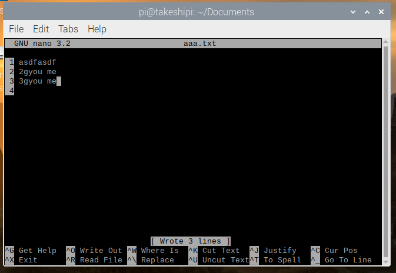

# Linuxの概要

この記事では最低限知っておくべきLinuxの知識を紹介する。ちなみに自分は学校に通って習ったわけでも本を買って勉強したわけでもなく、なんとなく野生児的にLinuxを触って習得したので詳しくは各項目を検索してもらいたい。

ここでは特にRaspberry Piを触るにあたって必要な事項を紹介する。

## Linuxのディストリビューション

WindowsはMicrosoftが、MacはAppleが作っているが、Linuxは色んな作者・団体がいて派生バージョンがいっぱいある。

* Red Hat系

  * Red Hat Enterprise Linux (RHEL)

  * CentOS

* Debian系

  * Debian
  * Ubuntu

* Slackwave系（詳しくは知らない）

これらは全てLinuxと呼ばれる（誰かが怒りそうな気はするけど、大体間違ってはない）が、それぞれで少しずつやり方が違う。

Raspberry Pi OSはDebianを元にしている。だからRaspberry Piに通用するLinuxコマンドを探そうと思ったらDebianまたはDebian系に注目すると良い。Raspberry Pi OSは以前はRaspbianと呼ばれていた。

ちなみに現在の最新バージョンであるRaspberry Pi OS 1.4はDebian 10.4をベースにしている。

## ターミナルについて

ターミナル（あるいはコンソール）とは、これのことを指す。

この黒の背景で、コマンドだけを打ち込んでいく画面。[前回](startup1.html)の初期設定でも早速これを立ち上げた。

Linuxはサーバーとして使われることが多く、そういう場合モニターを持たずデスクトップ画面を表示させることはほぼ無い。操作する場合、ターミナル（またはコンソール）にコマンドを打ち込んで操作していくことになる。

ちなみにターミナルとコンソールの違いは、細かく突っ込めば明確な違いはあるが、世間ではごっちゃにして使われている印象。

「ターミナルに以下を打ち込む～」と「コンソールに以下を打ち込む～」はほぼ同義語。

調べてみるとどうも「コンソール画面」という言い方が正しいらしい。

## コンソール画面について

Linuxのコンソール画面で必ず表示される4要素。

1. ユーザー名
2. ホスト名
3. 現在いるディレクトリ
4. 一般ユーザーか`root`ユーザーかの区別

ユーザー名はいいとして、それ以降を説明していく。

### ホスト名

どのコンピューターにログインしているのかを示す。`pi@takeshipi`は「`takeshipi`という名前のコンピューター上の`pi`さんですよ」ということを表す。

### 現在いるディレクトリ

デスクトップ画面ではディレクトリ（Windowsで言うフォルダ）を複数開いて～ということができるが、コンソール画面では必ずどこかのディレクトリに入ってそこで作業することになる。「ディレクトリに入る」というのは変な感じだが、そのうち慣れる。

ちなみに`~`はそのユーザーのホームディレクトリにいることを示す。ホームディレクトリという概念は`ls`コマンドの紹介と同時に説明する。

### 一般ユーザーか`root`ユーザーかの区別

ユーザーは2種類あり、一般か`root`かのどちらか。

* 一般ユーザー：`$`
* `root`ユーザー：`#`

`root`ユーザーはどのLinuxにも存在し、どんなコマンドでも実行することができる、いわばそのコンピューターの神のような存在。よく「自分自身すら削除することができる」と言われる。

どんなコマンドでも実行することができるので「`root`を乗っ取られる＝そのコンピューターを乗っ取られる」ということを意味する。

`root`ユーザーとしてログインすることは（普通は）設定により禁止されており、`root`ユーザーとして何かコマンドを打つ必要がある場合は

* 一般ユーザーで`su`コマンドを打ち`root`ユーザーに昇格する。
* `sudo`コマンドを付け、そのコマンド実行時の瞬間だけ`root`として実行する。

のどちらか。これも後で紹介する。

## Linuxコマンドについて

コンソール画面に打ち込むコマンドをいくつか紹介する。

### `ls`

エルエス、またはリストセグメンツ。現在いるディレクトリ（または指定のディレクトリ）の中にあるファイルまたはサブディレクトリを表示する。設定にもよるが、ディレクトリは青色、ファイルは白色で表示される。

例えば今いるホームディレクトリにどんなものがあるのか見てみると

~~~bash
pi@takeshipi:~ $ ls
Desktop  Documents  Downloads  Music  Pictures  Public  Templates  thinclient_drives  Videos
~~~

いくつかピックアップすると

* `Desktop`ディレクトリ：デスクトップ画面に置いてあるファイルが格納される
* `Documents`ディレクトリ：マイドキュメントのようなもの

これはWindowsで言うところの`c:\Users\(ユーザー名)`フォルダのようなもの。

つまりホームディレクトリとは「マイドキュメントやマイミュージックみたいなディレクトリが格納されている、ユーザーが自由にファイルを保存できる場所」というイメージ。

`ls`の後にディレクトリパスを指定すれば指定のディレクトリの中身を表示させる。

~~~shell
pi@takeshipi:~ $ ls Documents
pi@takeshipi:~ $
~~~

何もないので分かりにくい。よって何かファイルを作っていくことにする。

### `cd`

シーディー、またはカレントディレクトリ。現在いるディレクトリから指定のディレクトリに移動する。例えば今いるホームディレクトリから`Documents`ディレクトリに移動してみる。

~~~shell
pi@takeshipi:~ $ cd Documents
pi@takeshipi:~/Documents $
~~~

現在いるディレクトリの表示が`~`から`~/Documents`に変わった。これはホームディレクトリ直下の`Documents`ディレクトリということを表す。

一つ上のディレクトリに戻りたい場合は

~~~shell
pi@takeshipi:~/Documents $ cd ../
pi@takeshipi:~ $
~~~

`../`は一つ上のディレクトリを指す相対パス。ホームディレクトリに戻る場合は`../`の代わりに`~`。

### `touch`

タッチ。本来はファイルの更新日時を変更するコマンドだけど、存在しないファイルを指定するとその名前で中身のないファイルを作成する。ファイル作成用途で使われることが多い印象。

~~~shell
pi@takeshipi:~/Documents $ touch aaa.txt
pi@takeshipi:~/Documents $ ls
aaa.txt
~~~

`touch`コマンドで`aaa.txt`というファイルを作成した。`ls`コマンドで確認してみると表示されるようになった。

### `cat`

キャット。指定ファイルの中身を表示するコマンド。

~~~shell
pi@takeshipi:~/Documents $ cat aaa.txt
pi@takeshipi:~/Documents $
~~~

`aaa.txt`は中身がないので何も表示されない。

### `nano` 

これはコマンドというよりテキストエディタ。Windowsでいうメモ帳のようなもので、指定ファイルを開いて編集することができる。

~~~shell
pi@takeshipi:~/Documents $ nano aaa.txt
~~~

と打つと

このような画面になる。詳しくは「nano 使い方」で検索してもらうとして、最低限

* `ctrl + S`：保存
* `ctrl + X`：終了

を覚えておかないと終了できずにハマることになる。

適当に書き込んで保存終了する。

先ほどの`cat`コマンドで中身を見てみる。

~~~shell
pi@takeshipi:~/Documents $ cat aaa.txt
asdfasdf
2gyou me
3gyou me
~~~

表示された。

### `cp`

コピー。指定ファイルを指定の名前でコピーする。`cp (コピー元) (コピー先)`という書式。

~~~shell
pi@takeshipi:~/Documents $ cp aaa.txt bbb.txt
pi@takeshipi:~/Documents $ ls
aaa.txt  bbb.txt
pi@takeshipi:~/Documents $ cat bbb.txt
asdfasdf
2gyou me
3gyou me
~~~

同じ内容が表示された。ファイル名はフルパスで指定することが可能。

~~~shell
pi@takeshipi:~/Documents $ cp aaa.txt ~/ccc.txt
pi@takeshipi:~/Documents $ cd ../
pi@takeshipi:~ $ ls
ccc.txt  Desktop  Documents  Downloads  Music  Pictures  Public  Templates  thinclient_drives  Videos
pi@takeshipi:~ $ cat ccc.txt
asdfasdf
2gyou me
3gyou me
~~~

### `mv`

ムーブ。指定ファイルを指定の場所に動かすことができる。

~~~shell
pi@takeshipi:~ $ mv Documents/bbb.txt ~
pi@takeshipi:~ $ ls
bbb.txt  ccc.txt  Desktop  Documents  Downloads  Music  Pictures  Public  Templates  thinclient_drives  Videos
~~~

指定先に同じディレクトリで別名を指定するとリネームができる。

~~~shell
pi@takeshipi:~ $ mv bbb.txt ddd.txt
pi@takeshipi:~ $ ls
ccc.txt  ddd.txt  Desktop  Documents  Downloads  Music  Pictures  Public  Templates  thinclient_drives  Videos
~~~

### `rm`

リムーブ。指定ファイルを削除する。

~~~shell
pi@takeshipi:~ $ rm ddd.txt
pi@takeshipi:~ $ ls
ccc.txt  Desktop  Documents  Downloads  Music  Pictures  Public  Templates  thinclient_drives  Videos
~~~

### `mkdir`

メイクディレクトリ。ディレクトリを作成する。

~~~shell
pi@takeshipi:~ $ mkdir asdf
pi@takeshipi:~ $ ls
asdf  ccc.txt  Desktop  Documents  Downloads  Music  Pictures  Public  Templates  thinclient_drives  Videos
~~~

`aaa.txt`と`ccc.txt`を今作った`asdf`ディレクトリに移す。

~~~shell
pi@takeshipi:~ $ mv ccc.txt asdf
pi@takeshipi:~ $ mv Documents/aaa.txt asdf
pi@takeshipi:~ $ ls asdf
aaa.txt  ccc.txt
~~~

### `rmdir`

リムーブディレクトリ。ディレクトリを削除する。ポイントはディレクトリの中に何かファイルがあると削除できない。

~~~shell
pi@takeshipi:~ $ rmdir asdf
rmdir: failed to remove 'asdf': Directory not empty
~~~

この時、中のファイルをすべて削除してからディレクトリを削除するか、`rm`コマンドに`-r`オプションを付けて削除する。

~~~shell
pi@takeshipi:~ $ rm -r asdf
pi@takeshipi:~ $ ls
Desktop  Documents  Downloads  Music  Pictures  Public  Templates  thinclient_drives  Videos
~~~

### `su`

す。スーパーユーザーまたはサブスティテュートユーザー（substitute user）。指定ユーザーに変身する。特にオプションを指定せずにこのコマンドを打つと`root`ユーザーに変身（昇格）できる。ほぼこのために使われる。

~~~shell
pi@takeshipi:~ $ su
Password:
su: Authentication failure
~~~

実はRaspberry Pi OSの初期設定では`root`ユーザーにはパスワードが与えられておらず、何を入力しても（または空白でも）`root`ユーザーになることはできない。パスワードを与えることができるが、セキュリティホールになるので推奨はされないらしい。

しかしコマンドの中には`root`ユーザーでないと実行できないものもあるので、そういう場合は以下のコマンドを使う。

### `sudo`

スドゥー。`su`で`do`するコマンド。つまり指定ユーザー（またはスーパーユーザー）が指定のコマンドを実行する。[前回](startup1.html)の初期設定で

~~~shell
$ sudo nano /etc/dhcpcd.conf
~~~

というコマンドが出てきたが、もともと`/etc/dhcpcd.conf`は一般ユーザーには書き込み権限が与えられていないので、`sudo`を付け足して`root`ユーザーとして開くことを指定した。

場合によってはパスワードを求められることがある。その時のパスワードはその時ログインしているユーザーのパスワードで`root`のパスワードではない。

### その他

「linux よく使うコマンド」とか「raspberry pi よく使うコマンド」で検索。

## Linuxコマンドの表記の仕方について

今後コンソール画面に打ち込むコマンドは、必要のない限り以下の様に記述する。

~~~shell
$ ls
~~~

実際の画面上には`pi@takeshipi:~ $ `と表示されているけど、ユーザー名、ホスト名は基本的に設定次第でいくらでも変わる。また現在いるディレクトリは、特に問題にならない場合が多いか「～～ディレクトリに移動してから以下を打つ」みたいな感じで指定することが多く、ネット上の情報を見ても4要素のうち上記3つは省略することが多い。

`$`は省略せずに書くが、これが書いてあればほぼ「あ、コンソール画面に打ち込むんだな」と思って間違いない。ごくまれに`#`を書くこともある。

## ディレクトリの構造

`~`はホームディレクトリであると説明したが、例えば違うユーザー`pipi`を作成してそのユーザーでログインしたとする。じゃあ`pipi`が持つホームディレクトリはどうやって表されるか。

答えは`~`。

ユーザーが変わってもホームディレクトリの表記は同じ。じゃあファイルなどは共有されるのかというとNo。ホームディレクトリに保存したファイル等はユーザーごとに保存され共有はされない。

どういうこと？と思うかもしれないが、`~`は単にユーザーのホームディレクトリを表すショートカットみたいなもので、実際は`/home`ディレクトリにユーザーごとのホームディレクトリが格納されている。

例えばWindowsでもユーザーごとに「マイドキュメント」が用意されるけど、同じ名前だからと言ってユーザー間で共有はされない。そもそもマイドキュメントやユーザーフォルダはCドライブのトップにあるわけじゃない。

Linuxでも同じで、WindowsでのCドライブのトップにあたるディレクトリが`/`。

~~~shell
$ ls /
bin  boot  dev  etc  home  lib  lost+found  media  mnt  opt  proc  root  run  sbin  srv  sys  tmp  usr  var
~~~

この中の`home`ディレクトリに各ユーザーのホームディレクトリが、それぞれのユーザー名で格納されている。

~~~shell
$ ls /home
pi
~~~

なので、`pi`ユーザーのホームディレクトリは`/home/pi`となる。

~~~shell
$ ls /home/pi
Desktop  Documents  Downloads  Music  Pictures  Public  Templates  thinclient_drives  Videos
~~~

`pi`ユーザーにとって`~`＝`/home/pi`となるけど、`pipi`ユーザーにとっては`~`=`/home/pipi`となる。