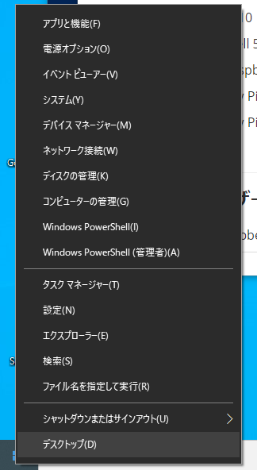
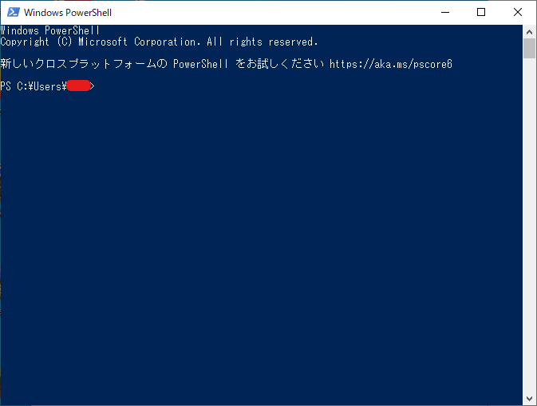

# PowerShellについて

ここではテーマからは少し外れるが、Windows付属のシェルについて説明する。

## 環境

- Windows10
- PowerShell 5.1

## 概要

詳しくは検索してもらうとして、ここでは

* コマンドプロンプトの上位版

という認識で構わない。コマンドプロンプトでできることはPowerShellでもできる。さらにPowerShellでのみできることもある。

## 起動方法

Windowsのスタートボタンを右クリックすると出てくる。

管理者として起動してもいいけど、Raspberry Piを動かすだけなら別に管理者じゃなくても構わない。起動すると

と表示される。

Linuxのコンソールの表示と似ている部分があって、

~~~
PS (現在のフォルダ)>
~~~

と表示される。`PS`はおそらくPowerShellの略。

## 今後のPowerShell上でのコマンド（またはコマンドレット）の表記

~~~shell
> ssh takeshi@192.168.1.201
~~~

などと`>`から始まるコマンド（またはコマンドレット）はすべてPowerShell上で打つものとする。

## コマンドレットって？

何故か知らないけどPowerShellではコマンドレットと呼ぶらしい。コマンドと呼ぶとやいやいうるさい人が出てくるかもしれないので一応書いてるけど、正直どっちでもいい。

## その他使い方

「PowerShell 使い方」とか「PowerShell コマンドレット」で検索。

