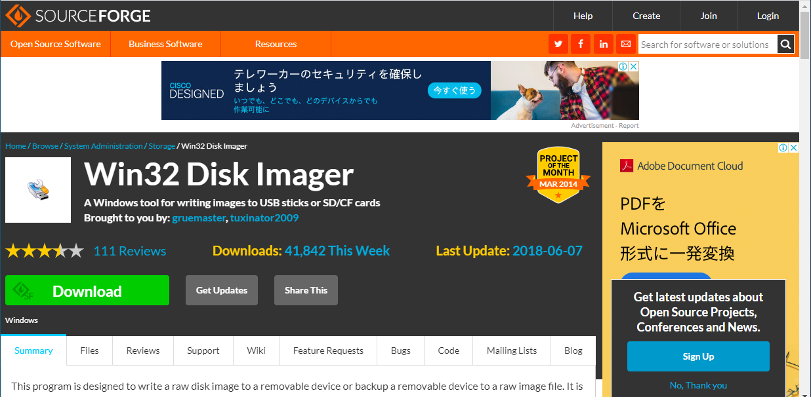
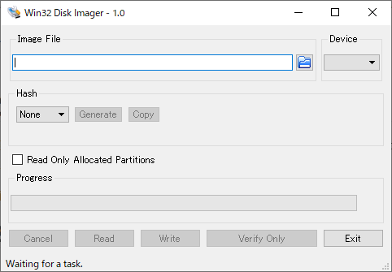

# バックアップについて

ある程度構築を進めると、もし何かでOSをリセットしないといけないとなった時に復帰するまでにいくつもの手順を踏まないといけなくなり時間がかかる。

そこで、microSDカードの中身を丸ごとバックアップする。

## Win32DiskImagerについて

### ダウンロード

[Win32 Disk Imager download \| SourceForge\.net](https://sourceforge.net/projects/win32diskimager/)

ここでダウンロードできる。

### 使い方

Raspberry Piのヘッドレスインストールで使うソフト。SDカードの中身を「イメージ」として丸ごと1つのファイルとして保存したり、書き込んだりする。

保存の方法は以下。

* 先に空の`.img`ファイルを準備し、「Image File」欄のファイルピッカーでその`.img`ファイルを選択する。
* microSDカードをPCに接続すると、「Device」にSDカードのドライブレターが表示されるのでそれを選択。
* Readボタンをクリック

逆にバックアップしたイメージファイルからSDカードに書き込むときは、同じ手順でWriteボタンをクリックすればよい。