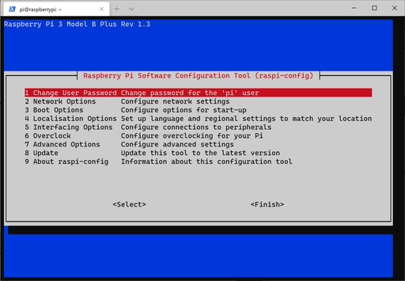

# （上級）Raspberry Piをモニター無し（ヘッドレス）で立ち上げる

モニター、キーボード無しで立ち上げる。

## 環境

- ローカル（PC側）
  - Windows10
  - PowerShell 5.1
- リモート（Raspberry Pi）
  - Raspberry Pi 3B+
  - Raspberry Pi OS 1.4

## 概要

1. microSDカードにOS書き込み（通常と同様）
2. SSHとWifiを有効化
3. Raspberry Piを立ち上げて、PCからRaspberry PiのIPを見つけてSSH接続
4. 各種設定（通常と同様）

ということで、SSH接続を確立するまでが勝負。

## 手順

### microSDカードにOS書き込み

#### OSのダウンロード

[通常のやり方](startup1.html)と同様でいいけど、せっかくなので別のやり方でSDカードにOSを書き込む。

[Operating system images – Raspberry Pi](https://www.raspberrypi.org/software/operating-systems/)から、Raspberry Pi OSのイメージファイルをダウンロード。どれでもいいけど、ヘッドレスインストールするぐらいならデスクトップ環境無しでもいい気がする。

一応今回はRDP接続して通常のインストールと同じ結果にたどり着けることを目標とするので、「Raspberry Pi OS with desktop」をダウンロードする。

回答すると`.img`ファイルが出てくる。

#### イメージファイル書き込みソフトをインストール

さらに、イメージファイル書き込みソフトをインストールする。[Raspberry Pi公式](https://www.raspberrypi.org/documentation/installation/installing-images/windows.md)で紹介されているのは[Win32DiskImage](https://sourceforge.net/projects/win32diskimager/)というソフト。Downloadをクリックしてダウンロード、インストールする。

規約同意。

インストール場所。

スタートメニューに表示させるフォルダ。

デスクトップにショートカットを作成。

インストール。

立ち上げ。READMEは不要。

立ち上げ画面。ちっちゃい。なんでや。

気を取り直して、広げたところ。

#### イメージファイルをmicroSDカードに書き込み

SDカードをPCに挿し、Win32 Disk ImagerでRaspberry Pi OSのイメージファイルを指定し、Writeをクリック。

SDカードの中身消すけどいいか？と聞かれるのでYes。

しばらくすると「書き込み成功」と出る。

書き込みが終了した後のmicroSDカードの中身。いろいろファイルが見える。WifiとSSHを有効化するために、ここにファイルをいくつか追加する。

### WifiとSSHを有効化する

#### Wifiを有効化する

microSDカードのルート直下に、`wpa_supplicant.conf`という名前のファイルを作成し、以下の内容を書き込む。ただし、文字コードはUTF-8、改行コードは`LF`になるように注意する。

~~~
ctrl_interface=DIR=/var/run/wpa_supplicant GROUP=netdev
update_config=1
country=JP

network={
 ssid="(WifiのSSID)"
 psk="(そのSSIDのパスフレーズ)"
}
~~~

Raspberry Pi OSが立ち上がるときにこのファイルを見つけたら、勝手に適切な場所にコピーしてくれるということらしい。

ということはLinuxが読める文字エンコードと改行コードが必要というわけ。

#### SSHを有効化する

同じくmicroSDカードのルート直下に`ssh`という拡張子無しの名前でファイルを作成する。これは中身無しでよい。

Wifiの設定同様に、Raspberry Pi OSが立ち上がるときにこの`ssh`という名前のファイルを見つけたら、SSHを有効化して、このファイルは削除される。

### Raspberry Piを立ち上げて、PCからRaspberry PiのIPを見つけてSSH接続

WifiとSSHを有効化したらmicroSDカードをRaspberry Piに挿し電源をつなぐ。

当たり前だけど見た目にはほぼ変化なし。グリーンのランプが落ち着いたら多分大丈夫。

#### Raspberry PiのIPを見つける

いくつかやり方があるけど、要は「同じサブネット内の有効なIPを探して、MACアドレスを頼りにRaspberry Piを特定」すればよい。

一番探しやすかった方法は「[Advanced IP Scanner](https://www.advanced-ip-scanner.com/jp/)」をインストールして使うやり方。他の方法（`arp`コマンドを使うとか）は各自で調べること。

（インストール中のスクリーンショット撮り忘れたけど、そんなに難しくないので適当にインストールして立ち上げてください）

「スキャン」をクリックすれば、同じネットワーク内に接続されているPC等のデバイスのIPが表示されるから、その中で「製造社」の項目が「Raspberry Pi Foundation」となっているもの（またはMACアドレスがB8:27:EBから始まる or DC:A6:32から始まるもの）を探す。

自分の場合は`192.168.0.121`が見つかった

#### SSH接続をする

PC上で以下を打ちRaspberry Piに接続する。

~~~shell
> ssh pi@192.168.0.121
~~~

初回接続時は「このIP初めてつなぐけど大丈夫か？」的なことを聞かれるので`yes`と打ちエンター。

~~~
> ssh pi@192.168.0.121
The authenticity of host '192.168.0.121 (192.168.0.121)' can't be established.
ECDSA key fingerprint is SHA256:5GLWqeNHjO0V9iHl75ldM/cfyFtKDCnGADu3IAsc9Rk.
Are you sure you want to continue connecting (yes/no)? yes
~~~

パスワードを求められるので、`raspberry`と打ちエンター。画面は何も表示が変わらないけど、セキュリティのために入力中の文字は一切表示されないだけ。入力はちゃんと行われている。

~~~
Warning: Permanently added '192.168.0.121' (ECDSA) to the list of known hosts.
pi@192.168.0.121's password:
~~~

以下のような表示が出ればログイン成功。

~~~
Linux raspberrypi 5.4.51-v7+ #1333 SMP Mon Aug 10 16:45:19 BST 2020 armv7l

The programs included with the Debian GNU/Linux system are free software;
the exact distribution terms for each program are described in the
individual files in /usr/share/doc/*/copyright.

Debian GNU/Linux comes with ABSOLUTELY NO WARRANTY, to the extent
permitted by applicable law.
Last login: Thu Aug 20 11:54:33 2020

SSH is enabled and the default password for the 'pi' user has not been changed.
This is a security risk - please login as the 'pi' user and type 'passwd' to set a new password.

pi@raspberrypi:~ $
~~~

BOOM!

### 各種設定

そのまま設定モードに入る。

~~~shell
$ sudo raspi-config
~~~

以下の項目を変えていく。

| 大項目               | 小項目              | 変更内容                              |
| -------------------- | ------------------- | ------------------------------------- |
| Change User Password | （なし）            | `pi`ユーザーのパスワードを変更する。※ |
| Boot Options         | B1 Desktop / CLI    | 「B1 Console」を選択。                |
| Localisation Options | I2 Change Time Zone | 「Asia」→「Tokyo」を選択。            |

※自分しか使うつもりがなくても`pi`ユーザーのパスワードは`raspberry`と決まっているのでセキュリティ的によろしくない。

#### OSアップデート

お約束のやつ。

~~~shell
$ sudo apt update
$ sudo apt upgrade
~~~

終わったら再起動。

~~~shell
$ sudo reboot
~~~

### IP固定化＆RDP接続を有効にする

[通常のセットアップ](startup1.html)と同じ。

いけた。

