# SSH接続時に`WARNING: UNPROTECTED PRIVATE KEY FILE!`というエラーが出た時の対処

## 状況

PC1（デスクトップPCなど）上でRSA鍵ペア`id_rsa`と`id_rsa.pub`を作成し、何らかの方法で別のPC2（ノートPCなど）にコピーしたときに、その鍵を使ってSSH接続しようとすると出る。

~~~
@@@@@@@@@@@@@@@@@@@@@@@@@@@@@@@@@@@@@@@@@@@@@@@@@@@@@@@@@@@
@         WARNING: UNPROTECTED PRIVATE KEY FILE!          @
@@@@@@@@@@@@@@@@@@@@@@@@@@@@@@@@@@@@@@@@@@@@@@@@@@@@@@@@@@@
Permissions for '(鍵の場所のパス)' are too open.
うんたらかんたら・・・
~~~

書いてあるように、`Permissions are too open`（権限が広すぎ）なのが問題。

## 環境

- ローカル（PC側）
  - Windows10
  - PowerShell 5.1

## 対処方法

1. 権限を適切に設定する。
2. 秘密鍵ファイルに紐づいたシンボリックリンクを作成する。

### 1. 権限を適切に設定する

Windowsに現在ログインしているユーザーのみに権限を与えるようにすればよい。

#### 現在ログインしているユーザーの名前を確認

PowerShell上で

~~~powershell
> $env:UserName
~~~

と打つと現在のユーザー名が表示される。

#### 秘密鍵`id_rsa`の現在の状況を確認

エクスプローラー上で`id_rsa`を右クリックし、プロパティ→セキュリティを開く。

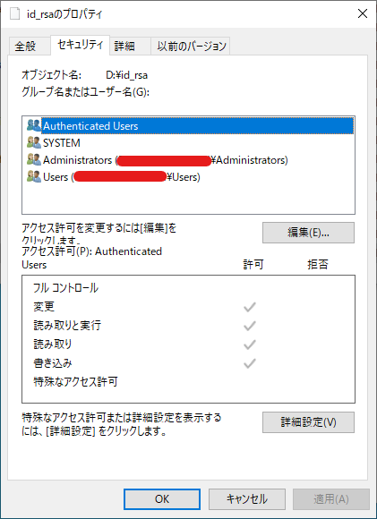

ここで表示されるグループ名またはユーザー名のうち

* SYSTEM
* Administrators

* 自分

のみにしていく。この画像で言うと、Authenticated UsersグループとUsersグループの権限は外す。

#### 詳細設定画面から所有者の変更を行う

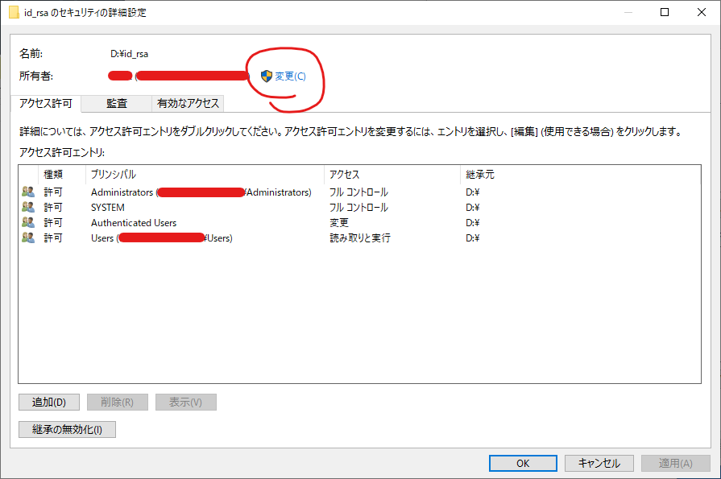

所有者の右の変更をクリック。

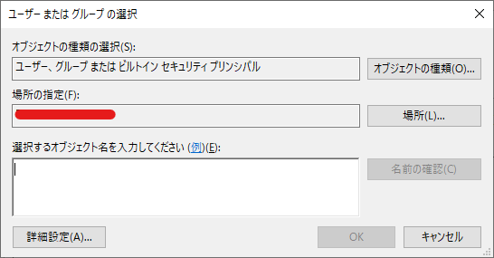

「選択するオブジェクト名を入力してください」というテキストボックスに先ほど調べた自分のユーザー名を入力して、右の名前の確認をクリックする。

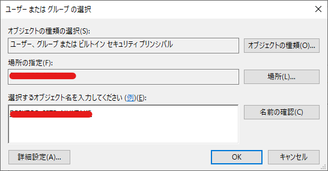

それっぽい名前になるから、それでOKを押す。

#### 継承の無効化

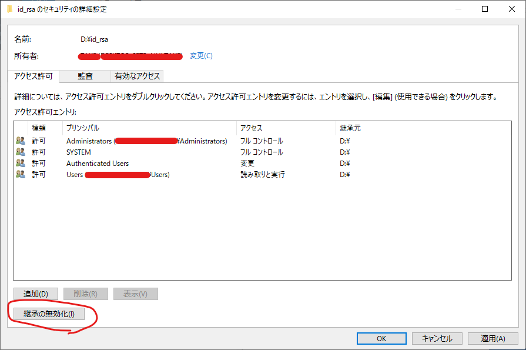

「継承の無効化」をクリック。

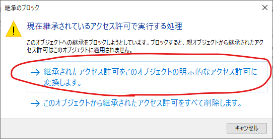

こんな警告が出るので「継承されたアクセス許可をこのオブジェクトの明示的なアクセス許可に変換します。」をクリック。

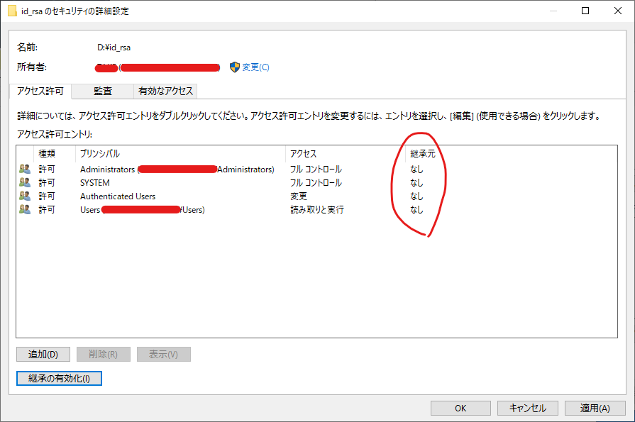

継承元が無しになる。

これで右下の「OK」をクリック。

#### 自分にアクセス許可を与える

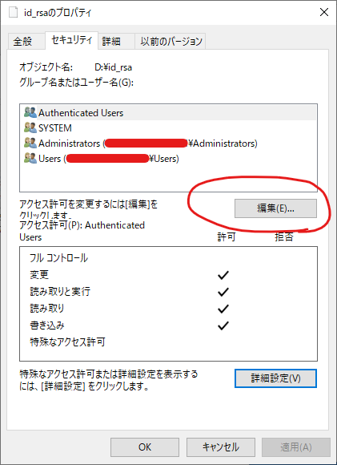

「編集」をクリック。

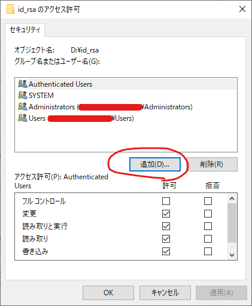

「追加」をクリック。

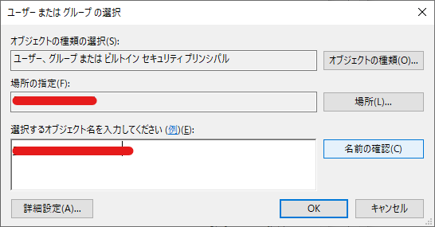

さっきと全く同じ画面が出てくるので、調べたユーザー名を入力して「名前の確認」をクリックして「OK」をクリック。

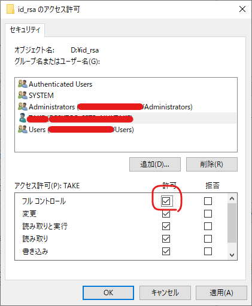

自分が追加されているので、フルコントロールを与える。

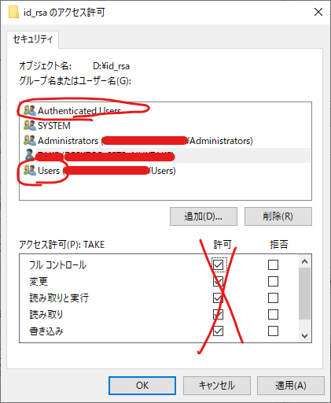

Authenticated UsersとUsersの許可はすべてチェックを外す。「OK」をクリック。

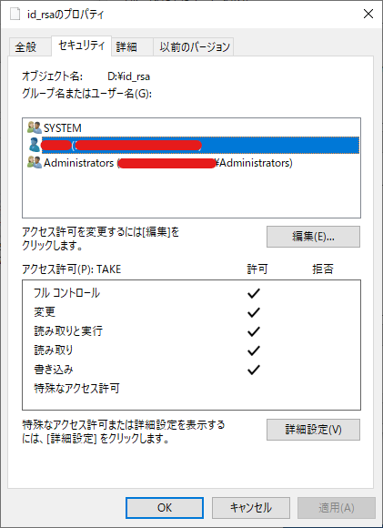

SYSTEMと自分とAdministratorsのみが残り、それ以外は消える。この状態になればOK。

### 2. 秘密鍵ファイルに紐づいたシンボリックリンクを作成する。

裏技的なやり方だが、秘密鍵に紐づいたシンボリックリンク（Windowsでいうショートカットみたいなもの）を作って、それでSSH接続をしてもうまくいく。

参考：[Windows版VSCodeで秘密鍵の位置に関係なくSSHログインするには \- Qiita](https://qiita.com/mindwood/items/ddae674a0694402f22a6)

> そんなときは**シンボリックリンク**で対処できる。
>
> ~~~
> コマンド例
> mklink C:\Users\xxxxx\.ssh\zzzzzz.pem E:\MW_Documents\開発\Aプロジェクト\設定情報\zzzzzz.pem
> ~~~

管理者権限で起動した**コマンドプロンプト**でこの`mklink`コマンドが有効になる。

> ~~~
> mklink  リンク名  実ファイル
> ~~~
>
> アイコンの見た目は、ショートカットと同じになる。

管理者権限でコマンドプロンプトを起動して

~~~
> mklink C:\Users\(ユーザー名)\.ssh\key.pem D:\(秘密鍵の場所のパス)
~~~

とした後、

~~~shell
> ssh (ラズパイのユーザー名)@(ラズパイのIP) -i C:\Users\(ユーザー名)\.ssh\key.pem
~~~

としたら怒られることなくSSH接続ができる。