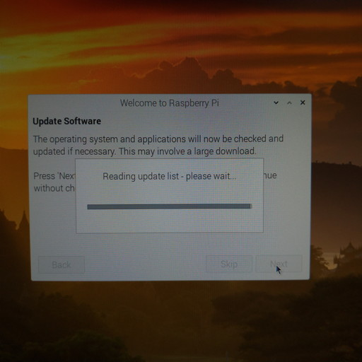
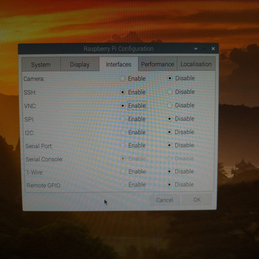

# （通常）Raspberry Piの立ち上げからリモート接続まで

## やりたいこと

* 買ってきたRaspberry Piの初期設定をし、起動。
* Windowsからリモート接続をし、Raspberry Piのためにいちいちモニター等を用意しなくてもいいようにする。

## 環境

- ローカル（PC側）
  - Windows10
  - Powershell 5.1
- リモート（Raspberry Pi側）
  - Raspberry Pi 3B+

## 前提

Raspberry Piに必要なものは購入済みとする。

* Raspberry Pi本体
* microSDカード（32GBぐらい？）
* 周辺機器
  * microUSB（Bタイプ）ケーブル＋2A以上出力のスマホ充電器 または ACアダプター5V/3A（microUSB-Bコネクタ）
  * HDMIケーブル＋モニター
  * USBキーボード＆マウス
* （任意）Raspberry Pi用ケース

## 設定表

| 項目         | 設定値                                                       |
| ------------ | ------------------------------------------------------------ |
| OS           | Raspberry Pi OS 1.4                                          |
| 国           | Japan                                                        |
| 言語         | Japanese                                                     |
| タイムゾーン | Tokyo                                                        |
| キーボード   | Generic 105-key PC (intl.) Layout：Japanese Variant：Japanese |
| Boot         | To CLI                                                       |
| Auto login   | No                                                           |
| Interfaces   | SSH：Enable                                                  |

その後

* IP固定
* `xrdp`をインストール

## 詳細な方法

### Raspberry Pi OSをダウンロード

配布サイト：[Raspberry Pi Downloads \- Software for the Raspberry Pi](https://www.raspberrypi.org/downloads/)

実行ファイルがDLされるが、これはmicroSDカードにRaspberry Pi OSを書き込んでくれるソフト。DLした実行ファイルを実行してインストールをする。

Installボタンをクリックするとインストールされる。Finishを押すと書き込みソフトが立ち上がる。

### microSDカードにOSを書き込む

買ってきたmicroSDカードを

PCにつなぐ。

書き込みソフト上で、Raspberry Piに書き込みたいOSと

書き込むドライブ（microSDカード）を選択。間違ってPCにつないでるHDDなんて選択しないように。

選択後、一番右の「WRITE」をクリック。

「選択されたドライブの中のファイル全部消えるけど、続けてええか？」と聞いてくるので、「YES」

書き込みが始まってしばらくすると終了する。「もうSDカード取っていいよ。」と言ってくれる。アンマウントまでしてくれるらしい。

これでOSの書き込みが完了。

### Raspberry Piをモニター等に接続

OSが書き込まれたmicroSDカードを挿し、

HDMIケーブル、キーボード、マウスをつなぎ

最後に電源（microUSB）を接続。Raspberry Piには電源ボタンという高度な機能は搭載されていないので、電源をつないだ瞬間から電源がONになる。その前にHDMIケーブルだけは最低限つないでおく必要あり。

モニターに何か写る。

無事立ち上がるとデスクトップ画面が表示される。これから初期設定が始まる。

### Raspberry Piの立ち上げ時設定

まず最初に国を聞かれる。**「Use English language」にチェックを入れることを強くオススメする。**というのも、今後はRaspberry PiをLinuxサーバーとして見なしていくので、変なところに日本語の名前を使われたりするとエラーの原因になる。Raspberry PiをデスクトップPCとして使っていきたい人は別に必要ではないかもしれない。

パスワードの設定。まだキーボード配列の設定がUSのままなので変に記号を使わない方が良い。後で記号を含めた強固なパスワードに設定するので、今はアルファベットのみの適当なパスワードにしておく。

「スクリーンに黒枠が表示されているか？」と聞かれる。要はRaspberry Piの画面がモニター一杯に広がっているかどうか。

これが黒枠。表示されているので、チェックボックスにチェックを入れて次へ。別にチェックボックスを入れなくても特に問題は起こらない。

Wifiの設定。しばらく待てばSSIDを表示するので、自分のものを選ぶ。

Wifiのパスワードを入力。

OSをアップデート。少し時間がかかる。

これで準備完了。新しい設定を読み込むために再起動を促されるので、再起動をする。

### OS設定

次は変えておくべきOSの設定をしておく。

設定画面はここ。

まずはキーボードの設定。「Localisation（ローカライゼイション）」タブの中の「Set keyboard」をクリックして、以下のように設定する。

然る後に「System」タブからパスワードを変える。記号を含めた強固なものにする。

その他の「System」設定。

* Hostnameは好きなように設定。
* Bootは「To CLI」にしておく。（後のセキュリティ設定で必要）
* Auto loginはチェックを外しておく。（後のセキュリティ設定で必要）

「Interfaces」タブ。SSHを有効にしておく。VNCはリモートデスクトップ接続に必要なものだったが、2020年9月現在WindowsからはRDPで接続できるので必要がない。自分はちょっとやりたいことがあったので有効にした。

また再起動を促されるが、ここでは「No」を選択。後述するIP固定化と`xrdp`をインストールした後に再起動をする。

これでOSの設定は終わり。

### リモート接続のためにIP固定化

後でWindowsからRaspberry PiのIPアドレスを指定して接続しにいくが、何も設定しなければRaspberry PiのIPアドレスが何になるか調べてみるまで分からない。それは面倒なので、先に固定して「Raspberry PiのIPはいつもコレ」という状態を作っておく。

ターミナルを立ち上げる。

以下のコマンドを打つ。

~~~shell
$ sudo nano /etc/dhcpcd.conf
~~~

そうするとターミナル上でNanoというテキストエディタが立ち上がり、`/etc/dhcpcd.conf`というファイルを開く。

↓キーでファイルの一番まで行き、末尾に

* Raspberry PiのIPアドレス
* ルーターのIPアドレス
* DNSサーバーのIPアドレス

を以下の書式で書き込む。

~~~
interface wlan0
static ip_address=192.168.aaa.bbb/24
static routers=192.168.aaa.ccc
static domain_name_server=192.168.aaa.ccc 8.8.8.8
~~~

* `192.168.aaa`の部分はPCのIPと揃える。
* `bbb`は自由に決めて良い。
* `192.168.aaa.ccc`はルーターのIP、`ccc`の部分は普通は`1`。
* `8.8.8.8`はGoogleのDNSサーバーで、書き込まなくても良い。

この辺りの説明は解説に参考サイトを記しておく。以下は自分の設定例。

書き込みが終わったら`ctrl + S`で保存、`ctrl + X`でテキストエディタを終了させる。

### リモート接続のために`xrdp`をインストール

Raspberry Piに`xrdp`というソフトをインストールしておけば、Windowsからは標準ソフトで接続できる。

引き続いてターミナル上で以下を打ち込む。

~~~shell
$ sudo apt install xrdp -y
~~~

分かる人向け：`apt-get`より`apt`を使おう。「apt-get apt 違い」で検索。

インストールが始まる。

しばらくするとインストールが終了する。

### Raspberry Piの再起動

通常の再起動やシャットダウンはここ。

### 再起動後のRaspberry Pi

OSの設定時に「Boot」の項目を「To CLI」に設定したので、再起動後はデスクトップが立ち上がらない。これが正常なのだが、慣れていないとびっくりするので画面を紹介しておく。

ずらずら文字が並んで以下の状態で止まる。ログイン待ち状態。この状態ではまずユーザー名を入力してエンターを押す。現状Raspberry Piに登録しているユーザーは`pi`ユーザーのみ。なので`pi`と入力してエンター。

設定したパスワードを入力してエンター。入力したパスワードはセキュリティのために表示されないので、画面上には変化がない。

ログインに成功したらターミナルを起動した時のような状態になる。とりあえずこれで良い。

もしデスクトップを起動したければ

~~~shell
$ startx
~~~

と打つ。

そうするとデスクトップが表示される。

### Windowsからリモート接続

Raspberry Piを起動させた状態（`pi`ユーザーがログインしているかどうかは不問）で、Windows上で「リモートデスクトップ接続」を起動する。

スタートメニューから「Windows アクセサリ」→「リモートデスクトップ接続」で起動するか、スタートボタン右にある「ここに入力して検索」欄に「リモートデスクトップ接続」と打ち込みエンターを押すと、Windows標準のリモートデスクトップ接続ソフトが立ち上がる。

以下は立ち上げた状態。少し画面が違うかもしれないが、とにかく「オプションの表示」をクリック。

以下の情報を入力。

* コンピューター名：Raspberry PiのIP
* ユーザー名：`pi`
* 資格情報を保存できるようにする：チェックを入れる

この辺の入力手順は忘れた。適当にうまいことやっといてください。とりあえず今入力しないといけないのは、今から繋ごうとしているRaspberry Piの設定。現在ログインしているWindowsユーザーとかは全く関係ない。

「画面」タブから表示させる画面の大きさを設定。大きすぎるとうっとうしいので「800 x 600」を推奨。

「接続」ボタンを押すとWindowsがRaspberry Piに接続を試みる。ひょっとしたらIDとパスワードを聞かれるかもしれない。無事成功したらWindows上にRaspberry Piのデスクトップが表示される。

### リモート接続を切る場合

リモートデスクトップ接続ソフトを終了すれば接続は切れる。ただ、Raspberry Pi自体は終了しない。Raspberry Piをシャットダウンさせたかったらターミナルを起動し以下を打つ。

~~~shell
$ sudo shutdown -h now
~~~

接続が切れるので、Raspberry Piの緑ランプが落ち着いたら電源であるmicroUSBケーブルを抜く。

## 解説

### IPアドレスについて

まず前提として

* ローカルIP：LAN内でそれぞれの機器に割り当てられるIP。電話でいう内線番号。
* グローバルIP：世界中で一意に割り当てられるIP。電話でいう外線番号。

WindowsとRaspberry Piは違う機器なので、家の中では区別される。でもブラウザ等で外部Webサイトを見に行くとWindowsからだろうがRaspberry Piからだろうが同じIPが割り当てられている。自分の家にはどんなグローバルIPが割り当てられているのか知るには[確認くん](https://www.ugtop.com/spill.shtml)等IP確認サイトに接続すれば分かる。

そしてWindowsとRaspberry Piは「同じサブネット内」に所属する必要がある。

参考：[サブネット \(subnet\)とは｜「分かりそう」で「分からない」でも「分かった」気になれるIT用語辞典](https://wa3.i-3-i.info/word11973.html)

通常、`192.168.aaa.bbb`というIPのうち

* `192.168`・・・ローカルIPであることを示す
* `aaa`・・・サブネットを示す
* `bbb`・・・サブネット内の機器1台ずつに割り当てる番号

という構成になっている。もちろん設定で変えることができるので、一概にそうとは言えないが、少なくとも特別な事情がない限りこういう設定になっているのが普通。

ちなみに`192.168.aaa.bbb/24`の末尾の`/24`はサブネットマスクを示す。

参考：[IPアドレスとサブネットマスクをまとめて表記する：Tech TIPS \- ＠IT](https://www.atmarkit.co.jp/ait/articles/0701/06/news014.html)

### WindowsPCのIPの確認の仕方

参考：[Windows 10 で自分のIPアドレスを調べる方法 \| ラボラジアン](https://laboradian.com/find-ip-on-windows10/)

