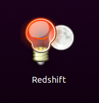

# Ubuntu Desktop編

メインPCのOSとして導入する。

もうLinuxを導入するのは何回目か分からん。ほぼ備忘録。

## インストールUSB作成

### ISOファイルを取ってくる

[Download Ubuntu Desktop | Download | Ubuntu](https://ubuntu.com/download/desktop)

### USBに書き込み

※前提：Linux上でのコマンド

~~~shell
$ sudo dd of=/dev/sd(挿したUSBメモリの認識アルファベット) bs=1M status=progress if=(Ubuntuのisoファイル)
~~~

挿したUSBメモリの認識アルファベットはつまり自分の場合でいえば`e`になる。

`sudo dmesg`で直近のメッセージに残ってるやつを見ればいい。

### USB取り出し

~~~shell
$ sudo eject /dev/se(挿したUSBメモリの認識アルファベット)
~~~

## SSDにインストール

念の為、目的のSSD以外は全部外しておくと良い。

Liveインストール中にパーティションを設定するけど、

* EFIシステムパーティション（512MB）
* SWAP area（4000MB）
* ext4（550000MB）←ここにUbuntuが入る

とした。

あとはタイムゾーンとユーザーネームの設定のみ。

## 立ち上げ後

* OSアップデート
  ~~~shell
  $ sudo apt update && sudo apt upgrade
  ~~~

* マルチディスプレイの場合、ディスプレイの設定が必要

* 日本語入力

  参考：[Ubuntu 20.04で日本語入力 (iBus – Mozc, Fcitx – Mozc)│hirooka.pro](https://hirooka.pro/ubuntu-20-04-japanese-input-ibus-fcitx-mozc/)

* Sambaサーバーのマウント

  ~~~shell
  $ sudo apt install cifs-utils
  ~~~

  あとは[ここ](../ubuntuserver/samba_from_linux.html)と一緒。
  
* HTMLフォルダのPull

  `git`をインストールして行う。

## Garuda Linuxの環境と合わせに行く

### Firefoxのアドオン

* Markdown Link
* Bitwarden
* Dark Reader

### 色温度

~~~shell
$ sudo apt install redshift redshift-gtk
~~~

`~/.config/redshift.conf`を作成し、以下の様に記入。

~~~
[redshift]
temp-day=6500
temp-night=4900

transition=1
gamma=1
location-provider=manual
adjustment-method=randr

[manual]
lat=35
lon=135
~~~

緯度、軽度は適当に自分家に合わせる。

その後、「Show Applications」（画面左下）のアプリ一覧からRedshiftを起動する。

でもなんかちょっと色味がGaruda Linuxのものとちょっと違うなー。目には優しいけど。

## その他インストールするソフト

* `flameshot`（スクリーンショットソフト）
* `typora`（マークダウンエディタ　要リポジトリ追加）
* 

