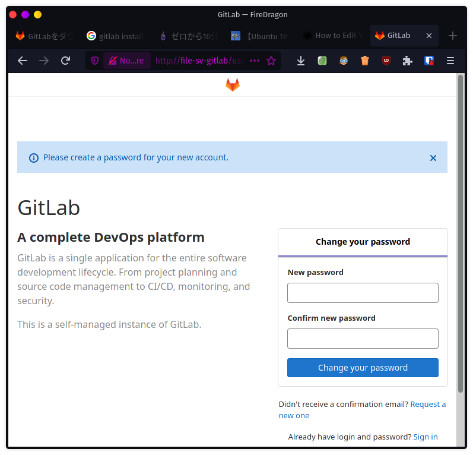
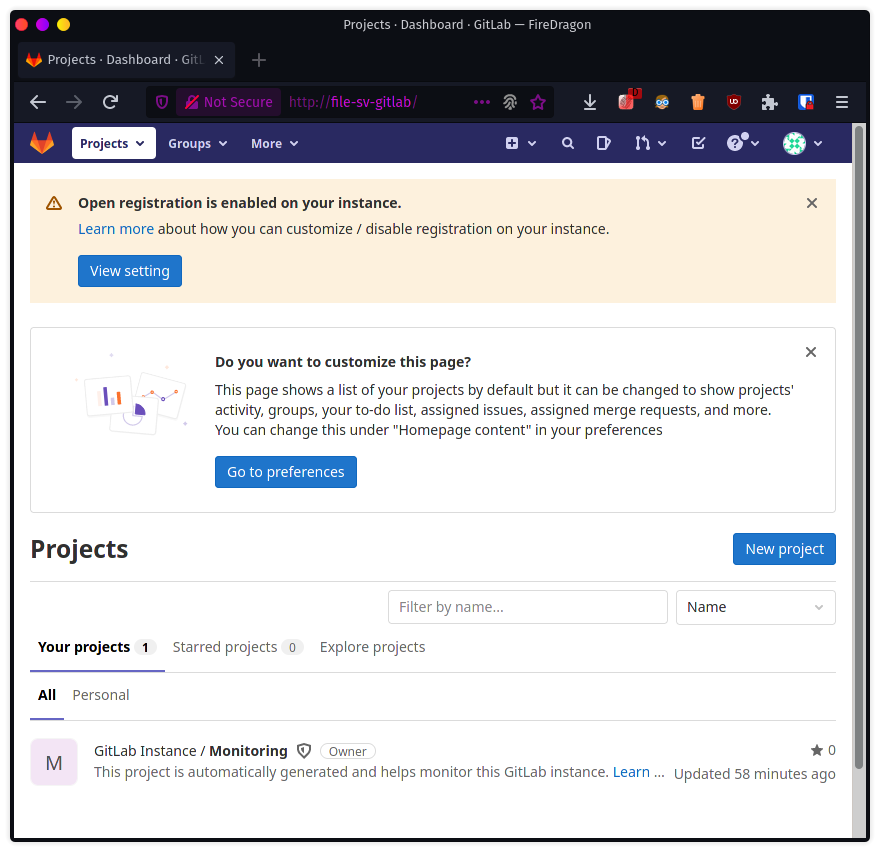

# GitLabを導入

GitHubを使えばいいんだけど、会社の都合で仕方なくリモートリポジトリを共有フォルダに置いている。そんな状況を打破したい。

なのでまずは自分の家で試してみる。

ちなみにどのサイトを見てもメールの設定がどうのこうのと言っているけど、自宅LAN内でやるのでなるべくそういうのは無しでやりたい。

参考

[GitLabをダウンロードしてインストール | GitLab.JP](https://www.gitlab.jp/install/#ubuntu)
[【Ubuntu 18.04 LTS Server】GitLabでGitサーバを構築する | The modern stone age.](https://www.yokoweb.net/2018/05/04/ubuntu-18_04-server-gitlab-install/)

## 導入

公式にも、まずは`curl`、`openssh-server`、`ca-certificates`を導入せよと書いてあるけど、最初から入ってた。

メールサーバー。使うつもりは無いけどとりあえず入れる。

~~~shell
$ sudo apt install postfix
~~~

インストール途中で突然問い合わせが現れるので↓キーを押して`Local only`を選択。続けてメールのドメイン名も聞かれるのでそのままエンター。

GitLabパッケージリポジトリの登録。シェルスクリプトをDLして勝手に実行する。

~~~shell
$ curl -sS https://packages.gitlab.com/install/repositories/gitlab/gitlab-ce/script.deb.sh | sudo bash
~~~

GitLabのインストール。

~~~shell
$ sudo apt install gitlab-ce
~~~

ちょっと時間がかかるけど放置してたらインストールできた。

## GitLabの設定

設定ファイルを開く。

~~~shell
$ sudo nano /etc/gitlab/gitlab.rb
~~~

一番最初に出てくる設定`external_url`を好きなように変える。

~~~
external_url 'http://file-sv-gitlab'
~~~

次にタイムゾーンを変える。いくらかスクロールしたらある。

~~~shell
gitlab_rails['time_zone'] = 'Asia/Tokyo'
~~~

設定反映。これもまあまあ時間かかる。再コンパイルでもしてんのかと思うぐらい大量のログが出た。

~~~shell
$ sudo gitlab-ctl reconfigure
~~~

## 名前解決

これってローカルに書いて保存しとけばいいのね。

ということで一旦Ubuntu Serverからログアウト。

~~~shell
$ exit
~~~

### Linuxの場合

以下を開く。

~~~shell
$ sudo nano /etc/hosts
~~~

末尾に以下を記入。IPアドレスはサーバーのローカルIP。

~~~
192.168.1.203 file-sv-gitlab
~~~

### Windowsの場合

メモ帳を管理者権限で開いて、メニューの「開く」で`c:\Windows\System32\drivers\etc\hosts`を指定してファイルを開く。末尾に以下を追記。

~~~
192.168.1.203 file-sv-gitlab
~~~

## ブラウザでアクセス

`http://file-sv-gitlab`

きたー。

最初に聞かれるのはrootユーザーのパスワード。設定すると次にユーザー名とパスワードを聞かれるので

~~~
username: root
password: (今さっき決めたパスワード)
~~~

でログインできる。

