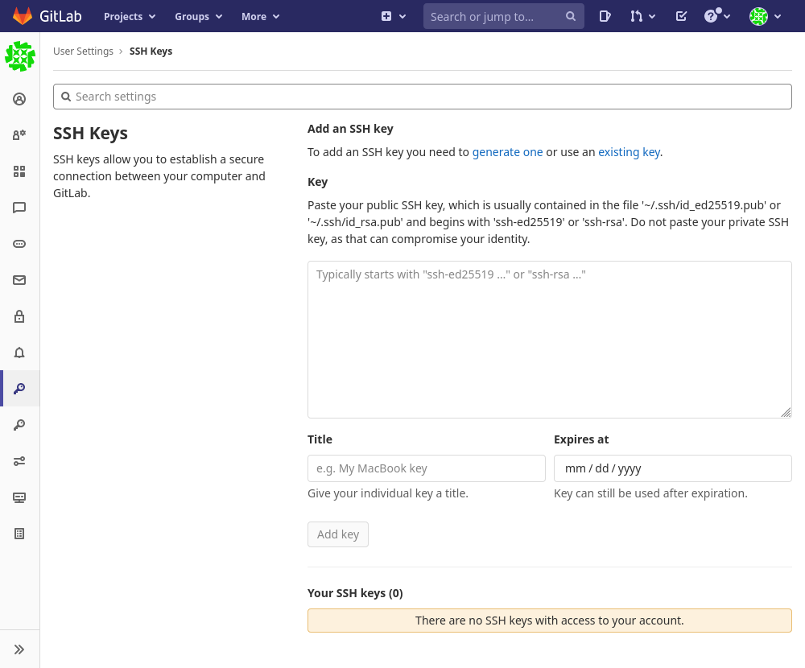
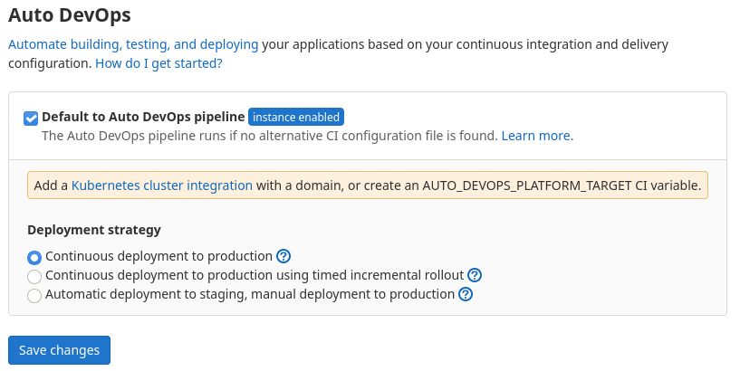
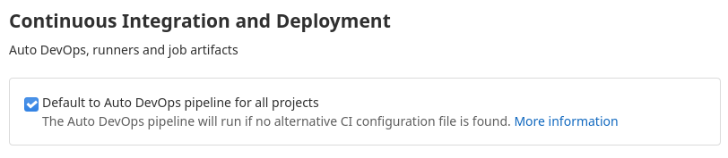

# GitLabの設定をする

詳しいことは使いながら探していけばいいけど、とりあえず表示にも出ている以下の2点を何とかする。

* SSH keyの登録・・・登録するとおそらくPushごとのログイン作業はなくなるはず
* DevOpsの設定・・・デフォルトではCI/CDによる自動デプロイ的なものがONになっているらしい

## SSH Keyの登録

画面右上の自分のアバターをクリック→「Preference」→「SSH Keys」

GitHubと同じ要領でいいのかな。「Key」に自分の公開鍵をコピペ。

「Title」を適当に自分がわかりやすい名前を付けておく。「Expires at」は入力不要。

### リモートリポジトリのアドレスを変更

~~~shell
$ git remote set-url origin git@file-sv-gitlab:takeshi/test1.git
~~~

これで、適当に変更してコミットしてプッシュするとパスワードを聞かれなくなる。初回はいつも通り「このサーバー初めてやけど接続してええか」と聞かれるけど。

## DevOpsの設定

### リポジトリごとの設定

対象のリポジトリページから「Settings」→「CI/CD」→「Auto DevOps」

「Default to Auto DevOps pipeline」を外せば良いっぽい。「Save changes」を忘れずに。

## デフォルトで無効にする

プロジェクトを作る度にいちいち無効にするのは面倒。

rootユーザーでログインし、Admin Areaに入り「Settings」→「CI/CD」→「Continuous Integration and Deployment」

この「Default to Auto DevOps pipeline for all projects」のチェックを外せば良い。

こちらも「Save changes」を忘れずに。

