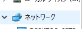
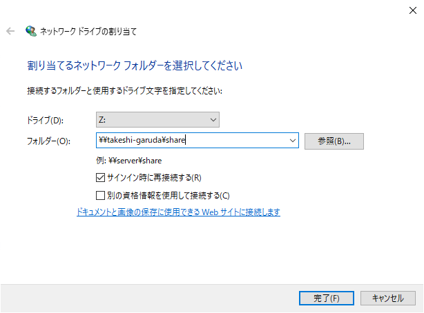
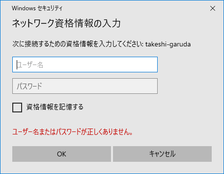

# Samba導入

[Garuda Linuxでやったとき](../garuda/samba.html)とほぼ同じ。

## インストール

~~~shell
$ sudo apt update && sudo apt upgrade
$ sudo apt install samba
~~~

## 設定ファイルを作成

~~~shell
$ sudo wget "https://git.samba.org/samba.git/?p=samba.git;a=blob_plain;f=examples/smb.conf.default;hb=HEAD" -O /etc/samba/smb.conf
~~~

開いて編集。

~~~shell
$ sudo nano /etc/samba/smb.conf
~~~

以下のように設定。

~~~
[global]
   workgroup = WORKGROUP

;[homes]
;   comment = Home Directories
;   browseable = no
;   writable = yes

(末尾に追記)

[share]
   path = /mnt/ssd1/share
   browseable = yes
   writable = yes
   valid users = takeshi
   create mode = 0777
   directory mode = 0777
~~~

## 共有ディレクトリを作成

~~~shell
$ sudo mkdir /mnt/ssd1/share
$ sudo chmod 777 /mnt/ssd1/share
~~~

## Samba用ユーザーを登録

~~~shell
$ sudo pdbedit -a -u takeshi
~~~

## Sambaスタート

ここだけGaruda Linuxのときと違った。`smb`じゃなくて`smbd`になってた。

~~~shell
$ sudo systemctl start smbd nmbd
~~~

## Windowsからアクセス

Explorerの（普通は）左側にあるショートカット一覧的なものの中から「ネットワーク」を探す。

右クリックをして「ネットワークドライブの割り当て」をクリック。

ドライブレターは適当、フォルダーは`\\(ipまたはコンピューター名)\(Sambaの設定ファイルに作ったセクション名)`を入力。

自分の場合は`\\file-sv\share`

※画像はコンピューター名が違う。

IDとパスワードを聞かれるので`pdbedit`で決めたやつを入力。資格情報を記憶しておけば次回は入力不要なのか。

OKでフォルダが開けば開通。

## PC起動時にSamba自動実行

~~~shell
$ sudo systemctl enable smbd nmbd
~~~

