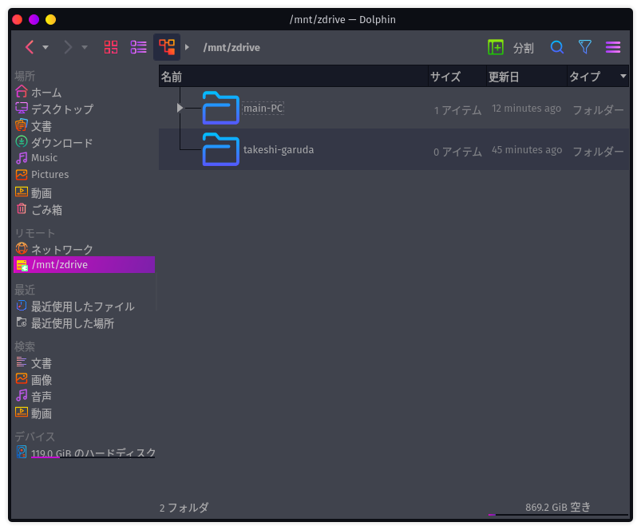

# Linuxからファイルサーバーにアクセス

## Garuda Linuxから

参考：[Samba - ArchWiki](https://wiki.archlinux.jp/index.php/Samba#.E3.82.AF.E3.83.A9.E3.82.A4.E3.82.A2.E3.83.B3.E3.83.88.E3.81.AE.E8.A8.AD.E5.AE.9A)

Wikiに書いてある`cifs-utils`だけど、どうやら最初から入っている模様。

マウントポイントの作成。

~~~shell
$ sudo mkdir /mnt/zdrive
$ sudo chmod 777 /mnt/zdrive
~~~

ログインIDとパスワードの情報をファイルに記入していく。

~~~shell
$ mkdir ~/credentials
$ sudo micro smbshare
~~~

以下のように打つ。

~~~
username=takeshi
password=(パスワード)
~~~

rootしか読み取れないようにしておく。

~~~shell
$ sudo chmod 600 /home/takeshi/credentials/smbshare
~~~

マウント。認証情報もちゃんと読み取ってくれる。

~~~shell
$ sudo mount -t cifs //192.168.1.203/share /mnt/zdrive -o credentials=/home/takeshi/credentials/smbshare,iocharset=utf8,uid=takeshi,gid=takeshi
~~~

マウントしたら勝手にDolphinに追加された。

以下の用に打っても通る。でもパスワード直打ちはダメ。

~~~shell
$ sudo mount -t cifs //192.168.1.203/share /mnt/zdrive -o username=takeshi,password=(パスワード),iocharset=utf8,uid=takeshi,gid=takeshi
~~~

### 起動時自動マウント

~~~shell
$ sudo micro /etc/fstab
~~~

末尾に以下を追記。

~~~
//192.168.1.203/share /mnt/zdrive cifs credentials=/home/takeshi/credentials/smbshare,iocharset=utf8,uid=takeshi,gid=takeshi 0 0
~~~

