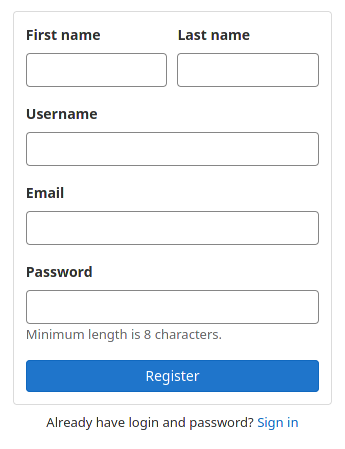
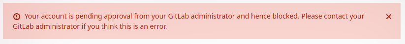
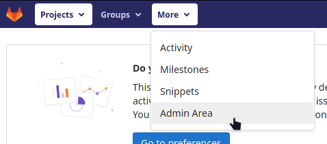
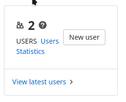
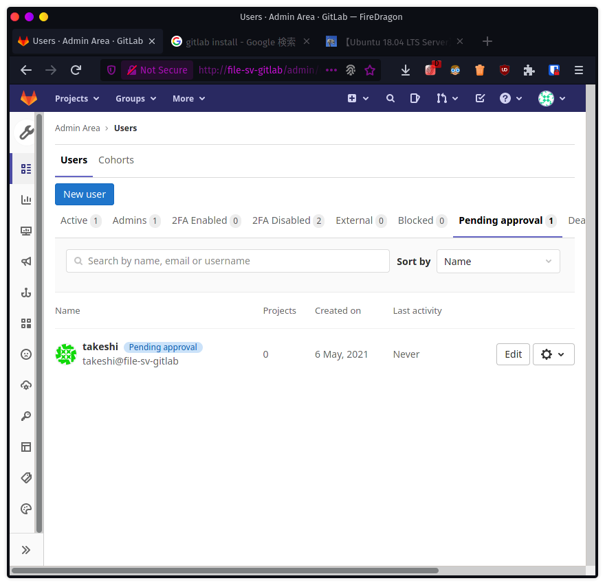
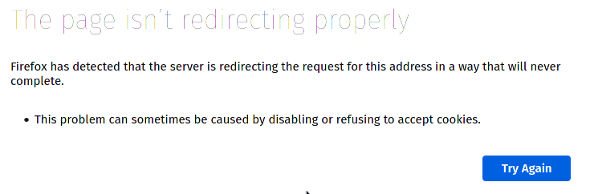
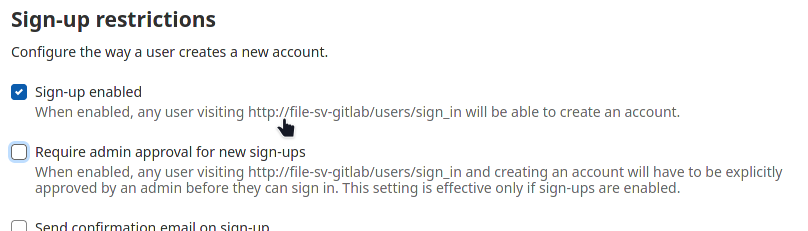
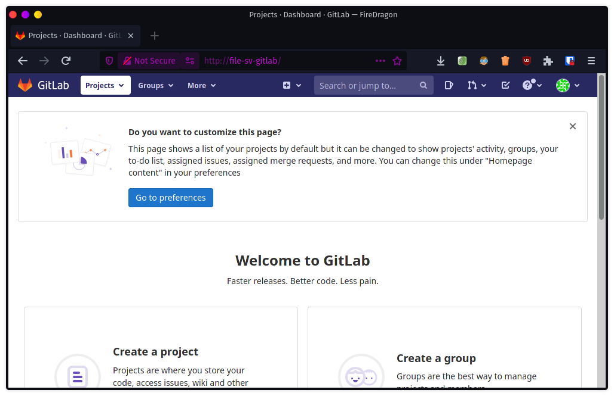

# GitLabにtakeshiユーザーを追加

一旦rootユーザーからサインアウトして、ログイン画面に戻り、画面下部の`Register now`をクリック。

適当に登録するとログイン画面に戻るので、ユーザー名とパスワードを入れてログイン！

あら、管理者の承認がいるらしい。

再びrootでログインし、画面上部の「More」から「Admin area」に入る。

「View latest users」をクリック。

「Pending approval」の中にいた。歯車マークに「Approve」があるので認証してあげる。

ではrootはサインアウトして、takeshiユーザーで再度ログイン。

ええー。Firefoxに止められた。適当にしかドメイン登録してないからか。

その後ブラウザを変えたりクッキー削除したりしてみたけどダメだったので、管理者の認証を無しにする。

「Admin area」の画面左の一番下にある歯車マークから、「General」をクリック。

「Sign-up restrictions」にある「Require admin approval for new sign-ups」のチェックを外す。

設定を保存。

takeshiユーザーを一旦削除（Approveしたときの画面からできる）して、再度登録。

Welcome画面を撮り忘れたけど、無事入れた。

