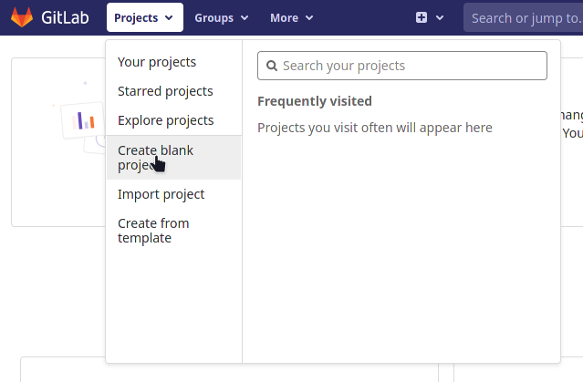
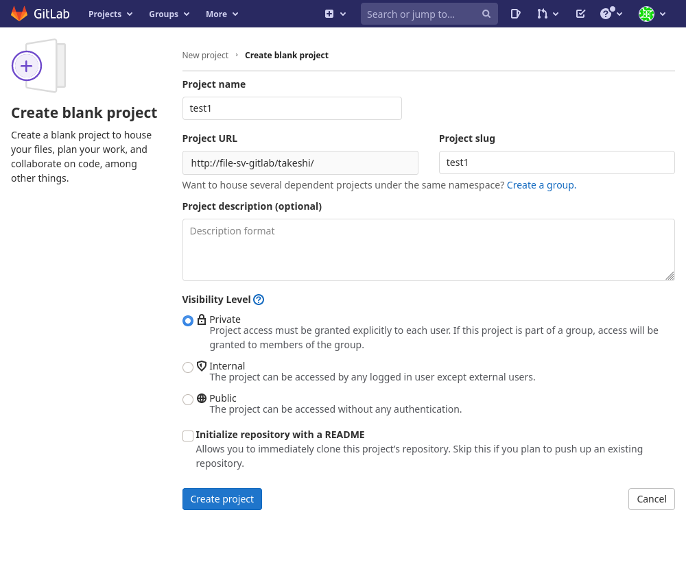
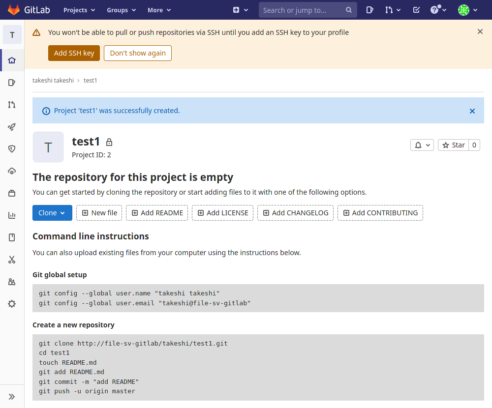
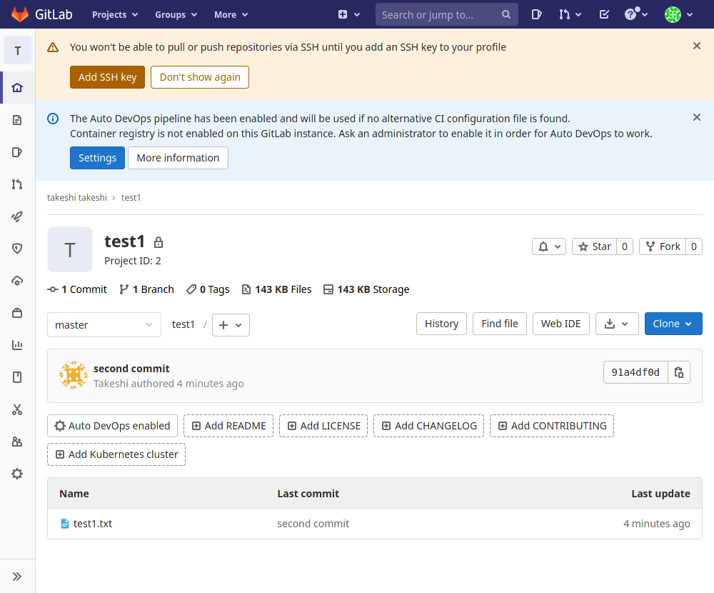
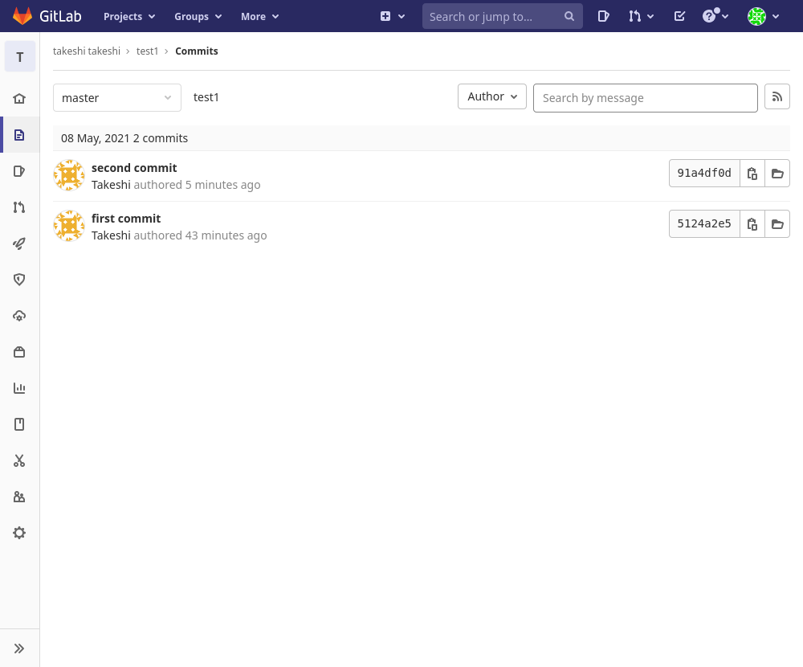
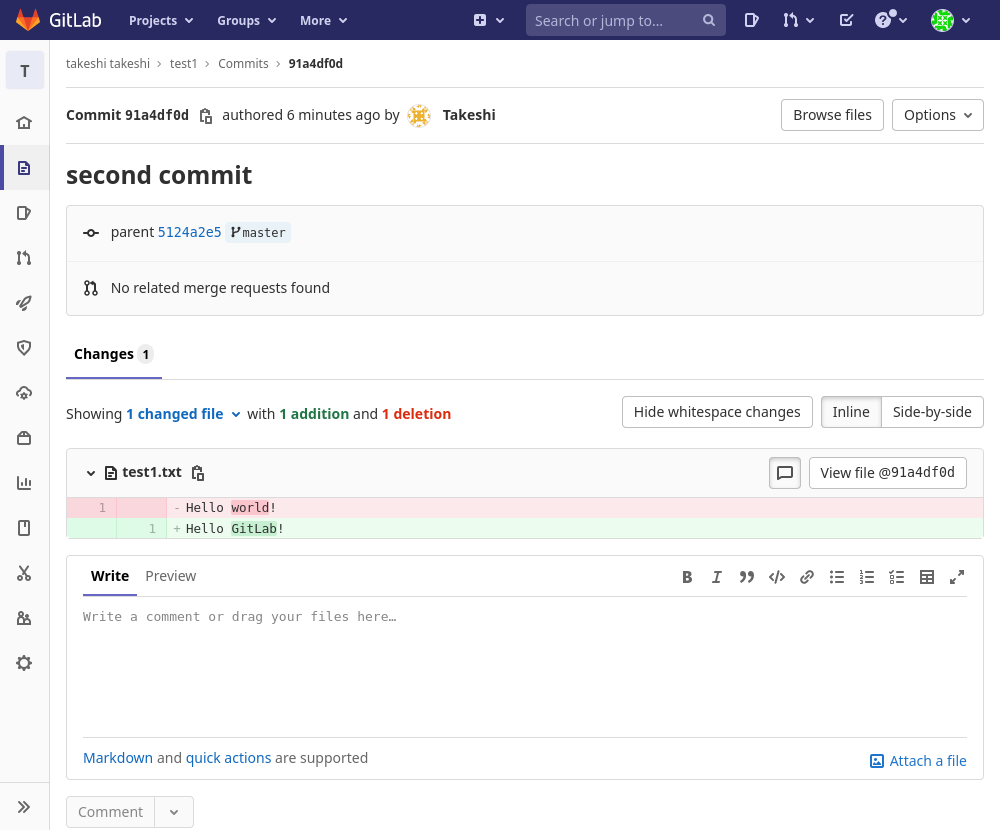

# とりあえず使ってみる

## 準備

適当にディレクトリを作成してその中で適当にファイルを作る。ローカルに以下の構成で作成。

~~~
python
└── test
    └── test1.txt

1 directory, 1 file
~~~

`test1.txt`の中身は

~~~
Hello World!
~~~

## Gitのローカルリポジトリ作成

`test`ディレクトリの中に移動してから

~~~shell
$ git init
$ git add .
$ git commit -m "first commit"
~~~

## GitLab上で空のプロジェクトを作成

「Projects」→「Create blank project」

作成画面はGitHubとよく似ている。

できた。

## GitLabにプッシュ

~~~shell
$ git remote add origin http://file-sv-gitlab/takeshi/test1.git
$ git push origin master
~~~

このあとGitLabにログインするときのUsernameとPasswordを聞かれた。

## GitLab上でどうなっているか確認

リロードしてみた。

いいじゃん。

## 変更をコミットしてプッシュ

`test1.txt`の内容を以下に変更。

~~~
Hello GitLab!
~~~

コミット＆プッシュ

~~~shell
$ git add .
$ git commit -m "second commit"
$ git push origin master
~~~

またユーザー名とパスワードを聞かれた。これは後で何とかしよう。

GitLabを見てみると、ちゃんと「second commit」に変わっている。

Historyを見てみる。「second commit」のところをクリック。

ちゃんと変更点がハイライトされている。

## 一人開発ならこれで十分

ローカルで開発してコミットしてプッシュを繰り返せば良い。

そもそも一人開発ならホスティングサービスなんていらんけど。まあそこは仕事の都合とか色々。

